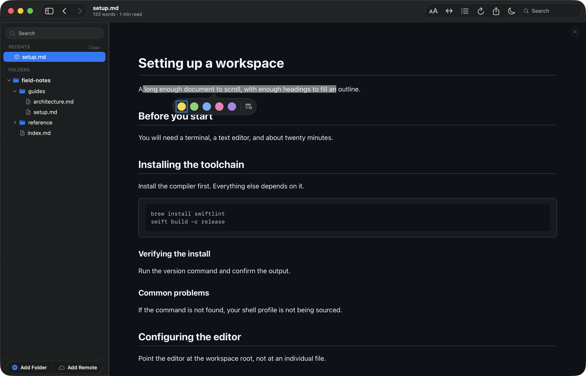
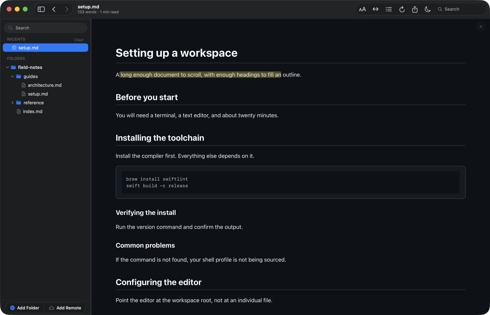
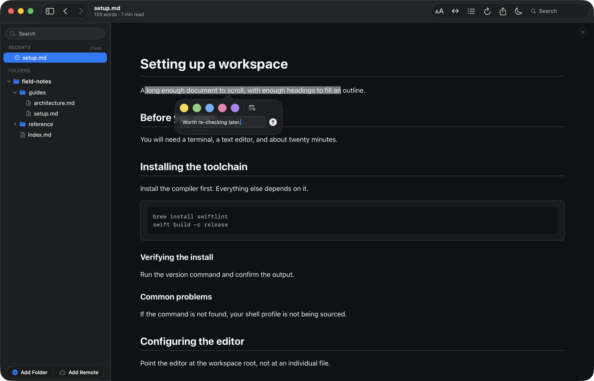

# Highlights and notes

Reader.md never writes to your markdown. Annotations live beside the file
instead, so you can mark up a document you have no business editing — a
repository you cloned, a folder mounted read-only, someone else's handbook.

A highlight, a note, and a comment thread are the same thing here, and they
differ only in how much you have added to them.

## Highlighting

Select any text and a bar appears under it, offering five colours and a note
button.

Click a colour and the selection keeps it.

Highlights are anchored to the text you selected, not to a position in the
file. Edit the paragraph above and the highlight stays on its own words.

## Notes

The button at the right of the bar opens a field instead of picking a colour.
Write a note and send it, and the highlight carries it.

A note takes a default colour, so an annotated passage still reads as
highlighted. A small marker sits at the end of the range to say there is
something attached.

## Threads and resolving

Click a mark you have already made and the bar comes back with everything the
mark can do: change its colour, remove the colour, read the thread, reply to
it, **Delete** it, or mark it **Resolve**d.

Replies stack under the first note, each with an author and the order they were
written in. The author is your macOS full name — there are no accounts, and
nothing leaves your Mac.

Resolving keeps the thread but stops it competing for attention: the mark is
de-emphasized, and a count of resolved threads appears in the toolbar.

That count is also a switch. Click it to hide resolved marks in the text
entirely, and again to bring them back.

## When the text moves

A mark remembers the words it was made on, along with a little of the text
either side, so an edit somewhere else in the document does not disturb it.

If the text a mark was made on disappears entirely, the mark is **orphaned**
rather than deleted: an amber count appears in the toolbar, and clicking it
lists the marks that lost their anchor so you can decide what to do with them.

## Where annotations live

Annotations are stored per document under
`~/Library/Application Support/Reader.md/`, keyed by the file's path. They are
never written into the markdown.

Two consequences worth knowing. Editing a file keeps its annotations —
that is the point of anchoring to text. Renaming or moving the file loses
them, because the path is the key.

Marks are hidden while you are reading a diff (⇧⌘D), where the two columns are
generated text rather than the document itself.
