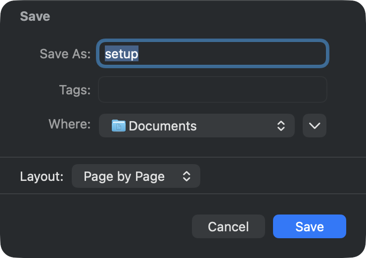

# Exporting and editing

Reader.md is a reader: it never writes to the documents you open. The two ways
something leaves it are a PDF you export and an editor you hand the file to.

## Export as PDF

Export (⌘E) opens a save dialog with one control the system does not put there:
**Layout**.

**Page by Page** produces a paginated PDF on your system paper size, the way it
would print. **Continuous** produces a single page as tall as the document,
which is better for a long document nobody is going to print — no page breaks
land in the middle of a diagram or a code block.

The picker starts on whatever **Settings ▸ Editing & Export** has as the
default. Changing it here changes only this export; the default stays put.

## What ends up in the file

The PDF carries the document as you are reading it — the same appearance,
reading theme, and text size. A dark document exports dark, edges included: the
page background is painted to the paper's edge rather than left as white
margins.

What does not carry over is the chrome: the copy buttons, the heading anchors,
and the diagram controls are all left out. Find highlights and any diagram you
have zoomed are reset for the export and put back afterwards. Exporting in the
middle of a search neither bakes the highlights in nor loses your place in the
matches.

## Hand the document to an editor

Reader.md does not edit, so ⇧⌘E sends the open document to an app that does.
Pick that app once and the shortcut is live from then on:

- **Settings ▸ Editing & Export ▸ Choose…**
- **File → Set Default Editor…**
- right-click any file in the sidebar → **Always Open With**, which opens it in
  that app *and* remembers it

The file watcher does the rest. Save in the editor and the document re-renders
where it stands, which is what makes the pair read as a live preview.

⇧⌘E is unavailable until an editor is chosen, and stays unavailable for the
bundled help documents, for anything piped in with `reader -`, and for files
inside a remote folder, which is read-only. If the editor you picked has since
been uninstalled, ⇧⌘E asks you to choose a replacement instead of failing
quietly.
