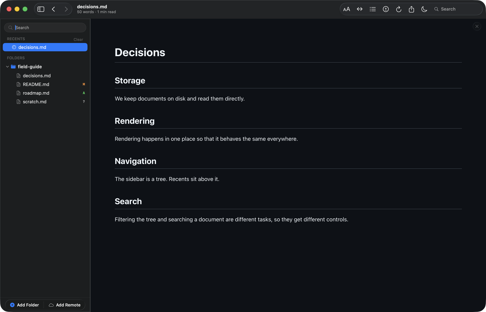
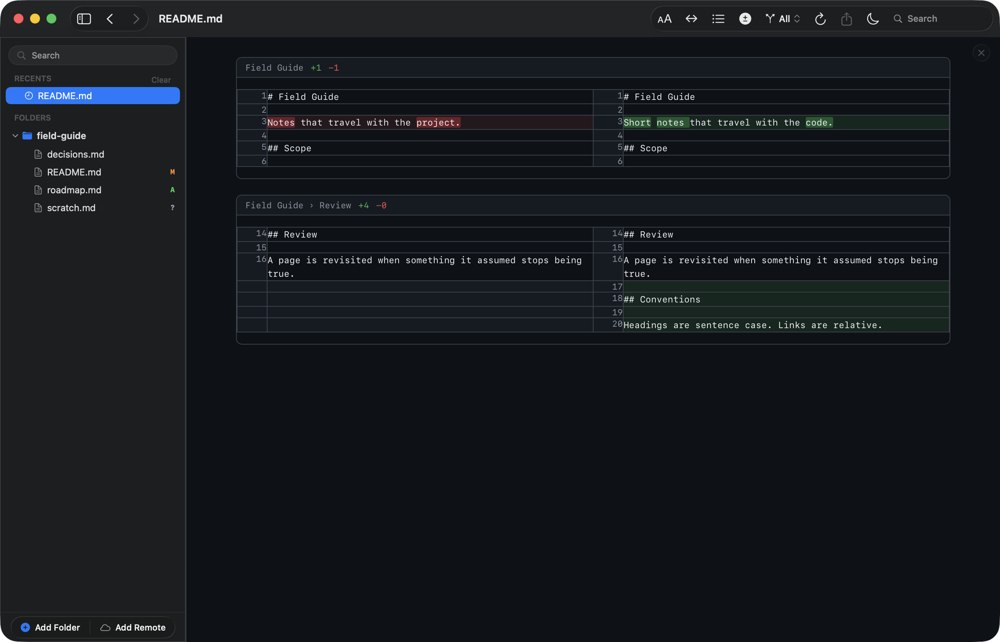
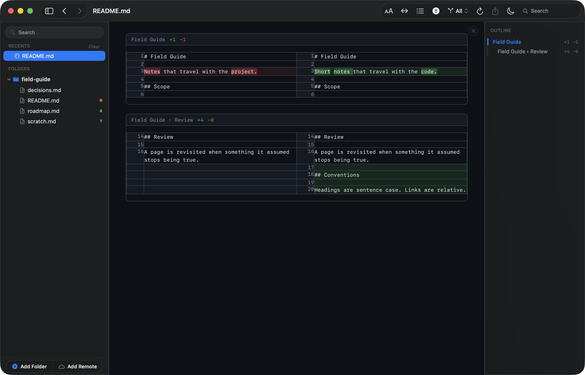
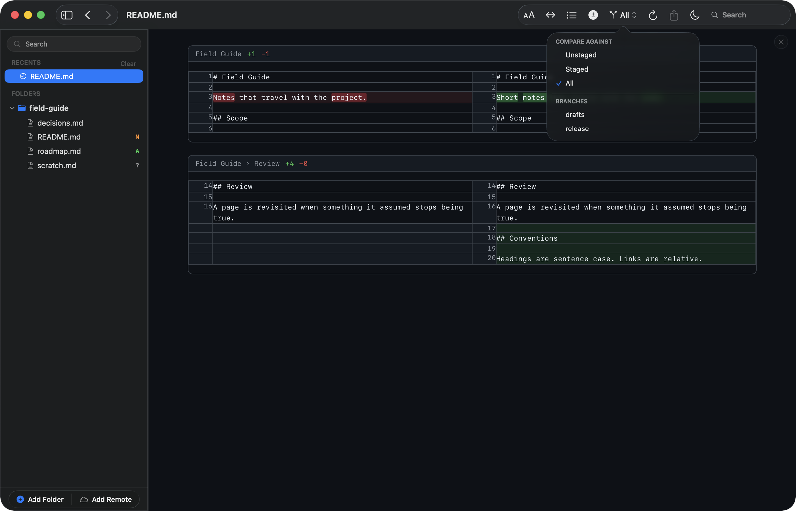

# Working in a git repository

When a folder you add is a git repository, Reader.md notices. Changed files get
a badge in the sidebar, and any document can be read as a diff instead of as
rendered markdown.

Nothing here writes to your repository. Reader.md runs `git` only to ask what
changed; it never stages, commits, or discards anything.

## Change badges

A markdown file with uncommitted changes carries a one-letter badge on its
sidebar row: **M** modified, **A** added, **?** untracked, and **U** for a file
left conflicted by a merge. Folders stay unmarked.

The badges read the index as well as the working tree: stage a new file and its
**?** becomes **A**, without the document itself changing. Edits on disk show up
as they happen. The index is re-checked when Reader.md comes back to the front,
so staging in a terminal lands the moment you switch across.

## Reading a diff

Toggle Diff (⇧⌘D) replaces the rendered document with a side-by-side comparison:
the committed text on the left, yours on the right. Each block of changes is a
hunk. Its header names the section the change falls in and counts the lines
added and removed.

Changed lines are highlighted word by word, so a reworded sentence reads as the
few words that moved rather than as a whole line replaced. Press ⇧⌘D again to go
back to the rendered view.

Diff mode is a setting, not a per-file one: it stays on as you move between
documents, and a file with no changes says so. Outside a repository the control
is not in the toolbar at all.

## Hunks in the outline

The outline (⇧⌘B) changes with it. In diff mode it lists the changed hunks
instead of the document's headings, each with its own added and removed counts,
and clicking one jumps to it.

## What the diff compares against

The control beside the diff button names what you are comparing against, and
opens the list of choices. **Unstaged** is what you have not staged yet,
**Staged** is what you have, and **All** is everything since the last commit.
All is the default.

Under those sit the repository's branches. Picking one compares your working
copy — uncommitted edits included — against that branch's tip. That is how you
read a document as it will look after a merge. A repository with a long list of
branches gets a filter field above the list.

The scope applies to whatever you open next, so you can set it once and read
several files against the same branch.

## What is left out

Markdown that `.gitignore` excludes never appears in the tree at all — not
greyed out, not badged, just absent. Generated documentation and vendored
folders stay out of the sidebar without you listing them anywhere else.
