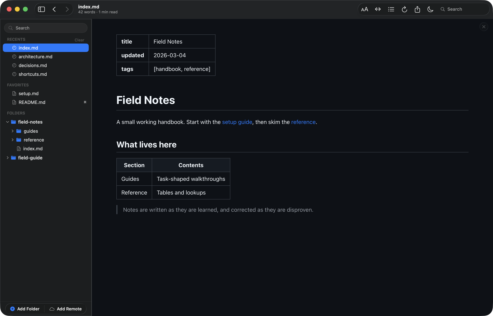
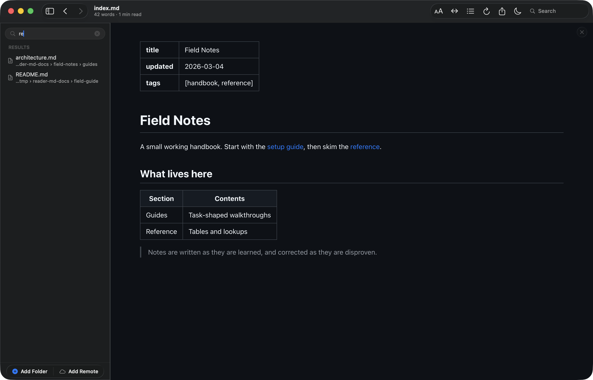
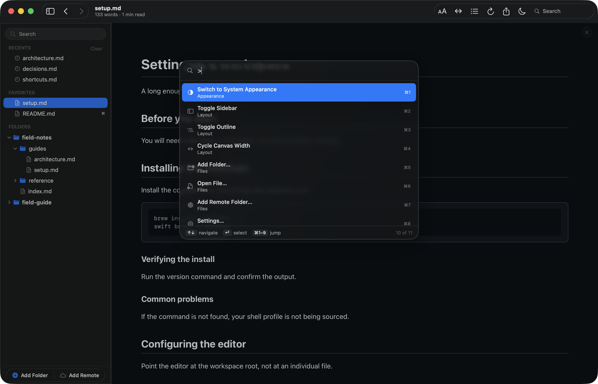
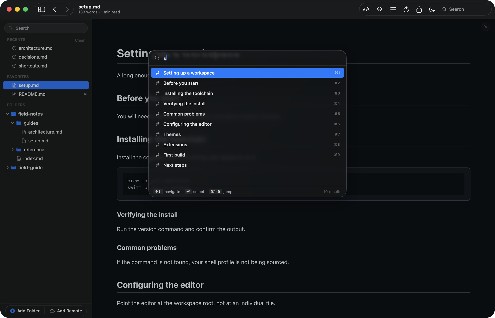

# Finding your files

Reader.md keeps every folder you add in one sidebar. This page covers getting
folders in there, and the two ways of finding a file once they are: filtering
the tree, and Quick Open.

## Folders in the sidebar

**Add Folder** (⇧⌘A) turns any folder into a **root** — a top-level section
holding every markdown file beneath it. Add as many roots as you like; each is
collapsible, and they sit side by side under **FOLDERS**. **Add Remote** (⌥⌘A)
takes an SSH destination or a git clone URL instead, and mirrors that folder
read-only.

Toggle the sidebar itself with ⌘B.

Only markdown files appear in the tree. Everything else is skipped, along with
folders like `node_modules` and `.git`.

## Recents and Favorites

**RECENTS** lists the files you have opened, most recent first; **Clear** empties
it. **FAVORITES** holds the ones you pinned — press ⌘D for the open document, or
right-click any file and choose **Add to Favorites**.

Pinning moves a file rather than copying it. Once a file is a favorite it drops
out of Recents, so the one you open every day stops pushing everything else off
the list.

## Filtering the tree

**Filter Files** (⇧⌘F) replaces the tree with a **RESULTS** list, searching
every root at once. Each result carries the folder it came from, so two files
with the same name stay apart.

The filter matches file names only. To search folder paths as well, use Quick
Open.

## Quick Open

Quick Open (⌘P) is a fuzzy switcher across every file in every root. It matches
the folder path as well as the name, so a query can find a file by where it
sits rather than what it is called.

The clip below opens Quick Open and types four letters, narrowing the whole
library to two results: `glossary.md`, matched on its name, and `decisions.md`,
matched through the folder it sits in.

Move through results with ↑ and ↓, open one with ⏎, or jump straight to any of
the first nine with ⌘1–⌘9. ⎋ dismisses it.

## Commands and headings

Quick Open has two more modes, each reached by starting the query with a
character.

Type `>` for commands — appearance, layout, and the file actions, each numbered
for ⌘1–⌘9.

Type `#` to list the headings of the document you are reading, in document
order, and jump to one.

