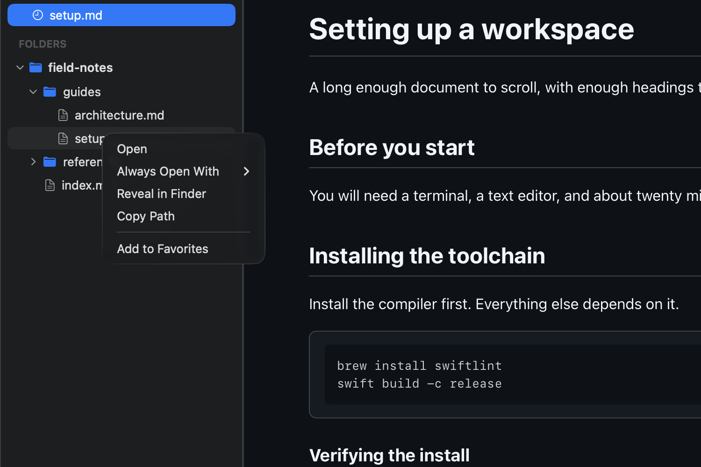
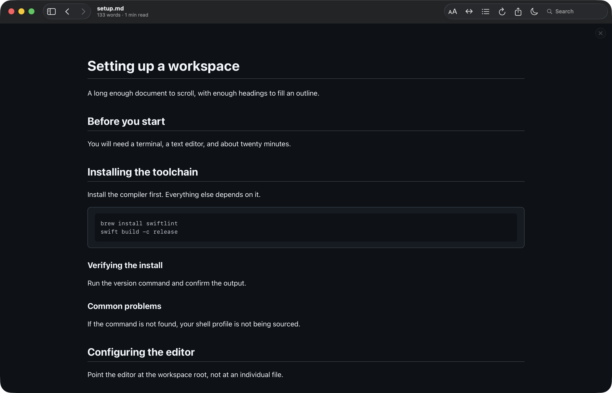

# Opening and moving between files

A document reaches the canvas in several ways, and once a few are open, moving
between them is back and forward like a browser.

## Opening a document

**Open File…** (⌘O) takes a single markdown file. So does dropping one onto the
window, and so does double-clicking one in Finder — Reader.md registers itself
as a markdown viewer, so you can make it the default in Finder's **Get Info**
panel.

Dropping a *folder* on the window adds it as a root instead, the same as **Add
Folder** (⇧⌘A). See [Finding your files](library.md) for what a root is and how
the sidebar organises them.

The `reader` command opens files too, which is the fastest route from a
terminal: `reader README.md`, or a whole folder. See [the CLI
reference](../cli.md).

## Back and forward

Every document you open goes on a history stack. **⌘[** goes back and **⌘]**
goes forward, and the two chevrons beside the sidebar button do the same. Both
are greyed out when there is nowhere to go.

Following a link between two markdown files counts as navigation, so ⌘[ returns
you to the document you came from — and Reader.md resumes it where you had
scrolled to.

## Right-click a file

Every row in the sidebar has a context menu, and it is where the per-file
actions live.

**Open** and **Reveal in Finder** do what they say. **Copy Path** puts the
file's full path on the clipboard. **Always Open With** opens the file in
another app and remembers it as the editor for ⇧⌘E — see
[Exporting and editing](exporting.md). **Add to Favorites** pins the file.

Folders and roots have their own menus: a folder offers **Collapse** or
**Expand**, and a root adds **Remove** — which takes it out of the sidebar and
leaves the folder on disk untouched. A remote root also offers **Edit
Connection** and **Re-sync**.

## Making room

⌘B collapses the sidebar, leaving the document the whole window.

Drag the divider to resize the sidebar instead; the width is remembered. Close
the document with ⌘W, or with the floating **×** at the top of the canvas — the
window and the sidebar stay as they are.

The title bar carries the file name and, under it, the word count and reading
time; with no document open it counts the markdown files in the sidebar instead.
The name is a proxy icon, so it behaves the way a document title does anywhere
else on macOS.
