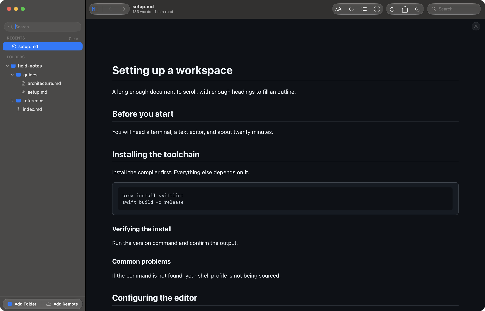
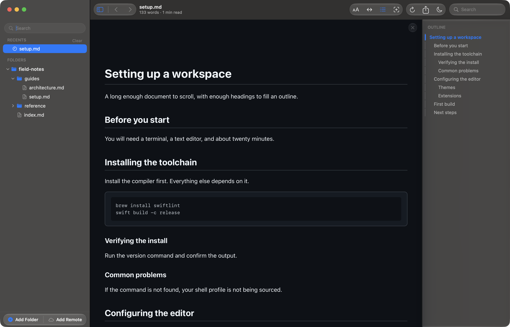
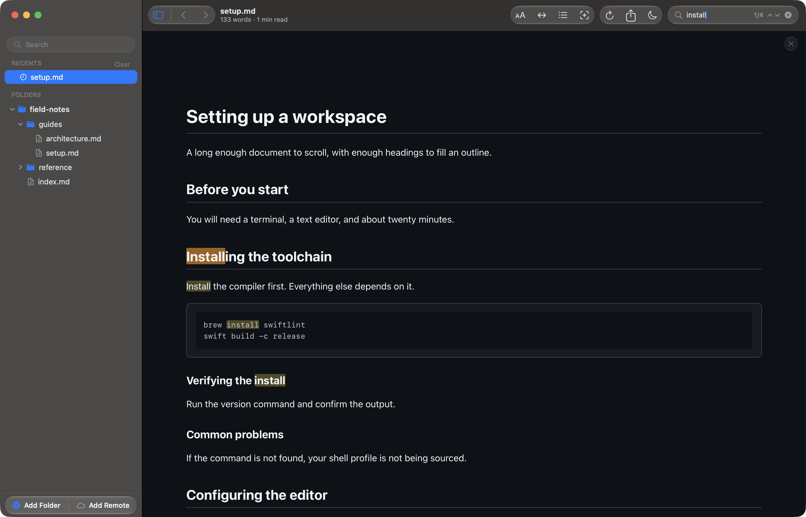
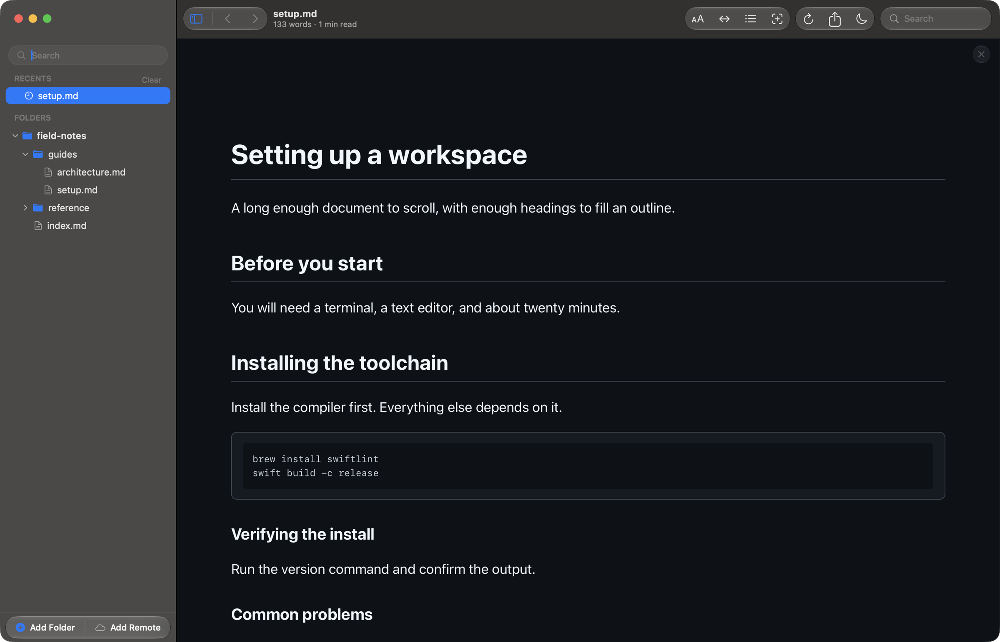

# Reading a document

Four things shape how a document reads: the canvas it lays out in, the outline
beside it, finding a phrase within it, and how large the text is. Each has a
keyboard shortcut, and every setting on this page persists across launches — set
it once and every document you open afterwards inherits it.

## The reading canvas

Open a file from the sidebar, with Quick Open (⌘P), or by dropping it onto the
window, and it renders in the canvas. The title bar carries the file name, the
word count, and an estimated reading time; a progress bar under the toolbar
fills as you scroll.

Close the document with ⌘W, or with the floating × at the top of the canvas.
Closing leaves the window and the sidebar as they are — it is the document that
closes, not the app.

## The outline

Toggle the outline (⇧⌘B) to get the document's heading structure in a pane on
the right. It tracks your position as you scroll, with an accent rail marking
the heading you are inside, and clicking any entry jumps to it.

Nested headings indent, so the pane shows at a glance how deeply a document is
structured. In diff mode (⇧⌘D) the outline lists changed hunks instead of
headings.

## Finding text in a document

Find in Page (⌘F) opens a search field in the toolbar. It counts the matches as
you type and highlights all of them, tinting the current match a stronger colour
than the others so you can see where you are in the document.

Step through matches with the chevrons beside the count, with ⌘G and ⇧⌘G, or
with ⌘↩ and ⇧⌘↩. Press ⎋ to clear the field.

This searches inside the open document. To search *across* files instead, filter
the sidebar (⇧⌘F) or use Quick Open (⌘P).

## Text size

Make the text bigger (⌘+), smaller (⌘−), or reset it to the default (⌘0). The
size applies to every document, not only the open one, and survives a restart.

## Canvas width

Cycle the canvas width (⇧⌘\\) through three settings: **Narrow** for a tight
measure, **Wide** for a comfortable one, and **Full Width** to use the whole
window. Wide is the default. The clip below cycles from Wide to Full Width to
Narrow, showing how the text column reflows at each step.

Width and text size work together: a narrow canvas with larger text gives the
short line length of a book, while full width with smaller text suits wide
tables and long code blocks.

For everything else Reader.md does — Quick Open, the file filter, diagrams, math
— and every binding in one table, see [Features](../features.md).
