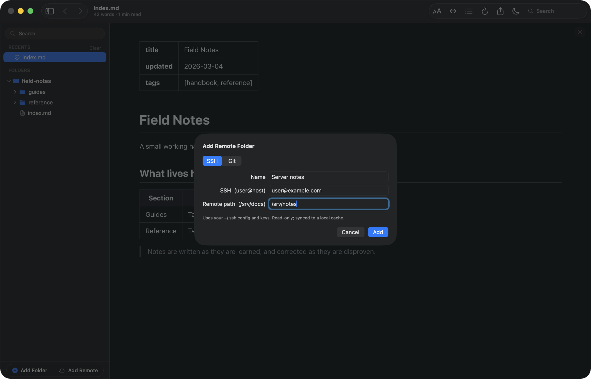
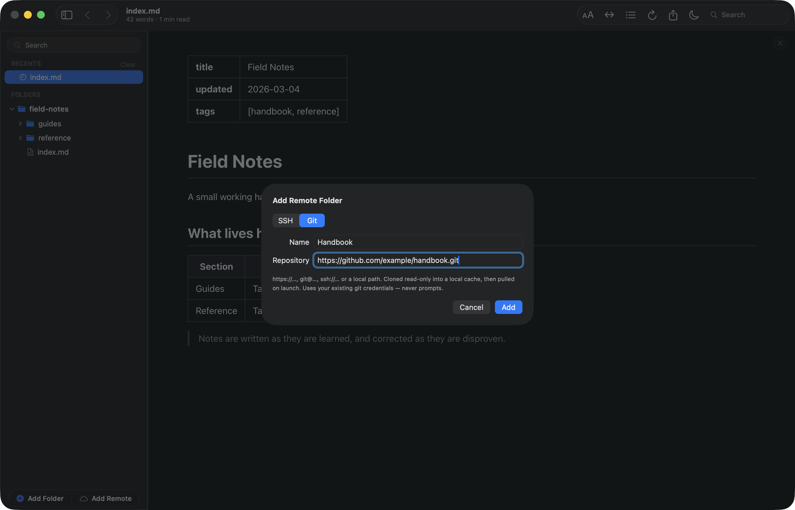
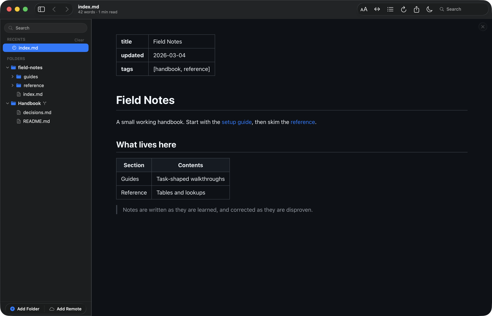

# Remote and cloned folders

Not every folder of markdown is on your Mac. **Add Remote** (⌥⌘A) takes a
folder on a server you can SSH into, or a git repository you can clone, and
syncs it read-only into a local cache. From then on it behaves like any other
root in the sidebar.

Reading happens against the cache, so the tree is as fast as a local folder and
works with no connection at all — you are reading the last copy that came down.

## A folder on a server

The **SSH** side of the sheet takes a destination and a path on that host.

The destination is whatever you would type after `ssh`, so a host you have
already set up in `~/.ssh/config` works by its short name. Reader.md uses that
config and your existing keys, and stores no credentials of its own.

Only markdown files and the images they reference come down, so pointing at a
folder that also holds a build directory does not drag one across. A file
deleted on the server leaves the sidebar on the next sync, and a re-sync moves
only what changed.

From a terminal, `reader remote me@vps:/srv/docs` opens this same sheet with
the destination already filled in.

## A git repository

The **Git** side takes a clone URL instead — `https://`, `git@`, `ssh://`, or a
path to a repository on disk.

Reader.md clones it once and runs `git pull --ff-only` on each launch. Fast
forward only: the cache is never sent anywhere, so a merge commit invented
there would only be in the way.

Your existing git credentials are used, and git is never allowed to prompt — a
repository you cannot read fails with git's own error instead of hanging on a
password request that has nowhere to appear.

## Reading the badges

A remote root carries a small badge after its name: a cloud for an SSH folder,
a branch for a cloned repository. While a sync runs, a spinner joins it. If a
sync fails, an amber triangle does instead, and hovering it gives you the error
git or rsync reported.

Hovering the root itself reveals three buttons: **Edit connection**, **Re-sync**,
and **Remove folder**. The first two are also in its right-click menu. Removing
a remote takes it out of the sidebar and leaves the server untouched — there was
never anything of yours there to remove.

Syncs run quietly on launch. Nothing interrupts you if a host is unreachable;
the badge says so and the cached copy is still readable.

## Read-only, and what follows from it

A remote root is a copy, so Reader.md will not pretend you can edit it.
⇧⌘E is unavailable for files inside one, and nothing you do in Reader.md is
ever written back to the server.

Highlights and notes still work: those live on your Mac, keyed by the file's
path in the cache. That path is stable across re-syncs, so annotations survive
them.
