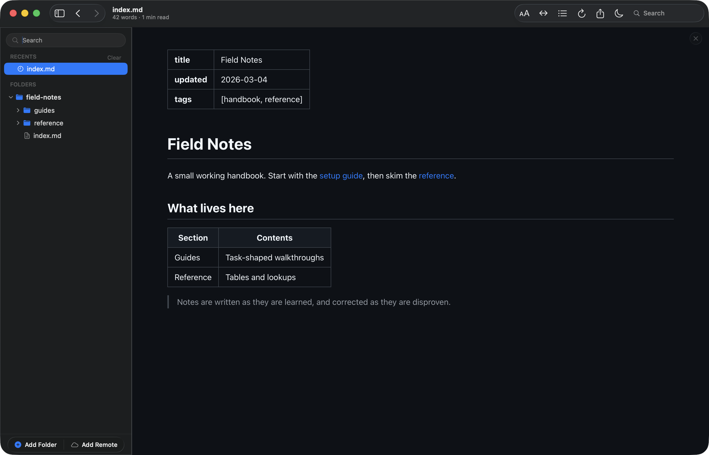
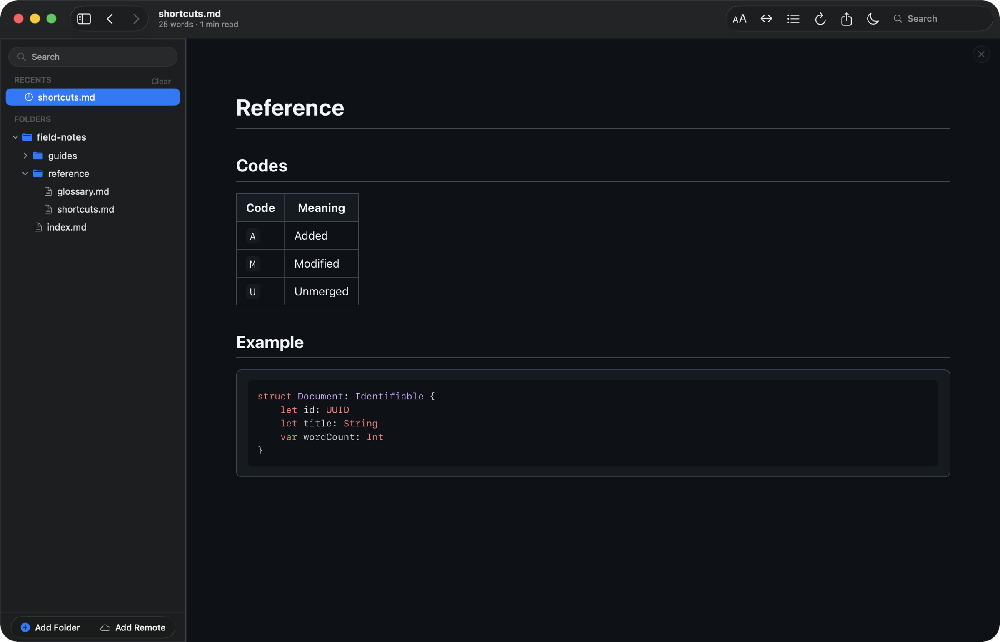
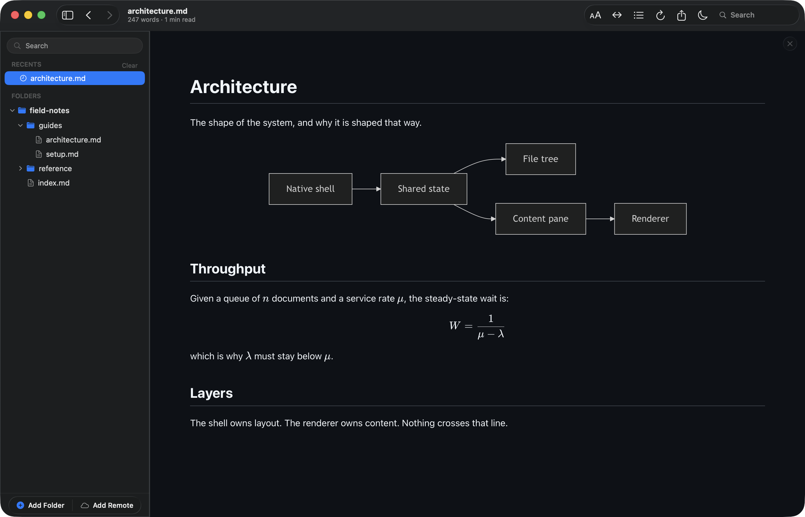

# How a document is rendered

Reader.md renders GitHub-flavoured markdown, plus the three things a plain
renderer usually drops: diagrams, math, and syntax-highlighted code. Everything
needed to draw them is bundled with the app, so none of this reaches the
network.

## Frontmatter and tables

A YAML frontmatter block is rendered as a key/value table above the document
rather than shown as raw text or hidden. Tables in the body get the same
treatment: a header row, ruled cells, and a width that follows the content.

Links to other markdown files work as links. Clicking one opens that document in
the same window, and ⌘[ takes you back.

## Code blocks

Fenced code blocks are highlighted for the language you tag them with. Inline
code keeps its own shading, so a `code` span inside a table or a sentence stays
legible.

Hovering a block reveals a **Copy** button at its top right. It copies the code
as plain text and reads **Copied** for a moment afterwards.

## Diagrams and math

A code fence tagged `mermaid` is drawn as a diagram, and LaTeX renders both
inline — `$\mu$` in the middle of a sentence — and as a centred display block.

Diagrams have their own controls, revealed on hover in the corner of the
drawing: zoom out, zoom in, reset, and fullscreen. Fullscreen drops the width
limit Mermaid puts on its own output, which is what makes a large diagram
readable. Pinch or ⌘-scroll zooms as well, double-clicking resets, and a diagram
zoomed past its fitted size can be dragged to pan.

A diagram that fails to parse is replaced by its error message in place, so a
broken block never takes the rest of the document down with it.

## Images and headings

Clicking an image opens it in a lightbox over the document; clicking again
dismisses it. Hovering a heading reveals an anchor link to its left. Neither the
anchors, the copy buttons, nor the diagram controls appear in an exported PDF.

## Live reload

Reader.md watches every folder you add. Save a file in your editor and the open
document re-renders where it stands — your scroll position is kept, so a long
document does not jump back to the top. The tree refreshes too, so a file added
or removed on disk appears or disappears without a manual reload.

The clip below shows a document on screen while a section is appended to it on
disk. Nothing is pressed in Reader.md; the new heading and its four entries
simply appear.

This is what makes an editor beside Reader.md a live preview. Hand the open
document to your editor with ⇧⌘E, and every save comes straight back.

Reload (⌘R) is there for the cases the watcher cannot see — a file that changed
on a remote volume, or one replaced underneath you.
