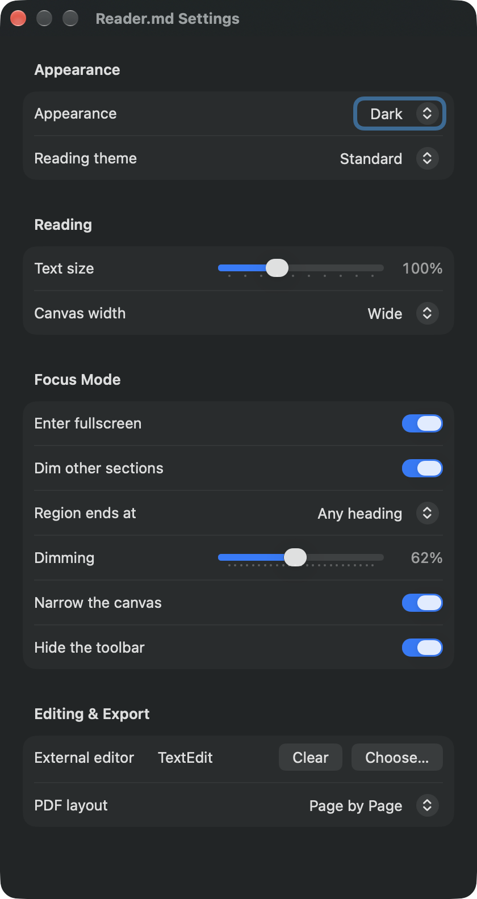
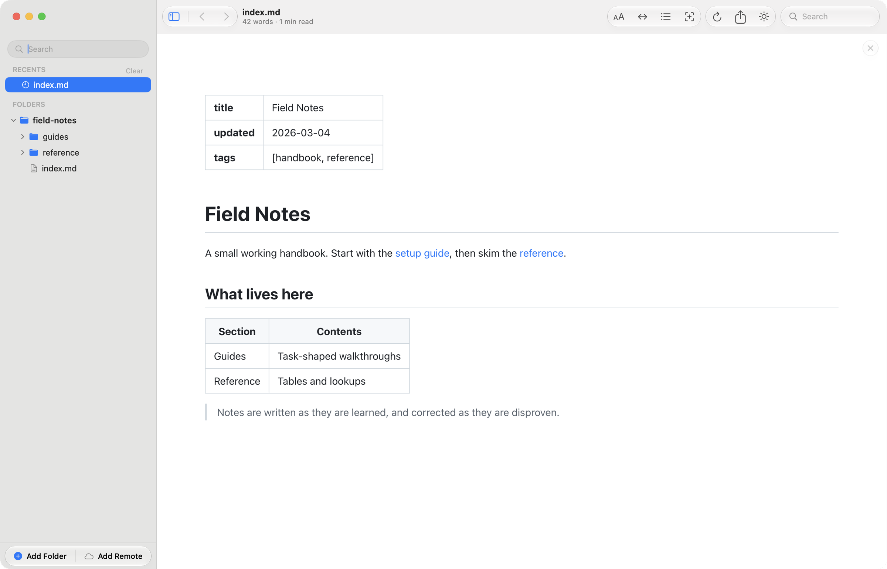
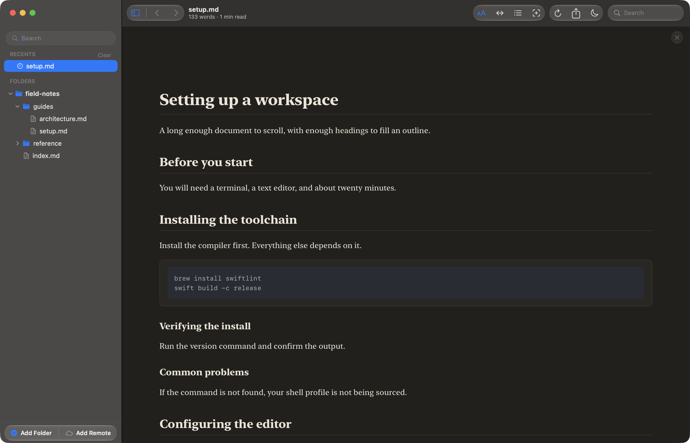
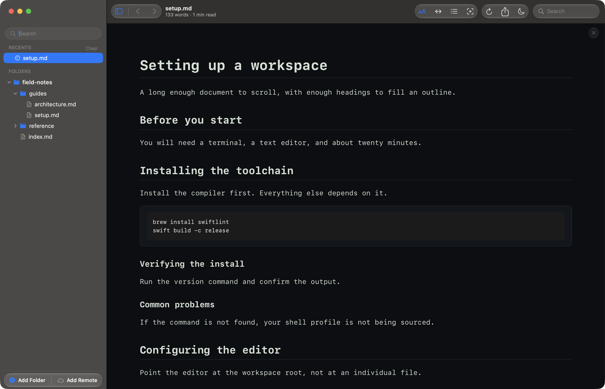

# Settings

Settings (⌘,) collects every preference in one window, grouped the way you would
look for them: **Appearance**, **Reading**, **Focus Mode**, and
**Editing & Export**.

Most of these controls have a twin in the toolbar or a menu, and changing either
changes both. Three things can only be done here: choosing an appearance mode
directly rather than cycling to it, clearing the external editor, and setting
the PDF layout the export dialog starts from.

Every setting on this page persists across launches and applies to every
document, not only the one open when you changed it.

## Appearance

**Appearance** is **Light**, **Dark**, or **System**, and covers the whole app —
the window chrome as well as the document. On **System** it follows macOS as it
changes, including a switch made on a schedule rather than by hand.

The toolbar button cycles through the three in order. The picker here is the way
to jump straight to the one you want.

## Reading themes

A **Reading theme** restyles the document without touching the window around it.
**Standard** is the default. **Editorial** sets the text in a serif face on a
warmer ground, for long prose.

**Terminal** sets everything in a monospaced face, which suits documents that
are mostly commands and code.

Reading themes sit on top of the appearance, rather than replacing it: the
sidebar and toolbar stay as Light, Dark, or System left them.

## Text size and canvas width

**Text size** is a slider from 70% to 160%, the same setting ⌘+, ⌘−, and ⌘0
move in steps. **Canvas width** is **Narrow**, **Wide**, or **Full Width**, the
same three ⇧⌘\\ cycles through. Both are described in more detail on
[Reading a document](reading.md).

## Focus Mode

Focus mode (⌥⌘F) is four things at once, and each is a switch here: **Enter
fullscreen**, **Dim other sections**, **Narrow the canvas**, and **Hide the
toolbar**. All four are on by default. Turning all four off leaves ⌥⌘F with
nothing to do, and the window says so.

Two settings shape the dimming itself. **Region ends at** decides how much of
the document counts as the section you're reading: *Any heading* is the default
and lights one heading's worth at a time, while *H2 or above* keeps a whole `h2`
section lit including its subheadings. **Dimming** sets how far everything else
fades, from 40% to 88%.

Both only matter with **Dim other sections** on, and grey out without it. While
this window is open the document behind it previews them, so dragging the slider
shows you the result.

## Editing and export

**External editor** names the app ⇧⌘E hands the open document to. **Choose…**
picks one; **Clear** appears once something is set and unsets it. If the chosen
editor has since been uninstalled, its bundle identifier is shown in place of a
name — which is the signal to clear it.

**PDF layout** sets what ⌘E offers by default: **Page by Page** for a paginated
document, or **Continuous** for one long page. The export dialog still lets you
change it for a single export; this is only where it starts.
