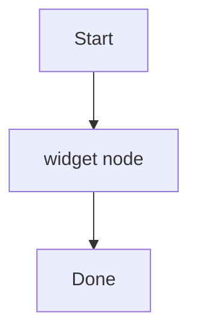

# Find in Page — count, highlight-all, next/prev — Implementation Plan

> **For agentic workers:** REQUIRED SUB-SKILL: Use superpowers:subagent-driven-development (recommended) or superpowers:executing-plans to implement this plan task-by-task. Steps use checkbox (`- [ ]`) syntax for tracking.

**Goal:** Replace the native `WKWebView.find` in-page search with a JS-driven find that highlights all matches, reports a live match count, supports next/prev, and is reachable from a topbar icon and ⌘F.

**Architecture:** Find is implemented entirely in `bridge.js` with its own filtered text walker (excluding heading anchors, code-copy buttons, SVG/Mermaid, and KaTeX), and driven from Swift over the existing `evaluateJavaScript` → `window.ReaderMd.*` channel. Match count/index flows back through a new `findResult` script message into two new `AppState` published vars. The existing marks/highlighting feature is left untouched.

**Tech Stack:** Swift 6.2 / SwiftUI / AppKit / WKWebView (macOS 26 SDK, deployment target macOS 13); vanilla JS in `bridge.js`; `marked`, `highlight.js`, KaTeX, Mermaid (all bundled).

## Global Constraints

- **Deployment target is macOS 13.** Any macOS 26-only API needs an `if #available(macOS 26.0, *)` guard with a pre-26 fallback. (This feature adds no 26-only API, but the constraint stands.)
- **There is NO JavaScript test framework in this repo** (no jest/vitest/jsdom). Do NOT add plan steps that run `npm test`, `jest`, or `pytest`. Verification is `swift build`, `swift run`, and opening the fixture markdown files this plan tells you to create.
- **Conventional commits.** NO `Co-Authored-By` line. NO "Generated with Claude Code" line.
- **The marks feature is NOT buggy and MUST NOT be refactored.** Its text pollution (heading `#`, `Copy`, KaTeX annotations) is symmetric across write (`reportSelection`/`offsetsFromRange`) and read (`resolveAnchor`/`rangeFromOffsets`), so marks land correctly. Any task that touches `resolveAnchor`, `offsetsFromRange`, `rangeFromOffsets`, or `wrapRange` is **out of scope**. Do not "helpfully" unify the marks walker with the find walker — they have different correct text bases (marks want the polluted-but-consistent text; find wants what the reader sees).
- **Find gets its OWN filtered text walker** excluding `.anchor, .copy-btn, svg, .katex`. It must NOT reuse `contentEl.textContent`, `rangeFromOffsets`, or `resolveAnchor`. Wrapping uses a dedicated `wrapFindMatch()`, NOT `wrapRange()`.
- **Ordering is `clearFind()` → `applyMarks()` → `applyFind()`, always.** The reason is **deterministic nesting** (find marks must wrap *inside* highlight marks regardless of arrival order), NOT exception safety — `surroundContents` confined to a single text node can never throw. This plan enforces the order by folding the find re-application into the Swift `applyMarks(json:)` method, so both mark-driver call sites (the `"rendered"` handler and the `updateNSView` mark-change site) get it.
- **Native `WKWebView.find` / `WKFindConfiguration` usage is deleted.**
- **⌘F and ⌘⇧F swap** (user-visible muscle-memory change): Find in Page → ⌘F, Filter Files → ⌘⇧F. This must be reflected in `ReaderMdApp.swift`, `SHORTCUTS.md`, and the CHANGELOG.

---

## File Structure

- `Sources/ReaderMd/Resources/web/bridge.js` — **modified.** Add the find engine: `FIND_EXCLUDE`, module-level `findMatches`/`findFocus`/`findQuery`, `findTextSegments()`, `wrapFindMatch()`, `clearFind()`, `setCurrentFind()`, `applyFindQuery(query, wantFocus, scroll)`, `findStep()`, and four `window.ReaderMd` entries (`find`, `refind`, `findStep`, `clearFind`). `render()` is **not** modified.
- `Sources/ReaderMd/Resources/web/template.html` — **modified.** Add the `mark.rmd-find` CSS class (light + dark, base + `.current`).
- `Sources/ReaderMd/Models/AppState.swift` — **modified.** Add `@Published var findCount: Int` and `@Published var findIndex: Int`.
- `Sources/ReaderMd/Views/MarkdownWebView.swift` — **modified.** Add `findResult` to the message-name list and the message switch; rewrite `applyFind`/`findStep` to call `evaluateJavaScript`; fold the find re-application into `applyMarks(json:)`; sequence `clearFind`→`createPDF`→re-apply in `exportPDF`. Delete `WKFindConfiguration` usage.
- `Sources/ReaderMd/Views/FindBar.swift` — **modified.** Add a count label; disable chevrons on `findCount == 0`.
- `Sources/ReaderMd/Views/TopBar.swift` — **modified.** Add a `magnifyingglass` button in the right glass capsule, before the reload divider.
- `Sources/ReaderMd/ReaderMdApp.swift` — **modified.** Swap the ⌘F / ⌘⇧F bindings.
- `Sources/ReaderMd/Resources/docs/SHORTCUTS.md` — **modified.** Swap the Find in Page / Filter Files shortcut rows.
- `Sources/ReaderMd/Resources/docs/CHANGELOG.md` — **modified.** Add the Find-in-Page release note.

**Fixtures (throwaway, NOT committed):** created under `/tmp/reader-find-fixtures/`. The app is unsandboxed and reads any folder, so you add that folder as a root and open the files. Their exact markdown content is given verbatim in Task 1.

---

## Task 1: Find engine + Swift bridge

This is the minimal on-screen-observable unit: after this task, opening the find bar (currently ⌘⇧F — the keybinding swap is Task 4), typing a term, highlights every match, moves the current match with the chevrons, and reports a count into `AppState` (the count *label* is Task 2, but highlights, current-match movement, exclusions, PDF-cleanliness, and re-render behavior are all directly observable now).

**Files:**
- Modify: `Sources/ReaderMd/Resources/web/bridge.js`
- Modify: `Sources/ReaderMd/Resources/web/template.html`
- Modify: `Sources/ReaderMd/Models/AppState.swift:94-96` (the one-shot-triggers block) and `:87-91`
- Modify: `Sources/ReaderMd/Views/MarkdownWebView.swift` (message list `:47-48`, `applyMarks` `:194-196`, find methods `:296-317`, `exportPDF` `:321-328`, message switch `:352-433`)

**Interfaces:**
- Consumes: existing `contentEl`, `post(name, body)`, `clearHighlights()` pattern (in `bridge.js`); existing `applyMarks(json:)`, `Self.encode(_:)`, `WKScriptMessageHandler` switch (in `MarkdownWebView.swift`).
- Produces:
  - JS: `window.ReaderMd.find(query: String)` — clears prior find marks; empty query posts `{count:0, index:0}` and stops; else wraps every case-insensitive occurrence in `<mark class="rmd-find">`, marks occurrence 0 `.current`, scrolls it into view, posts `{count, index}`.
  - JS: `window.ReaderMd.findStep(forward: Bool)` — moves `.current` by ±1 modulo count, scrolls, posts `{count, index}`.
  - JS: `window.ReaderMd.clearFind()` — unwraps `mark.rmd-find` and `normalize()`s; posts nothing (so PDF export doesn't flicker the count).
  - JS→Swift script message `findResult` with body `{count: Int, index: Int}`.
  - Swift: `AppState.findCount: Int`, `AppState.findIndex: Int`.
  - Swift: `Coordinator.applyFind(query: String)`, `Coordinator.findStep(forward: Bool)` (now JS-backed).

---

- [ ] **Step 1: Create the verification fixtures**

Run (paths are absolute; the shell's cwd resets between calls):

```bash
mkdir -p /tmp/reader-find-fixtures
cat > /tmp/reader-find-fixtures/basic.md <<'EOF'
# Find basics

foo appears here. Here is Foo. And FOO again.
Another foo. Plus one more foo to reach five.

Nothing else to see.
EOF
cat > /tmp/reader-find-fixtures/mermaid.md <<'EOF'
# Mermaid exclusion test

The widget pipeline has two stages. Each widget flows through them.


EOF
cat > /tmp/reader-find-fixtures/latex.md <<'EOF'
# LaTeX exclusion test

The alpha channel and the alpha blend are separate concerns.

$$ E = \alpha \cdot \beta $$
EOF
cat > /tmp/reader-find-fixtures/copy.md <<'EOF'
# Copy button exclusion test

Copy the config below. Then copy it into place.

```bash
echo hello
```
EOF
cat > /tmp/reader-find-fixtures/headings.md <<'EOF'
# First heading

Some prose about widgets.

## Second heading

More prose here.

### Third heading

Final prose.
EOF
cat > /tmp/reader-find-fixtures/overlap.md <<'EOF'
# Highlight overlap test

The quick brown fox jumps over the lazy dog.
EOF
ls /tmp/reader-find-fixtures
```

Expected: the six `.md` files are listed. These are throwaway — do NOT `git add` them.

- [ ] **Step 2: Observe the current (pre-change) behavior**

Run: `swift run`
In the app: `Add Folder…` → select `/tmp/reader-find-fixtures`. Open `basic.md`. Press ⌘⇧F (current Find in Page binding), type `foo`.
Expected (current native find): only ONE occurrence is highlighted (the current match), there is no count, and no "all matches" highlighting. This is the failure state Task 1 replaces. Quit the app.

- [x] **Step 3: Add the `mark.rmd-find` CSS**

In `Sources/ReaderMd/Resources/web/template.html`, immediately before the `/* image lightbox */` comment (currently line 90), add:

```css
    /* find-in-page matches */
    mark.rmd-find          { background: rgba(250, 216, 60, 0.40); border-radius: 2px; color: inherit; }
    mark.rmd-find.current  { background: rgba(255, 149, 0, 0.75); }
    html.dark mark.rmd-find         { background: rgba(250, 216, 60, 0.28); }
    html.dark mark.rmd-find.current { background: rgba(255, 149, 0, 0.60); }
```

- [x] **Step 4: Add the four `window.ReaderMd` find entries**

In `Sources/ReaderMd/Resources/web/bridge.js`, in the `window.ReaderMd = { ... }` object, immediately after the `applyMarks(marksJSON) { applyMarks(marksJSON); },` entry (currently lines 57-59), add:

```js
  // A user-initiated search: focus the first match and scroll to it.
  find(query) {
    applyFindQuery(query, 0, true);
  },

  // A re-application after the DOM was rebuilt (re-render, marks re-wrap, PDF
  // export). Keeps the user's current match and does NOT scroll — otherwise
  // saving the file while reading would yank the viewport to match 1 and reset
  // the counter from "7 of 12" to "1 of 12".
  refind() {
    if (findQuery) applyFindQuery(findQuery, findFocus, false);
  },

  findStep(forward) {
    findStep(forward);
  },

  clearFind() {
    clearFind();
  },
```

- [x] **Step 5: Add the find engine to `bridge.js`**

In `Sources/ReaderMd/Resources/web/bridge.js`, immediately before the final `// Signal readiness so Swift can flush any pending document.` comment (currently line 502), add the whole block below.

Notes baked into the code: (a) the walker excludes `.anchor, .copy-btn, svg, .katex` so anchors/copy-buttons/Mermaid-SVG/KaTeX text are neither counted nor wrapped; (b) `indexOf` advances by the query length, so occurrences never overlap; (c) occurrences are wrapped in **reverse** document order — `surroundContents` on a same-node range leaves the original text node as its *prefix* portion, so an earlier match sharing a text node keeps valid offsets; (d) `wrapFindMatch` is confined to one text node per `surroundContents`, so it can never throw.

```js
// ---- Find in page ----
//
// Find has its OWN filtered text base — NOT contentEl.textContent and NOT the
// marks walker. It excludes heading anchors, code-copy buttons, inline SVG
// (Mermaid), and KaTeX, so invisible/injected text is never counted or wrapped.
// Kept entirely separate from the marks anchoring (resolveAnchor / rangeFromOffsets),
// which needs the polluted-but-consistent text and must not be touched.

const FIND_EXCLUDE = '.anchor, .copy-btn, svg, .katex';
let findMatches = [];   // one entry per occurrence: an array of its <mark> elements
let findFocus = 0;      // index of the .current occurrence
let findQuery = '';     // the live query, so refind() can rebuild after a re-render

// [{ node, start, end }] over the visible prose, plus the concatenated string.
function findTextSegments() {
  const walker = document.createTreeWalker(contentEl, NodeFilter.SHOW_TEXT, {
    acceptNode: (n) =>
      n.parentElement && !n.parentElement.closest(FIND_EXCLUDE)
        ? NodeFilter.FILTER_ACCEPT
        : NodeFilter.FILTER_REJECT,
  });
  const segments = [];
  let text = '';
  let node;
  while ((node = walker.nextNode())) {
    const len = node.textContent.length;
    segments.push({ node, start: text.length, end: text.length + len });
    text += node.textContent;
  }
  return { segments, text };
}

// Wrap one occurrence spanning [mStart, mEnd) in <mark class="rmd-find">, one per
// intersecting text node. Returns the created <mark> elements. Each surroundContents
// is confined to a single text node, so it can never partially select an element
// and can never throw.
function wrapFindMatch(segments, mStart, mEnd) {
  const marks = [];
  for (const seg of segments) {
    if (seg.end <= mStart || seg.start >= mEnd) continue; // no overlap
    const from = Math.max(mStart, seg.start) - seg.start;
    const to = Math.min(mEnd, seg.end) - seg.start;
    const range = document.createRange();
    range.setStart(seg.node, from);
    range.setEnd(seg.node, to);
    const mark = document.createElement('mark');
    mark.className = 'rmd-find';
    range.surroundContents(mark);
    marks.push(mark);
  }
  return marks;
}

// Mirror of clearHighlights() for find marks. Forgets the *marks*, not the
// *position*: findFocus and findQuery survive so refind() can restore the user's
// current match after the DOM is rebuilt.
function clearFind() {
  contentEl.querySelectorAll('mark.rmd-find').forEach((mark) => {
    const parent = mark.parentNode;
    if (!parent) return;
    while (mark.firstChild) parent.insertBefore(mark.firstChild, mark);
    parent.removeChild(mark);
    parent.normalize();
  });
  findMatches = [];
}

function setCurrentFind(i, scroll) {
  const prev = findMatches[findFocus];
  if (prev) prev.forEach((m) => m.classList.remove('current'));
  findFocus = i;
  const cur = findMatches[i];
  if (!cur || !cur.length) return;
  cur.forEach((m) => m.classList.add('current'));
  if (scroll) cur[0].scrollIntoView({ block: 'center' });
}

// `wantFocus` is the occurrence to make current; `scroll` says whether to bring it
// into view. A user-initiated find passes (0, true); a re-application after the DOM
// was rebuilt passes (findFocus, false) so the viewport and the counter hold still.
function applyFindQuery(query, wantFocus, scroll) {
  clearFind();
  findQuery = query || '';
  const q = findQuery.toLowerCase();
  if (!q) { findFocus = 0; post('findResult', { count: 0, index: 0 }); return; }

  const { segments, text } = findTextSegments();
  const lower = text.toLowerCase();
  const occurrences = [];
  let idx = lower.indexOf(q);
  while (idx !== -1) {
    occurrences.push([idx, idx + q.length]);
    idx = lower.indexOf(q, idx + q.length); // non-overlapping
  }
  if (!occurrences.length) { findFocus = 0; post('findResult', { count: 0, index: 0 }); return; }

  // Wrap last-to-first so wrapping a later occurrence can't invalidate the
  // offsets of an earlier one that shares a text node.
  const byOccurrence = new Array(occurrences.length);
  for (let i = occurrences.length - 1; i >= 0; i--) {
    byOccurrence[i] = wrapFindMatch(segments, occurrences[i][0], occurrences[i][1]);
  }
  findMatches = byOccurrence;
  // Clamp: an edited file may now hold fewer matches than before the re-render.
  const focus = Math.min(Math.max(wantFocus, 0), findMatches.length - 1);
  setCurrentFind(focus, scroll);
  post('findResult', { count: findMatches.length, index: focus });
}

function findStep(forward) {
  const n = findMatches.length;
  if (!n) { post('findResult', { count: 0, index: 0 }); return; }
  const next = ((findFocus + (forward ? 1 : -1)) % n + n) % n;
  setCurrentFind(next, true);
  post('findResult', { count: n, index: next });
}

```

- [x] **Step 6: Add the `findCount` / `findIndex` published vars**

In `Sources/ReaderMd/Models/AppState.swift`, in the "One-shot triggers consumed by the web view" block (currently lines 93-96), add the two vars right after `findQuery` in the Overlays block instead — put them adjacent to `findQuery` (currently line 88). Change:

```swift
    @Published var showFind: Bool = false
    @Published var findQuery: String = ""
```

to:

```swift
    @Published var showFind: Bool = false
    @Published var findQuery: String = ""
    @Published var findCount: Int = 0
    @Published var findIndex: Int = 0
```

- [x] **Step 7: Register the `findResult` script message**

In `Sources/ReaderMd/Views/MarkdownWebView.swift`, change the `messageNames` array (currently lines 47-48):

```swift
        let messageNames = ["ready", "toc", "activeHeading", "openExternal", "openFile", "wordCount", "progress",
                             "rendered", "textSelected", "markClicked", "marksApplied"]
```

to:

```swift
        let messageNames = ["ready", "toc", "activeHeading", "openExternal", "openFile", "wordCount", "progress",
                             "rendered", "textSelected", "markClicked", "marksApplied", "findResult"]
```

- [x] **Step 8: Fold find re-application into `applyMarks(json:)`**

This is where the `clearFind → applyMarks → applyFind` ordering is enforced "always": every driver that re-wraps marks re-wraps find *after*, so find marks always nest inside highlight marks. In `Sources/ReaderMd/Views/MarkdownWebView.swift`, replace `applyMarks(json:)` (currently lines 194-196):

```swift
        func applyMarks(json: String) {
            webView?.evaluateJavaScript("window.ReaderMd.applyMarks(\(Self.encode(json)));")
        }
```

with:

```swift
        func applyMarks(json: String) {
            webView?.evaluateJavaScript("window.ReaderMd.applyMarks(\(Self.encode(json)));")
            // Re-apply find AFTER marks so find wraps nest inside highlight wraps
            // (deterministic nesting). Both eval calls hit the same JS API in order.
            // refind(), not find() — it keeps the current match and does not scroll,
            // so an FSEvents re-render can't yank the viewport away from the reader.
            if !lastFindQuery.isEmpty {
                webView?.evaluateJavaScript("window.ReaderMd.refind();")
            }
        }
```

- [x] **Step 9: Rewrite `applyFind` / `findStep` to call JS; delete `WKFindConfiguration`**

In `Sources/ReaderMd/Views/MarkdownWebView.swift`, replace the `// MARK: Find` block (currently lines 294-317):

```swift
        // MARK: Find

        func applyFind(query: String) {
            guard isReady, query != lastFindQuery else { return }
            lastFindQuery = query
            guard let webView else { return }
            if query.isEmpty {
                webView.evaluateJavaScript("window.getSelection().removeAllRanges();")
                return
            }
            let cfg = WKFindConfiguration()
            cfg.caseSensitive = false
            cfg.wraps = true
            webView.find(query, configuration: cfg) { _ in }
        }

        func findStep(forward: Bool) {
            guard isReady, !lastFindQuery.isEmpty, let webView else { return }
            let cfg = WKFindConfiguration()
            cfg.caseSensitive = false
            cfg.wraps = true
            cfg.backwards = !forward
            webView.find(lastFindQuery, configuration: cfg) { _ in }
        }
```

with:

```swift
        // MARK: Find
        //
        // Find is JS-driven (bridge.js) — the native WKWebView.find gave no match
        // count and highlighted only the current match. applyFind is idempotent per
        // query via lastFindQuery; the rendered/marks path re-applies out-of-band.

        func applyFind(query: String) {
            guard isReady, query != lastFindQuery else { return }
            lastFindQuery = query
            webView?.evaluateJavaScript("window.ReaderMd.find(\(Self.encode(query)));")
        }

        func findStep(forward: Bool) {
            guard isReady, !lastFindQuery.isEmpty else { return }
            webView?.evaluateJavaScript("window.ReaderMd.findStep(\(forward));")
        }
```

- [x] **Step 10: Sequence `clearFind` → `createPDF` → re-apply in `exportPDF`**

`evaluateJavaScript` and `createPDF` are different APIs with no ordering guarantee, so clearing find and snapshotting in the same turn races (the PDF can capture un-cleared highlights). Nest `createPDF` inside `clearFind`'s completion so the DOM is provably clean, then re-apply find in `createPDF`'s completion. In `Sources/ReaderMd/Views/MarkdownWebView.swift`, replace `exportPDF()` (currently lines 321-328):

```swift
        func exportPDF() {
            guard let webView else { return }
            let cfg = WKPDFConfiguration()
            webView.createPDF(configuration: cfg) { result in
                guard case let .success(data) = result else { return }
                Task { @MainActor in self.savePDF(data) }
            }
        }
```

with:

```swift
        func exportPDF() {
            guard let webView else { return }
            // Find highlights would bake into the PDF. Clear them, wait for that JS
            // to finish (completion handler), snapshot, then re-apply.
            if lastFindQuery.isEmpty {
                generatePDF(restore: false)
            } else {
                webView.evaluateJavaScript("window.ReaderMd.clearFind();") { [weak self] _, _ in
                    self?.generatePDF(restore: true)
                }
            }
        }

        private func generatePDF(restore: Bool) {
            guard let webView else { return }
            webView.createPDF(configuration: WKPDFConfiguration()) { [weak self] result in
                if restore, let self {
                    // refind() restores the exact match the user was on; find() would
                    // scroll them back to match 1 as a side effect of exporting.
                    self.webView?.evaluateJavaScript("window.ReaderMd.refind();")
                }
                guard case let .success(data) = result else { return }
                Task { @MainActor in self?.savePDF(data) }
            }
        }
```

- [x] **Step 11: Handle the `findResult` message**

In `Sources/ReaderMd/Views/MarkdownWebView.swift`, in the `userContentController(_:didReceive:)` switch, add a case immediately before `default:` (currently line 430):

```swift
            case "findResult":
                guard let payload = message.body as? [String: Any],
                      let count = payload["count"] as? Int,
                      let index = payload["index"] as? Int else { return }
                Task { @MainActor in
                    self.state.findCount = count
                    self.state.findIndex = index
                }

```

- [x] **Step 12: Build**

Run: `swift build`
Expected: `Build complete!` with no errors. (If the compiler complains that `WKFindConfiguration` is unused/undeclared anywhere else, there are no other references — the two deleted usages were the only ones.)

- [ ] **Step 13: Verify highlight-all, next/prev, exclusions, marks-overlap, disk-edit, PDF, case-insensitivity**

Run: `swift run`. `Add Folder…` → `/tmp/reader-find-fixtures`. Then walk these (the count *label* is Task 2, so read the count via the highlights themselves / web-inspector `window` if needed; the visual highlighting is the assertion here):

1. **basic.md** (items 1-3, 12): open it, ⌘⇧F, type `foo`. Expected: five occurrences highlighted yellow (`foo`, `Foo`, `FOO`, `foo`, `foo` — case-insensitive, item 12), the first is orange (`.current`) and scrolled into view. Chevron-down: the orange `.current` moves to the 2nd, 3rd… and wraps from the 5th back to the 1st. Chevron-up wraps the other way.
2. **basic.md** (item 4): type `zzz`. Expected: no highlights (the count is 0 — the "No results" label and disabled chevrons are Task 2).
3. **mermaid.md** (item 6): type `widget`. Expected: exactly **two** highlights, both in the prose sentence; the Mermaid diagram's `widget node` label is NOT highlighted and the diagram renders intact (positive control: 2, not 3).
4. **latex.md** (item 7): type `alpha`. Expected: exactly **two** highlights in the prose; the rendered `$$…$$` equation is untouched and renders intact (the `\alpha` in the KaTeX subtree is excluded — 2, not 3).
5. **copy.md** (item 8): type `copy`. Expected: exactly **two** highlights (`Copy the`, `then copy`); the code block's `Copy` button label is NOT highlighted (2, not 3).
6. **headings.md** (item 9): type `#`. Expected: no highlights (heading anchors inject `#` but are excluded). Positive control: type `widgets` → one highlight, confirming find works on the same doc.
7. **overlap.md** (item 5): select the words `quick brown fox` with the mouse and pick a highlight color in the popover (creates a user mark). Then ⌘⇧F, type `brown`. Expected: the find highlight and the user highlight both render, nesting is stable (no visual breakage), and clicking the user highlight still opens the mark popover.
8. **basic.md** (item 10 — the `refind()` behavior): open it, search `foo` (5 matches), then press chevron-down twice so the **3rd** match is the orange `.current` one. Note the scroll position. In a terminal run `printf '\nA trailing sentence.\n' >> /tmp/reader-find-fixtures/basic.md`. Expected: the view re-renders (FSEvents) and the five `foo` highlights are re-applied — **and critically, the 3rd match is still the orange `.current` one, and the viewport has not moved.** That is what `refind()` buys: a naive re-`find()` would reset focus to match 1 and scroll there, fighting `render()`'s own scroll preservation. (The "3 of 5" *label* arrives in Task 2; at this point the only observable is which match is orange.)

9. **basic.md** (item 11): with `foo` still active and the **3rd** match orange, press ⌘E, save a PDF, open it. Expected: the PDF shows NO find highlights. Back in the app the on-screen highlights are still present, the 3rd match is still orange, and the viewport has not jumped to match 1.

- [x] **Step 14: Commit**

```bash
git add Sources/ReaderMd/Resources/web/bridge.js \
        Sources/ReaderMd/Resources/web/template.html \
        Sources/ReaderMd/Models/AppState.swift \
        Sources/ReaderMd/Views/MarkdownWebView.swift
git commit -m "feat: JS-driven find-in-page with highlight-all and match count

Replace native WKWebView.find (no count, current-match-only highlight) with
a bridge.js find engine over its own filtered text walker (excludes heading
anchors, copy buttons, Mermaid SVG, KaTeX). Reports count/index via a new
findResult message into AppState.findCount/findIndex. clearFind is sequenced
around PDF export so highlights don't bake in."
```

---

## Task 2: Find bar count label + chevron enablement

**Files:**
- Modify: `Sources/ReaderMd/Views/FindBar.swift`

**Interfaces:**
- Consumes: `AppState.findQuery: String`, `AppState.findCount: Int`, `AppState.findIndex: Int` (from Task 1).
- Produces: nothing new.

- [ ] **Step 1: Observe the missing label**

Run: `swift run`, add `/tmp/reader-find-fixtures`, open `basic.md`, ⌘⇧F, type `foo`. Expected (current): highlights appear but there is NO "1 of 5" text between the field and the chevrons. Type `zzz`: no "No results" text and the chevrons stay enabled (they currently disable on empty query only). Quit.

- [x] **Step 2: Add the count label and fix chevron enablement**

In `Sources/ReaderMd/Views/FindBar.swift`, replace the whole `body` (currently lines 8-48) with:

```swift
    var body: some View {
        HStack(spacing: 8) {
            Image(systemName: "magnifyingglass")
                .font(.system(size: 11))
                .foregroundStyle(.secondary)

            TextField("Find in page", text: $state.findQuery)
                .textFieldStyle(.plain)
                .font(.system(size: 12))
                .frame(width: 160)
                .focused($focused)
                .onSubmit { state.triggerFindNext() }

            if !state.findQuery.isEmpty {
                Text(state.findCount > 0 ? "\(state.findIndex + 1) of \(state.findCount)" : "No results")
                    .font(.system(size: 11))
                    .foregroundStyle(.secondary)
                    .frame(minWidth: 52, alignment: .trailing)
            }

            Divider().frame(height: 14)

            Button { state.triggerFindPrev() } label: {
                Image(systemName: "chevron.up")
            }
            .buttonStyle(.borderless)
            .disabled(state.findCount == 0)

            Button { state.triggerFindNext() } label: {
                Image(systemName: "chevron.down")
            }
            .buttonStyle(.borderless)
            .disabled(state.findCount == 0)

            Button { close() } label: {
                Image(systemName: "xmark")
            }
            .buttonStyle(.borderless)
            .keyboardShortcut(.cancelAction)
        }
        .font(.system(size: 11))
        .padding(.horizontal, 12)
        .padding(.vertical, 8)
        .background(GlassPanel(cornerRadius: 12, material: .hudWindow))
        .overlay(RoundedRectangle(cornerRadius: 12, style: .continuous).stroke(Color.white.opacity(0.12)))
        .shadow(color: .black.opacity(0.18), radius: 12, y: 3)
        .onAppear { focused = true }
    }
```

- [x] **Step 3: Fix the stale doc comment**

In `Sources/ReaderMd/Views/FindBar.swift`, change the comment (currently line 3):

```swift
/// Floating in-page find bar; drives the WKWebView's native find via AppState.
```

to:

```swift
/// Floating in-page find bar; drives the JS find engine (bridge.js) via AppState.
```

- [x] **Step 4: Build**

Run: `swift build`
Expected: `Build complete!`

- [ ] **Step 5: Verify the label (items 1-4)**

Run: `swift run`, add `/tmp/reader-find-fixtures`, open `basic.md`, ⌘⇧F.
- Type `foo`: label reads **"1 of 5"** (item 1), five highlighted, first is `.current`.
- Chevron-down: label reads **"2 of 5"** and the `.current` highlight moves + scrolls into view (item 2).
- Chevron-down three more times, then once more: from "5 of 5" it wraps to **"1 of 5"** (item 3).
- Type `zzz`: label reads **"No results"** and both chevrons are disabled (item 4).
- Clear the field: the label disappears.

- [x] **Step 6: Commit**

```bash
git add Sources/ReaderMd/Views/FindBar.swift
git commit -m "feat: find bar match-count label and count-gated chevrons

Show \"N of M\" / \"No results\" between the field and the chevrons; disable
next/prev when there are zero matches instead of on empty query."
```

---

## Task 3: Topbar find button

**Files:**
- Modify: `Sources/ReaderMd/Views/TopBar.swift`

**Interfaces:**
- Consumes: `AppState.showFind: Bool`, `AppState.selectedFile: FileNode?`.
- Produces: nothing new.

- [x] **Step 1: Add the `magnifyingglass` button**

In `Sources/ReaderMd/Views/TopBar.swift`, in the right-hand glass capsule, insert the find button between the outline (`if !state.toc.isEmpty { … }`) block and the reload divider (currently the reload block starts at line 88). Insert immediately before this existing code:

```swift
                Divider().frame(height: 20)
                Button { state.triggerReload() } label: {
                    Image(systemName: "arrow.clockwise")
                }
                .disabled(state.selectedFile == nil)
                .help("Reload (⌘R)")
```

the new block:

```swift
                Divider().frame(height: 20)
                Button { state.showFind = true } label: {
                    Image(systemName: "magnifyingglass")
                }
                .disabled(state.selectedFile == nil)
                .help("Find in page (⌘F)")
```

(Result order in the capsule: typography menu · [outline] · **find** · reload · export · theme. The find button follows the existing `ToolbarIconButtonStyle(glass: false)` + `.glassCapsule()` grouping applied to the whole `HStack`.)

- [x] **Step 2: Build**

Run: `swift build`
Expected: `Build complete!`

- [ ] **Step 3: Verify**

Run: `swift run`.
- With no file open: the topbar shows a magnifying-glass button in the right capsule and it is **disabled** (dimmed), matching reload/export.
- Add `/tmp/reader-find-fixtures`, open `basic.md`: the button enables. Hover shows the tooltip "Find in page (⌘F)". Click it: the find bar appears.

- [x] **Step 4: Commit**

```bash
git add Sources/ReaderMd/Views/TopBar.swift
git commit -m "feat: add find-in-page button to the topbar glass capsule

magnifyingglass button before the reload divider, disabled when no file is
open, opening the find bar."
```

---

## Task 4: Keybinding swap + docs

Swaps ⌘F (now Find in Page) and ⌘⇧F (now Filter Files). This changes existing users' muscle memory, so it is documented in the shortcut cheatsheet and the changelog.

**Files:**
- Modify: `Sources/ReaderMd/ReaderMdApp.swift:51-65`
- Modify: `Sources/ReaderMd/Resources/docs/SHORTCUTS.md:25,28`
- Modify: `Sources/ReaderMd/Resources/docs/CHANGELOG.md`

**Interfaces:**
- Consumes: `AppState.showFind: Bool`, `AppState.focusSearch: Bool`.
- Produces: nothing new.

- [ ] **Step 1: Swap the shortcuts in the Find command menu**

In `Sources/ReaderMd/ReaderMdApp.swift`, in the `CommandMenu("Find")` block, change the `Find in Page` button's modifier and the `Filter Files` button's modifier. Replace (currently lines 52-64):

```swift
                Button("Find in Page") {
                    state.showFind = true
                }
                .keyboardShortcut("f", modifiers: [.command, .shift])
                Button("Find Next") { state.triggerFindNext() }
                    .keyboardShortcut("g", modifiers: .command)
                    .disabled(!state.showFind)
                Button("Find Previous") { state.triggerFindPrev() }
                    .keyboardShortcut("g", modifiers: [.command, .shift])
                    .disabled(!state.showFind)
                Divider()
                Button("Filter Files") { state.focusSearch.toggle() }
                    .keyboardShortcut("f", modifiers: .command)
```

with:

```swift
                Button("Find in Page") {
                    state.showFind = true
                }
                .keyboardShortcut("f", modifiers: .command)
                Button("Find Next") { state.triggerFindNext() }
                    .keyboardShortcut("g", modifiers: .command)
                    .disabled(!state.showFind)
                Button("Find Previous") { state.triggerFindPrev() }
                    .keyboardShortcut("g", modifiers: [.command, .shift])
                    .disabled(!state.showFind)
                Divider()
                Button("Filter Files") { state.focusSearch.toggle() }
                    .keyboardShortcut("f", modifiers: [.command, .shift])
```

- [ ] **Step 2: Swap the shortcut rows in SHORTCUTS.md**

In `Sources/ReaderMd/Resources/docs/SHORTCUTS.md`, change line 25:

```markdown
| ⇧⌘F | Find in Page |
```

to:

```markdown
| ⌘F | Find in Page |
```

and change line 28:

```markdown
| ⌘F | Filter Files (sidebar) |
```

to:

```markdown
| ⇧⌘F | Filter Files (sidebar) |
```

- [ ] **Step 3: Add the changelog entry**

In `Sources/ReaderMd/Resources/docs/CHANGELOG.md`, add a new entry directly under the top `# Changelog` heading (currently line 1), before the `## 1.5.0 …` heading. Leave the version number/date to be set at release time — use an `Unreleased` heading:

```markdown
## Unreleased

- **Find in Page** — highlights every match, shows a live "N of M" count, and
  steps through matches with ⌘G / ⇧⌘G or the find-bar chevrons. Reachable from
  the new topbar search button.
- **Find in Page moved to ⌘F**; **Filter Files (sidebar) moved to ⇧⌘F**.
```

- [ ] **Step 4: Build**

Run: `swift build`
Expected: `Build complete!`

- [ ] **Step 5: Verify the swap**

Run: `swift run`, add `/tmp/reader-find-fixtures`, open `basic.md`.
- Press **⌘F**: the find bar opens (Find in Page).
- Press Esc to close, then **⌘⇧F**: focus moves to the sidebar filter field (Filter Files).
- Menu bar → Find: "Find in Page" shows ⌘F, "Filter Files" shows ⇧⌘F.

- [ ] **Step 6: Commit**

```bash
git add Sources/ReaderMd/ReaderMdApp.swift \
        Sources/ReaderMd/Resources/docs/SHORTCUTS.md \
        Sources/ReaderMd/Resources/docs/CHANGELOG.md
git commit -m "feat: bind Find in Page to Cmd-F, Filter Files to Cmd-Shift-F

Swap the two find shortcuts so in-page find takes the conventional Cmd-F.
Update the shortcut cheatsheet and changelog."
```

- [ ] **Step 7: Clean up fixtures (optional)**

```bash
rm -rf /tmp/reader-find-fixtures
```

---

## Self-Review

**1. Spec coverage** — every spec change and all 12 verification items map to a task:

| Spec change | Task |
| --- | --- |
| `bridge.js`: `findTextSegments`, `wrapFindMatch`, `clearFind`, 3 `window.ReaderMd` entries, `findResult` post | Task 1, steps 4-5 |
| `template.html`: `mark.rmd-find` CSS | Task 1, step 3 |
| `render()` does NOT re-apply find (Swift drives it) | Task 1 — `render()` untouched; re-apply folded into Swift `applyMarks` (step 8) |
| `AppState`: `findCount`, `findIndex` | Task 1, step 6 |
| `MarkdownWebView`: `findResult` in handler list + switch | Task 1, steps 7, 11 |
| `MarkdownWebView`: `applyFind`/`findStep` via `evaluateJavaScript`, delete `WKFindConfiguration` | Task 1, step 9 |
| `MarkdownWebView`: re-apply find after `applyMarks` | Task 1, step 8 |
| `MarkdownWebView`: `clearFind` before `createPDF`, re-apply after | Task 1, step 10 |
| `FindBar`: count label + chevrons disabled on `findCount == 0` | Task 2 |
| `ReaderMdApp`: ⌘F / ⌘⇧F swap | Task 4, step 1 |
| `TopBar`: `magnifyingglass` button | Task 3 |
| Release-note line for keybinding swap | Task 4, step 3 |

| Verification item | Task/step |
| --- | --- |
| 1. term ×5 → "1 of 5", all highlighted, first current | Task 1 step 13.1 (highlights) + Task 2 step 5 (label) |
| 2. ⌘G/chevron → "2 of 5", current moves+scrolls | Task 1 step 13.1 + Task 2 step 5 |
| 3. wrap past last → "1 of 5" | Task 1 step 13.1 + Task 2 step 5 |
| 4. no match → "No results", chevrons disabled | Task 1 step 13.2 + Task 2 step 5 |
| 5. overlaps user highlight → both render, popover works | Task 1 step 13.7 (overlap.md) |
| 6. Mermaid node label excluded, SVG intact | Task 1 step 13.3 (mermaid.md) |
| 7. LaTeX excluded, KaTeX intact | Task 1 step 13.4 (latex.md) |
| 8. `Copy` button label not counted | Task 1 step 13.5 (copy.md) |
| 9. `#` heading anchors not counted | Task 1 step 13.6 (headings.md) |
| 10. disk edit re-applies highlights, count correct | Task 1 step 13.8 (basic.md) |
| 11. ⌘E → PDF has no find highlights | Task 1 step 13.9 (basic.md) |
| 12. case-insensitive Foo/foo/FOO | Task 1 step 13.1 (basic.md) |

**2. Placeholder scan** — no "TBD/TODO/implement later", no "add appropriate…", no "write tests for the above", no "similar to Task N". Every code step shows complete JS/Swift/CSS/Markdown. Fixture content is given verbatim.

**3. Type/name consistency** — names are stable across tasks: JS `applyFindQuery(query, wantFocus, scroll)`, `wrapFindMatch`, `findTextSegments`, `clearFind`, `setCurrentFind`, `findStep`, module vars `findMatches`/`findFocus`/`findQuery`, `FIND_EXCLUDE`; `window.ReaderMd.find` / `.refind` / `.findStep` / `.clearFind`; script message `findResult` → `{count, index}`; Swift `AppState.findCount`/`findIndex`, `Coordinator.applyFind(query:)`/`findStep(forward:)`/`generatePDF(restore:)`, `Self.encode(_:)`, `lastFindQuery`. The find bar and topbar consume exactly the `AppState` vars Task 1 produces. `findIndex` (0-based) is displayed as `findIndex + 1` in Task 2 — consistent with the JS posting a 0-based `index`.

## Execution Handoff

**Plan complete and saved to `docs/superpowers/plans/2026-07-09-find-in-page.md`. Two execution options:**

**1. Subagent-Driven (recommended)** — dispatch a fresh subagent per task, review between tasks, fast iteration.

**2. Inline Execution** — execute tasks in this session using executing-plans, batch execution with checkpoints.

**Which approach?**
