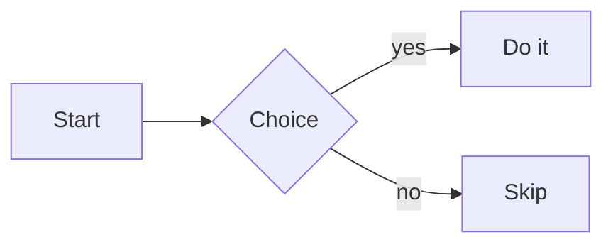

# Reading Themes Implementation Plan

> **For agentic workers:** REQUIRED SUB-SKILL: Use superpowers:subagent-driven-development (recommended) or superpowers:executing-plans to implement this plan task-by-task. Steps use checkbox (`- [ ]`) syntax for tracking.

**Goal:** Add three curated reading themes (Standard, Editorial, Terminal) to the content pane — each defining its own light and dark palette, body font, and syntax-highlighting stylesheet pair — selectable from the existing text-size menu.

**Architecture:** Themes live entirely in the web layer as CSS variable blocks scoped by an `html[data-theme="…"]` attribute plus a highlight.js stylesheet lookup table. Swift persists the choice and pushes it over the existing `window.ReaderMd.*` bridge, mirroring the light/dark `setTheme` path. Chrome (sidebar/topbar/outline) is untouched — only the content pane carries theme personality.

**Tech Stack:** SwiftUI/AppKit shell, WKWebView content pane, `bridge.js`, `template.html`, highlight.js v11.11.1 stylesheets, UserDefaults persistence, XCTest.

## Global Constraints

- **Deployment target macOS 13.** This feature introduces **no** macOS 26-only APIs, so **no new availability guards are needed** — do not add spurious `#available` checks. (The existing 26/Glass guards elsewhere are untouched.)
- **Do NOT touch `Color.accentColor` anywhere.** Chrome tinting is explicitly out of scope. The nine `Color.accentColor` call sites (`SidebarView`, `TOCView`, `FileTreeRow`, `QuickOpenView`, `MarkPopoverView`, `ResolvedThreadsToggle`) stay exactly as they are.
- **Persisted rawValues must not change.** `AppearanceMode` keeps rawValues `"light"`/`"dark"`; UserDefaults key `reader.md.theme` is unchanged. New key is `reader.md.readingTheme`.
- **The rename touches the TYPE symbol only.** Rename `AppTheme` → `AppearanceMode` (6 literal occurrences, verified below). Do NOT rename the property `theme`, the method `toggleTheme()`, `Settings.loadTheme/saveTheme`, the key `reader.md.theme`, or `ReaderMdApp.swift:22`.
- **New enum case is `standard`, not `default`** (`default` is a Swift keyword).
- **Standard theme = today's values verbatim.** Existing users must see zero visual change on upgrade — colors AND font stacks must be byte-identical to the current hardcoded values.
- **Conventional commit messages.** NO `Co-Authored-By` line, NO "Generated with Claude Code" line. (This overrides the Bash-tool/global git defaults, which the task explicitly countermands.)
- **No release in this plan.** The themed-PDF release note is recorded as text in Task 7; the actual release is the `release` skill's job, run separately.
- **No JS test framework exists in this repo.** Verification is `swift build`, `swift test`, `swift run`, and opening a fixture markdown file. Never invoke `npm test`, `jest`, or `pytest`.

### Rename surface (verified — spec's "15 call sites" is an overestimate)

`AppTheme` the **type** appears **6 times across 2 files**:

- `Sources/ReaderMd/Models/AppState.swift:6` — `enum AppTheme: String, CaseIterable {`
- `Sources/ReaderMd/Models/AppState.swift:24` — `var toggled: AppTheme { … }`
- `Sources/ReaderMd/Models/AppState.swift:63` — `@Published var theme: AppTheme = .light`
- `Sources/ReaderMd/Models/Settings.swift:39` — `static func loadTheme() -> AppTheme {`
- `Sources/ReaderMd/Models/Settings.swift:40` — `… let theme = AppTheme(rawValue: raw) {`
- `Sources/ReaderMd/Models/Settings.swift:48` — `static func saveTheme(_ theme: AppTheme) {`

Everything else that mentions "theme" references the **property** or **method**, not the type, and MUST stay: `AppState.theme`, `toggleTheme()`, `Settings.loadTheme/saveTheme`, key `reader.md.theme`, `TopBar.swift` (`state.theme.symbol`, `state.theme == .dark`), `ReaderMdApp.swift:22` (`state.theme.colorScheme`), `MarkdownWebView.swift` comments/`applyTheme`.

---

## File Structure

**Modified:**
- `Sources/ReaderMd/Models/AppState.swift` — rename type; add `ReadingTheme` enum, `@Published readingTheme`, `setReadingTheme(_:)`.
- `Sources/ReaderMd/Models/Settings.swift` — rename type in signatures; add `readingThemeKey`, `loadReadingTheme()`, `saveReadingTheme(_:)`.
- `Sources/ReaderMd/Views/MarkdownWebView.swift` — wire `readingTheme` change + first-`ready` push into the coordinator.
- `Sources/ReaderMd/Views/TopBar.swift` — inline Picker "Theme" section at top of the `textformat.size` menu.
- `Sources/ReaderMd/Resources/web/template.html` — add `--font-body`/`--font-mono` to all blocks; extend from 2 to 6 theme blocks; consume font vars in `body`/`code`.
- `Sources/ReaderMd/Resources/web/bridge.js` — `HLJS` lookup table + `window.ReaderMd.setReadingTheme(name)`.

**Created:**
- `Tests/ReaderMdTests/ReadingThemeTests.swift` — XCTest for the unknown-name fallback.
- `Sources/ReaderMd/Resources/web/styles/atom-one-light.min.css`
- `Sources/ReaderMd/Resources/web/styles/atom-one-dark.min.css`
- `Sources/ReaderMd/Resources/web/styles/stackoverflow-light.min.css`
- `Sources/ReaderMd/Resources/web/styles/stackoverflow-dark.min.css`

---

## Task 1: Rename `AppTheme` → `AppearanceMode`

Sequenced first, with its own commit, so the mechanical rename never tangles with feature work.

**Files:**
- Modify: `Sources/ReaderMd/Models/AppState.swift:6,24,63`
- Modify: `Sources/ReaderMd/Models/Settings.swift:39,40,48`

**Interfaces:**
- Consumes: nothing.
- Produces: `enum AppearanceMode: String, CaseIterable { case light, dark }` with `var colorScheme: ColorScheme?`, `var symbol: String`, `var toggled: AppearanceMode`. `AppState.theme: AppearanceMode`. `Settings.loadTheme() -> AppearanceMode`, `Settings.saveTheme(_ theme: AppearanceMode)`.

- [ ] **Step 1: Rename the enum declaration and its self-referencing return type in AppState.swift**

In `Sources/ReaderMd/Models/AppState.swift`, change line 6:

```swift
enum AppearanceMode: String, CaseIterable {
```

and line 24:

```swift
    var toggled: AppearanceMode { self == .dark ? .light : .dark }
```

and line 63:

```swift
    @Published var theme: AppearanceMode = .light
```

Leave `case light, dark`, `colorScheme`, `symbol`, the `theme` property NAME, and `toggleTheme()` unchanged.

- [ ] **Step 2: Rename the type in Settings.swift signatures**

In `Sources/ReaderMd/Models/Settings.swift`, line 39:

```swift
    static func loadTheme() -> AppearanceMode {
```

line 40:

```swift
        if let raw = defaults.string(forKey: themeKey), let theme = AppearanceMode(rawValue: raw) {
```

line 48:

```swift
    static func saveTheme(_ theme: AppearanceMode) {
```

Leave `themeKey = "reader.md.theme"` and `theme.rawValue` unchanged.

- [ ] **Step 3: Verify no stray `AppTheme` remains**

Run: `grep -rn "AppTheme" Sources/ Tests/`
Expected: no output (exit 1).

- [ ] **Step 4: Build**

Run: `swift build`
Expected: `Build complete!` with no errors.

- [ ] **Step 5: Run the existing test suite (regression guard)**

Run: `swift test`
Expected: all existing tests pass (`FuzzyScoreTests`, `RemoteSpecTests`, `RemoteSyncTests`) — the rename must not break the build the tests link against.

- [ ] **Step 6: Verify persistence unchanged — upgrade path (Verification item 7)**

Simulate an existing user whose saved appearance is dark:

```bash
defaults write com.reader.md reader.md.theme -string "dark"
swift run
```

Expected: the app launches in **dark** mode (dark content pane), proving the persisted `"dark"` rawValue still decodes into `AppearanceMode.dark`. Quit the app.

> Note: the bundle identifier for `defaults` is whatever `UserDefaults.standard` uses under `swift run`. If `com.reader.md` shows no effect, find the domain with `defaults domains | tr ',' '\n' | grep -i reader` and retry against that domain. The point of the check is: a pre-existing `reader.md.theme="dark"` yields dark on launch, unchanged from before.

- [ ] **Step 7: Commit**

```bash
git add Sources/ReaderMd/Models/AppState.swift Sources/ReaderMd/Models/Settings.swift
git commit -m "refactor: rename AppTheme to AppearanceMode"
```

---

## Task 2: `ReadingTheme` enum + persistence with unknown-name fallback (TDD)

**Files:**
- Create: `Tests/ReaderMdTests/ReadingThemeTests.swift`
- Modify: `Sources/ReaderMd/Models/AppState.swift` (add enum near the top, after `AppearanceMode`)
- Modify: `Sources/ReaderMd/Models/Settings.swift` (add key + load/save)

**Interfaces:**
- Consumes: nothing.
- Produces:
  - `enum ReadingTheme: String, CaseIterable { case standard, editorial, terminal }`
  - `static func named(_ raw: String?) -> ReadingTheme` — returns `.standard` for `nil` or any unrecognized rawValue.
  - `var displayName: String` — `"Standard"`, `"Editorial"`, `"Terminal"`.
  - `Settings.loadReadingTheme() -> ReadingTheme`, `Settings.saveReadingTheme(_ theme: ReadingTheme)`.

- [ ] **Step 1: Write the failing test**

Create `Tests/ReaderMdTests/ReadingThemeTests.swift`:

```swift
import XCTest
@testable import ReaderMd

/// The reading-theme name resolver must never fail closed: an absent or
/// unrecognized persisted name (e.g. a theme removed in a future version)
/// falls back to Standard rather than crashing startup.
final class ReadingThemeTests: XCTestCase {

    func testKnownNamesResolve() {
        XCTAssertEqual(ReadingTheme.named("standard"), .standard)
        XCTAssertEqual(ReadingTheme.named("editorial"), .editorial)
        XCTAssertEqual(ReadingTheme.named("terminal"), .terminal)
    }

    func testNilFallsBackToStandard() {
        XCTAssertEqual(ReadingTheme.named(nil), .standard)
    }

    func testUnknownNameFallsBackToStandard() {
        XCTAssertEqual(ReadingTheme.named("nonexistent"), .standard)
        XCTAssertEqual(ReadingTheme.named(""), .standard)
    }

    func testCaseIterableCoversAllThree() {
        XCTAssertEqual(ReadingTheme.allCases, [.standard, .editorial, .terminal])
    }
}
```

- [ ] **Step 2: Run the test to verify it fails**

Run: `swift test --filter ReadingThemeTests`
Expected: FAIL / compile error — `ReadingTheme` is not defined yet.

- [ ] **Step 3: Add the `ReadingTheme` enum**

In `Sources/ReaderMd/Models/AppState.swift`, immediately after the closing brace of `AppearanceMode` (after line 25), insert:

```swift
/// A curated content-pane theme: a palette + font stack + highlight.js
/// stylesheet pair. Orthogonal to `AppearanceMode` (light/dark) — a theme
/// defines *both* of its modes. The set is fixed; not user-editable.
enum ReadingTheme: String, CaseIterable {
    case standard, editorial, terminal

    var displayName: String {
        switch self {
        case .standard:  return "Standard"
        case .editorial: return "Editorial"
        case .terminal:  return "Terminal"
        }
    }

    /// Resolve a persisted rawValue, failing closed to `.standard` when the
    /// name is absent or unrecognized (so removing a theme can't brick startup).
    static func named(_ raw: String?) -> ReadingTheme {
        raw.flatMap(ReadingTheme.init(rawValue:)) ?? .standard
    }
}
```

- [ ] **Step 4: Run the test to verify it passes**

Run: `swift test --filter ReadingThemeTests`
Expected: PASS (4 tests).

- [ ] **Step 5: Add persistence to Settings.swift**

In `Sources/ReaderMd/Models/Settings.swift`, add the key alongside the others (after line 15, `showResolvedThreadsKey`):

```swift
    private static let readingThemeKey = "reader.md.readingTheme"
```

and add the load/save pair after the existing Theme block (after line 50, the closing brace of `saveTheme`):

```swift
    // Reading theme (content-pane palette + fonts + syntax stylesheet)
    static func loadReadingTheme() -> ReadingTheme {
        ReadingTheme.named(defaults.string(forKey: readingThemeKey))
    }
    static func saveReadingTheme(_ theme: ReadingTheme) {
        defaults.set(theme.rawValue, forKey: readingThemeKey)
    }
```

- [ ] **Step 6: Build and re-run the full suite**

Run: `swift build && swift test`
Expected: `Build complete!`, all tests pass.

- [ ] **Step 7: Manual bad-data check (Verification item 6)**

```bash
defaults write com.reader.md reader.md.readingTheme -string "nonexistent"
swift run
```

Expected: app launches with the **Standard** content-pane appearance, no crash. (Same domain caveat as Task 1 Step 6 applies.) Quit the app, then clean up: `defaults delete com.reader.md reader.md.readingTheme`.

- [ ] **Step 8: Commit**

```bash
git add Sources/ReaderMd/Models/AppState.swift Sources/ReaderMd/Models/Settings.swift Tests/ReaderMdTests/ReadingThemeTests.swift
git commit -m "feat: add ReadingTheme enum with unknown-name fallback"
```

---

## Task 3: Six theme blocks + font variables in `template.html`

**Files:**
- Modify: `Sources/ReaderMd/Resources/web/template.html:9-23` (the `:root` / `html.dark` blocks) and `:37-46` (`body`, `code` font-family).

**Interfaces:**
- Consumes: nothing (pure CSS; the `data-theme` attribute is set by Task 4's JS).
- Produces: CSS variables `--font-body`, `--font-mono` on every theme block; six theme×mode selectors: `:root`, `html.dark`, `html[data-theme="editorial"]`, `html[data-theme="editorial"].dark`, `html[data-theme="terminal"]`, `html[data-theme="terminal"].dark`.

- [ ] **Step 1: Record the current (Standard) values for the diff-check**

Run: `git show HEAD:Sources/ReaderMd/Resources/web/template.html | sed -n '9,23p'`
Expected output (this is the baseline Standard palette that must stay byte-identical):

```css
    :root {
      --bg: #ffffff; --fg: #1f2328; --border: #d8dee4; --accent: #0969da;
      --code-bg: #f6f8fa; --blockquote: #656d76;
      --content-width: 760px; --content-size: 16px;
    }
    html.dark {
      --bg: #1e2228; --fg: #e6edf3; --border: #30363d; --accent: #4493f8;
      --code-bg: #161b22; --blockquote: #8b949e;
    }
```

- [ ] **Step 2: Replace the `:root` / `html.dark` blocks with all six theme blocks**

In `Sources/ReaderMd/Resources/web/template.html`, replace lines 9-17 (the `:root { … }` and `html.dark { … }` blocks) with:

```css
    :root {
      --bg: #ffffff; --fg: #1f2328; --border: #d8dee4; --accent: #0969da;
      --code-bg: #f6f8fa; --blockquote: #656d76;
      --font-body: -apple-system, BlinkMacSystemFont, "Segoe UI", Helvetica, Arial, sans-serif;
      --font-mono: ui-monospace, SFMono-Regular, "SF Mono", Menlo, monospace;
      --content-width: 760px; --content-size: 16px;
    }
    html.dark {
      --bg: #1e2228; --fg: #e6edf3; --border: #30363d; --accent: #4493f8;
      --code-bg: #161b22; --blockquote: #8b949e;
    }

    /* Editorial — warm paper, serif body. Palette is a starting point, tuned in Task 7. */
    html[data-theme="editorial"] {
      --bg: #fbf7f0; --fg: #2b2724; --border: #ddd2c2; --accent: #8a4b2a;
      --code-bg: #f2ead d; --blockquote: #6f6558;
      --font-body: "New York", ui-serif, Georgia, "Times New Roman", serif;
      --font-mono: ui-monospace, SFMono-Regular, "SF Mono", Menlo, monospace;
    }
    html[data-theme="editorial"].dark {
      --bg: #22201d; --fg: #ece5d8; --border: #3a352e; --accent: #e0a458;
      --code-bg: #2a2723; --blockquote: #a89e8d;
    }

    /* Terminal — crisp, monospace body. Palette is a starting point, tuned in Task 7. */
    html[data-theme="terminal"] {
      --bg: #ffffff; --fg: #101418; --border: #d0d7de; --accent: #0a7a33;
      --code-bg: #f4f6f4; --blockquote: #5a655a;
      --font-body: ui-monospace, SFMono-Regular, "SF Mono", Menlo, monospace;
      --font-mono: ui-monospace, SFMono-Regular, "SF Mono", Menlo, monospace;
    }
    html[data-theme="terminal"].dark {
      --bg: #0b0e11; --fg: #d5e0d5; --border: #1e262b; --accent: #3fb950;
      --code-bg: #12171b; --blockquote: #6b786b;
    }
```

> Correction note for the implementer: fix the typo `#f2ead d` to a valid hex `#f2eadd` when typing — the plan spaces it only to flag it; the intended value is `#f2eadd`. Standard's `:root`/`html.dark` color values are copied verbatim from Step 1; only the two `--font-*` lines are added to `:root`. `--content-width`/`--content-size` stay in `:root` and are NOT duplicated into theme blocks (the JS overrides them inline on `documentElement.style`).

- [ ] **Step 3: Consume the font variables in `body` and `code`**

In the same file, change the `body` rule (was lines 20-23) so its `font-family` reads the variable:

```css
    html, body { margin: 0; background: var(--bg); color: var(--fg); }
    body {
      font-family: var(--font-body);
      -webkit-font-smoothing: antialiased;
    }
```

and change the inline `code` rule (was lines 37-40) `font-family` line:

```css
    code {
      background: var(--code-bg); padding: 0.2em 0.4em; border-radius: 5px; font-size: 85%;
      font-family: var(--font-mono);
    }
```

Leave `pre code`, `.copy-btn` (`font-family: -apple-system, sans-serif`), and all other rules unchanged. Headings have no `font-family` of their own, so they inherit `--font-body` from `body` automatically — Editorial gets serif headings for free.

- [ ] **Step 4: Diff-check that Standard is unchanged**

Run: `git diff Sources/ReaderMd/Resources/web/template.html`
Expected: the diff shows ONLY additions — the four new `html[data-theme=…]` blocks and the two `--font-*` lines in `:root` — plus the `body`/`code` `font-family` lines changing to `var(--font-body)` / `var(--font-mono)`. The six Standard color values (`--bg`, `--fg`, `--border`, `--accent`, `--code-bg`, `--blockquote` in `:root` and `html.dark`) must be untouched. Confirm the two literal font stacks in `:root` exactly equal the previously-hardcoded stacks (`-apple-system, BlinkMacSystemFont, "Segoe UI", Helvetica, Arial, sans-serif` and `ui-monospace, SFMono-Regular, "SF Mono", Menlo, monospace`).

- [ ] **Step 5: Build and smoke-launch (Standard still identical — Verification item 7 visual)**

Run: `swift build && swift run`
Expected: content pane renders exactly as before (no `data-theme` attribute is set yet, so `:root`/`html.dark` serve Standard). Open any markdown file; toggle light/dark with the ☀/☽ button — both look identical to the pre-change app. Quit.

- [ ] **Step 6: Commit**

```bash
git add Sources/ReaderMd/Resources/web/template.html
git commit -m "feat: add per-theme CSS variable blocks and font variables"
```

---

## Task 4: highlight.js stylesheets + `setReadingTheme` in `bridge.js`

**Files:**
- Create: `Sources/ReaderMd/Resources/web/styles/atom-one-light.min.css`, `atom-one-dark.min.css`, `stackoverflow-light.min.css`, `stackoverflow-dark.min.css`
- Modify: `Sources/ReaderMd/Resources/web/bridge.js` (add `HLJS` table near top; add `setReadingTheme` to the `window.ReaderMd` object)

**Interfaces:**
- Consumes: `initMermaid()`, `render(text, dir, keepScroll)`, `currentDir`, `window.__lastMarkdown` (all existing in `bridge.js`); DOM ids `hljs-light` / `hljs-dark` (existing in `template.html`); `data-theme` blocks (Task 3).
- Produces: `window.ReaderMd.setReadingTheme(name)` — sets/removes `documentElement.dataset.theme`, swaps both hljs `href`s, re-inits Mermaid, and scroll-preservingly re-renders.

- [ ] **Step 1: Download the four highlight.js stylesheets (v11.11.1, matching the bundled `highlight.min.js`)**

The existing `github.min.css` / `github-dark.min.css` were committed by hand into `styles/`; these are their siblings from the same distribution. Run from the repo root:

```bash
cd Sources/ReaderMd/Resources/web/styles
BASE="https://cdn.jsdelivr.net/gh/highlightjs/cdn-release@11.11.1/build/styles"
for f in atom-one-light atom-one-dark stackoverflow-light stackoverflow-dark; do
  curl -fsSL "$BASE/$f.min.css" -o "$f.min.css"
done
cd -
```

- [ ] **Step 2: Verify the downloads**

Run: `ls -l Sources/ReaderMd/Resources/web/styles/ && head -c 120 Sources/ReaderMd/Resources/web/styles/atom-one-light.min.css`
Expected: six `.css` files present (`github*`, `atom-one-*`, `stackoverflow-*`); each new file 800–1300 bytes and starting with `pre code.hljs{display:block;overflow-x:auto;padding:1em}`. These ship under the highlight.js npm package's `styles/` and are **BSD-3-Clause** licensed (same license as the already-bundled `highlight.min.js`), so no new license obligation beyond what the repo already carries.

- [ ] **Step 3: Add the `HLJS` lookup table to `bridge.js`**

In `Sources/ReaderMd/Resources/web/bridge.js`, after line 7 (`let currentDir = '';`), insert:

```javascript

// highlight.js stylesheet pairs [light, dark] per reading theme. Both hrefs are
// set on theme change (see setReadingTheme) so the currently-disabled sheet is
// already correct when the mode toggles — no flash of unstyled code.
const HLJS = {
  standard:  ['styles/github.min.css',             'styles/github-dark.min.css'],
  editorial: ['styles/atom-one-light.min.css',     'styles/atom-one-dark.min.css'],
  terminal:  ['styles/stackoverflow-light.min.css', 'styles/stackoverflow-dark.min.css'],
};
```

- [ ] **Step 4: Add `setReadingTheme` to the `window.ReaderMd` object**

In the same file, inside the `window.ReaderMd = { … }` object, add this method after the `setTheme` method (after line 34, the closing `},` of `setTheme`):

```javascript

  setReadingTheme(name) {
    const root = document.documentElement;
    // Standard must *remove* the attribute, not set it empty — html[data-theme=""]
    // would still match an attribute selector and shadow the :root defaults.
    if (name === 'standard') delete root.dataset.theme;
    else root.dataset.theme = name;
    const [light, dark] = HLJS[name] || HLJS.standard;
    document.getElementById('hljs-light').href = light;
    document.getElementById('hljs-dark').href = dark;
    initMermaid();
    if (window.__lastMarkdown != null) render(window.__lastMarkdown, currentDir, true);
  },
```

> This mirrors `setTheme(dark)` exactly: same `initMermaid()` + scroll-preserving re-render path. On first push (before any document loads) `window.__lastMarkdown` is `null`, so it only sets the attribute/hrefs and skips the re-render. Mermaid has only `'dark'`/`'default'` built-ins, so diagrams follow the mode, not the reading theme — accepted limitation.

- [ ] **Step 5: Build**

Run: `swift build`
Expected: `Build complete!` (SwiftPM copies the resource bundle including the four new CSS files).

- [ ] **Step 6: Commit**

```bash
git add Sources/ReaderMd/Resources/web/styles Sources/ReaderMd/Resources/web/bridge.js
git commit -m "feat: add syntax stylesheets and setReadingTheme bridge call"
```

---

## Task 5: Wire `readingTheme` through `AppState` and `MarkdownWebView`

**Files:**
- Modify: `Sources/ReaderMd/Models/AppState.swift` (add published property, init load, setter)
- Modify: `Sources/ReaderMd/Views/MarkdownWebView.swift` (coordinator field, `applyReadingTheme`, `updateNSView` call, first-`ready` push)

**Interfaces:**
- Consumes: `Settings.loadReadingTheme()`, `Settings.saveReadingTheme(_:)`, `ReadingTheme` (Task 2); `window.ReaderMd.setReadingTheme(name)` (Task 4).
- Produces: `AppState.readingTheme: ReadingTheme` (`@Published`), `AppState.setReadingTheme(_ theme: ReadingTheme)`; coordinator `applyReadingTheme(_ name: String)`.

- [ ] **Step 1: Add the published property and load it in `init`**

In `Sources/ReaderMd/Models/AppState.swift`, add the property next to `theme` (after line 63, `@Published var theme: AppearanceMode = .light`):

```swift
    @Published var readingTheme: ReadingTheme = .standard
```

and in `init()` (after line 120, `theme = Settings.loadTheme()`), add:

```swift
        readingTheme = Settings.loadReadingTheme()
```

- [ ] **Step 2: Add the setter next to `toggleTheme`**

In `AppState.swift`, in the "Theme / TOC persistence" MARK section, after `toggleTheme()` (after line 304), add:

```swift
    func setReadingTheme(_ theme: ReadingTheme) {
        readingTheme = theme
        Settings.saveReadingTheme(theme)
    }
```

- [ ] **Step 3: Add coordinator state + `applyReadingTheme`**

In `Sources/ReaderMd/Views/MarkdownWebView.swift`, add a coordinator field next to `private var lastDark: Bool?` (after line 133):

```swift
        private var lastReadingTheme: String?
```

and add the method right after `applyTheme(isDark:)` (after line 149):

```swift
        func applyReadingTheme(_ name: String) {
            guard isReady, lastReadingTheme != name else { lastReadingTheme = name; return }
            lastReadingTheme = name
            webView?.evaluateJavaScript("window.ReaderMd.setReadingTheme('\(name)');")
        }
```

> `name` is a `ReadingTheme.rawValue` — one of `standard`/`editorial`/`terminal`, all bare ASCII identifiers, so single-quote interpolation is safe (no escaping needed), matching the existing `setTheme(\(isDark))` style.

- [ ] **Step 4: Call it from `updateNSView`**

In `MarkdownWebView.swift`, in `updateNSView`, right after the existing `coord.applyTheme(isDark:)` line (line 75), add:

```swift
        coord.applyReadingTheme(state.readingTheme.rawValue)
```

- [ ] **Step 5: Push the reading theme on first `ready`**

In `MarkdownWebView.swift`, in the `case "ready":` handler, add the reading-theme push before the `if loadedPath != nil { pushCurrentFile(keepScroll: false) }` line (after line 360, the `setWide` push). Set the attribute/hrefs before the document loads so the very first render is already themed:

```swift
                if let name = lastReadingTheme {
                    webView?.evaluateJavaScript("window.ReaderMd.setReadingTheme('\(name)');")
                }
```

> Ordering: on `ready`, `setTheme` (existing) then `setReadingTheme` (new) run before `pushCurrentFile`. Both call `initMermaid`, and both skip the re-render when `__lastMarkdown` is null (no document yet), so there is no double render. `lastReadingTheme` is populated by the `applyReadingTheme` call in `updateNSView`, which runs before `ready` fires.

- [ ] **Step 6: Build**

Run: `swift build`
Expected: `Build complete!`.

- [ ] **Step 7: Smoke-test theme switching via the console (no UI yet)**

Run: `swift run`, open a markdown file with a code block. The TopBar menu item lands in Task 6, so exercise the bridge directly is not possible from UI here — instead confirm the wiring compiles and the default (Standard) still renders identically. Toggle light/dark; confirm still identical to before. Quit.

- [ ] **Step 8: Commit**

```bash
git add Sources/ReaderMd/Models/AppState.swift Sources/ReaderMd/Views/MarkdownWebView.swift
git commit -m "feat: persist and apply reading theme through the web bridge"
```

---

## Task 6: Theme picker in the TopBar text-size menu

**Files:**
- Modify: `Sources/ReaderMd/Views/TopBar.swift:63-78` (the `textformat.size` `Menu` content)

**Interfaces:**
- Consumes: `AppState.readingTheme` (`@Published`), `AppState.setReadingTheme(_:)`, `ReadingTheme.allCases`, `ReadingTheme.displayName` (Tasks 2, 5).
- Produces: no new API; UI only.

- [ ] **Step 1: Add the inline Picker section at the top of the menu**

In `Sources/ReaderMd/Views/TopBar.swift`, replace the `Menu { … }` **content** (lines 64-71, from `Button("Increase Text  ⌘+")` through the `Toggle(...)` closing `))`) so a Theme picker sits above the existing items:

```swift
                Menu {
                    Picker("Theme", selection: Binding(
                        get: { state.readingTheme },
                        set: { state.setReadingTheme($0) }
                    )) {
                        ForEach(ReadingTheme.allCases, id: \.self) { theme in
                            Text(theme.displayName).tag(theme)
                        }
                    }
                    .pickerStyle(.inline)

                    Divider()
                    Button("Increase Text  ⌘+") { state.adjustFontScale(0.1) }
                    Button("Decrease Text  ⌘−") { state.adjustFontScale(-0.1) }
                    Button("Actual Size  ⌘0") { state.resetFontScale() }
                    Divider()
                    Toggle("Wide Reading Column", isOn: Binding(
                        get: { state.wideReading },
                        set: { _ in state.toggleWideReading() }
                    ))
                } label: {
                    Image(systemName: "textformat.size")
                }
```

Leave the `.menuStyle`, `.menuIndicator`, `.frame`, and `.help` modifiers after the `Menu` unchanged. `ReadingTheme` is `Hashable` (String-backed enum), so `.tag(theme)` and `id: \.self` are valid.

> An inline `Picker` inside a `Menu` renders a "Theme" section header with a checkmark on the selected row — matching the spec mockup. If on macOS 13 the inline picker fails to show a header or checkmarks, fall back to a `Section("Theme")` of `Button`s, each labeled `Label(theme.displayName, systemImage: state.readingTheme == theme ? "checkmark" : "")`. Verify the actual rendering in Step 3 before settling.

- [ ] **Step 2: Build**

Run: `swift build`
Expected: `Build complete!`.

- [ ] **Step 3: Verify the menu renders with checkmarks and switches theme**

Run: `swift run`, open a markdown file containing a code block. Click the `textformat.size` (Aa) button.
Expected: menu shows a **Theme** header, three rows (Standard / Editorial / Terminal) with a checkmark on the active one, a divider, then Increase/Decrease/Actual Size, a divider, then Wide Reading Column. Pick **Editorial** → body switches to serif, background warms, code block restyles (atom-one). Pick **Terminal** → monospace body, stackoverflow code colors. Pick **Standard** → returns to the original look. Confirm the checkmark follows your selection. Quit.

- [ ] **Step 4: Commit**

```bash
git add Sources/ReaderMd/Views/TopBar.swift
git commit -m "feat: add reading theme picker to text-size menu"
```

---

## Task 7: Palette tuning, full-matrix verification, release note

The hex values from Task 3 for Editorial/Terminal are starting points. This task tunes them against a real document and confirms all nine spec verification items.

**Files:**
- Modify: `Sources/ReaderMd/Resources/web/template.html` (only if tuning adjusts hexes)

**Interfaces:**
- Consumes: everything from Tasks 3–6.
- Produces: final tuned palettes; a recorded release-note line (added to the changelog later by the `release` skill, not here).

- [ ] **Step 1: Create the verification fixture**

Write this to a scratch path (it is a throwaway, not committed):

```bash
cat > /tmp/theme-fixture.md <<'EOF'
# Reading Themes Fixture

A paragraph of body text to judge the reading typeface and measure — the quick
brown fox jumps over the lazy dog, and then keeps on jumping for a while.

## Code block

```swift
func greet(_ name: String) -> String {
    let greeting = "Hello, \(name)!"
    return greeting  // keyword / string / comment colors
}
```

Inline `code span` should use the mono variable.

## Mermaid



## LaTeX

Inline $E = mc^2$ and display:

$$\int_0^\infty e^{-x^2}\,dx = \frac{\sqrt{\pi}}{2}$$

## Table

| Theme     | Body font | Accent  |
| --------- | --------- | ------- |
| Standard  | sans      | blue    |
| Editorial | serif     | rust    |
| Terminal  | mono      | green   |

## Blockquote

> The content pane carries the personality; the chrome stays system-native.
EOF
```

- [ ] **Step 2: Walk all six theme × mode combinations (Verification items 1, 2, 4, 9)**

Run: `swift run`, then File → open `/tmp/theme-fixture.md` (or drag it onto the window).
For each of the three themes, and within each toggle light↔dark (☀/☽):
- **Item 1:** all six combos render; no unstyled flash on switch.
- **Item 2:** the code block, Mermaid diagram, LaTeX (inline + display), table, and blockquote all render in every combo.
- **Item 4:** syntax highlighting matches the theme (github / atom-one / stackoverflow) AND still swaps light↔dark within a theme.
- **Item 9:** in Editorial, headings and body are serif but the code block and inline `code span` are monospace (font-mono unchanged).

Note any palette that reads poorly (low contrast, muddy accent, code-bg too close to bg).

- [ ] **Step 3: Verify scroll preservation and text scaling (Verification items 3, 8)**

- **Item 3:** scroll to the Table section, switch theme via the Aa menu — scroll position is preserved (the `keepScroll` re-render path).
- **Item 8:** in each theme, press ⌘+ / ⌘− / ⌘0 — text scales in the content pane regardless of theme.

- [ ] **Step 4: Verify persistence across restart (Verification item 5)**

Pick **Terminal**, quit (⌘Q), relaunch `swift run`.
Expected: the app reopens in Terminal (the `reader.md.readingTheme` key survived). Item 6 (unknown-name fallback) and item 7 (existing `reader.md.theme="dark"` → Standard-dark) were already proven in Task 2 Step 7 and Task 1 Step 6.

- [ ] **Step 5: Tune palettes if Step 2 flagged issues**

If any Editorial/Terminal value read poorly, edit the corresponding `html[data-theme=…]` block in `Sources/ReaderMd/Resources/web/template.html`. Keep changes to the four themed blocks only — `:root`/`html.dark` (Standard) stay verbatim. Re-run Step 2's walk to confirm. If no tuning is needed, note that and skip the edit.

- [ ] **Step 6: Verify themed PDF export (spec Consequences) and record the release note**

Run: `swift run`, open the fixture in **Editorial dark**, press ⌘E, save, and open the PDF.
Expected: the PDF is themed (Editorial dark palette + serif body), consistent with how light/dark export already behaves.

Record this line verbatim for the eventual changelog (the `release` skill adds it; do not run a release here):

> Reading themes: Standard, Editorial, and Terminal, each with its own light/dark palette, body font, and syntax colors — pick one from the text-size (Aa) menu. PDF export (⌘E) renders through the active theme.

- [ ] **Step 7: Commit (only if Step 5 changed the template)**

```bash
git add Sources/ReaderMd/Resources/web/template.html
git commit -m "fix: tune Editorial and Terminal palettes"
```

If Step 5 made no changes, there is nothing to commit for this task — the release note is recorded above for later use.

---

## Self-Review

**1. Spec coverage — all 9 Verification items map to a concrete step:**

| # | Verification item | Where checked |
| --- | --- | --- |
| 1 | Six combos render; no flash | Task 7 Step 2 |
| 2 | Code/Mermaid/LaTeX/table/blockquote survive all six | Task 7 Step 2 (fixture in Step 1) |
| 3 | Switching theme preserves scroll | Task 7 Step 3 |
| 4 | Syntax swaps with theme AND with mode | Task 7 Step 2 |
| 5 | Theme survives restart | Task 7 Step 4 |
| 6 | `"nonexistent"` → Standard, no crash | Task 2 Step 1 (XCTest) + Step 7 (manual `defaults write`) |
| 7 | Existing `reader.md.theme="dark"` → Standard-dark, identical | Task 1 Step 6 + Task 3 Step 5 (visual identity) |
| 8 | ⌘+/⌘− scale text in every theme | Task 7 Step 3 |
| 9 | Editorial serif on headings+body, not code | Task 7 Step 2 |

Other spec areas: rename (Task 1), `ReadingTheme`/fallback (Task 2), six CSS blocks + font vars (Task 3), HLJS table + `setReadingTheme` + four stylesheets (Task 4), AppState/WebView wiring (Task 5), TopBar menu section (Task 6), themed-PDF release note (Task 7 Step 6). Chrome untouched and `Color.accentColor` off-limits — Global Constraints. No gaps.

**2. Placeholder scan:** No "TBD"/"add appropriate X"/"similar to Task N". Every code step shows complete code. The one intentional flag (`#f2ead d`) is called out with its corrected value `#f2eadd` inline so it can't slip through as real content.

**3. Type/name consistency:** `AppearanceMode` (Task 1) used consistently. `ReadingTheme` with cases `standard`/`editorial`/`terminal`, `displayName`, `named(_:)` (Task 2) — consumed unchanged in Tasks 5 (`state.readingTheme.rawValue`, `Settings.loadReadingTheme`) and 6 (`ReadingTheme.allCases`, `.displayName`). `setReadingTheme` names align across `bridge.js` (`window.ReaderMd.setReadingTheme(name)`, Task 4), `AppState.setReadingTheme(_:)` (Task 5 Step 2), and coordinator `applyReadingTheme(_:)` (Task 5 Step 3). DOM ids `hljs-light`/`hljs-dark` match `template.html`. `HLJS` keys (`standard`/`editorial`/`terminal`) match `data-theme` values and enum rawValues. Consistent.

---

## Execution Handoff

**Plan complete and saved to `docs/superpowers/plans/2026-07-09-reading-themes.md`. Two execution options:**

**1. Subagent-Driven (recommended)** — dispatch a fresh subagent per task, review between tasks, fast iteration.

**2. Inline Execution** — execute tasks in this session using executing-plans, batch execution with checkpoints.

**Which approach?**
