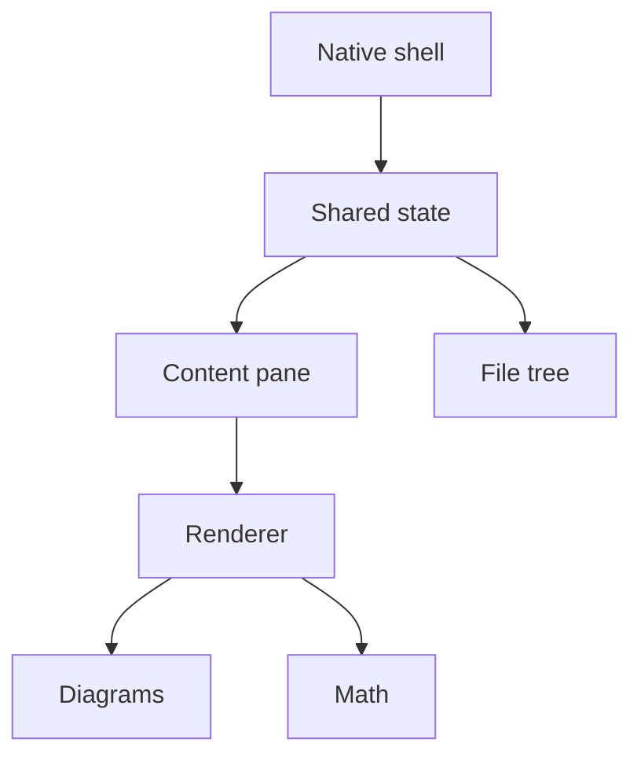

# Feature Documentation with Real Screenshots — Implementation Plan

> **For agentic workers:** REQUIRED SUB-SKILL: Use superpowers:subagent-driven-development (recommended) or superpowers:executing-plans to implement this plan task-by-task. Steps use checkbox (`- [ ]`) syntax for tracking.

**Goal:** Build a committed, reusable capture harness and skill that documents every Reader.md feature as web-published pages backed by real screenshots and clips, then prove it by shipping one finished page (`/docs/reading`).

**Architecture:** A shot manifest (JSON, committed beside each docs page) is executed by `capture.sh`, which drives an isolated build of the app via AppleScript keystrokes and the `reader` CLI, captures each state with `screencapture`, and writes PNGs and MP4s into `docs/assets/screenshots/`. Prose lives in `docs/features/*.md` and the Astro site renders those files directly through a content collection, so there is exactly one copy of every sentence. A project-scoped skill at `.claude/skills/reader-docs/` orchestrates the whole loop behind three approval gates.

**Tech Stack:** bash, Swift (single-file scripts run via `swift <file>.swift`), AppleScript via `osascript`, `screencapture`, `sips`, `ffmpeg`, `jq`, Astro 7 content collections, remark.

**Spec:** `docs/superpowers/specs/2026-08-12-feature-docs-with-screenshots-design.md`

## Global Constraints

- **Platform:** macOS 26.6.1 (Tahoe) verified; screenshots show real Liquid Glass. Deployment target of the app stays macOS 13 — this work adds no app code beyond one line in `make-app.sh`.
- **Permissions:** the terminal running the harness needs **Screen Recording** (for `screencapture` and window titles) and **Accessibility** (for System Events). Both are already granted on this machine.
- **External dependencies:** `ffmpeg` and `jq` only. Both are present (`/opt/homebrew/bin/ffmpeg`, `jq`). `oxipng`, `pngquant`, ImageMagick, and `cliclick` are **not installed and must not be used** — PNG scaling and image comparison both go through `ffmpeg`, and cursor parking goes through a Swift helper.
- **Isolation:** the harness drives bundle id `com.nahian.reader-md.shots` and must refuse to run against `com.nahian.reader-md`. The real app's preference keys are namespaced `reader.md.*`.
- **Image budget:** one theme (light) throughout, except the appearance page where dark is the subject. Stills capped at 2400px wide. Five video clips total across all ten pages.
- **Site rules** (from `web/CLAUDE.md`): no CSS framework, no client-side framework; colours/radii/spacing come from tokens in `src/styles/global.css` — a hard-coded hex is a mistake; all motion sits behind `prefers-reduced-motion`.
- **Publishing is merging:** Cloudflare Pages builds and publishes on any push to `main` touching `web/`. There is no staging step.
- **Copy rule:** shortcuts are always written parenthesised after the label — "Toggle outline (⇧⌘B)".
- **Authority for shortcuts:** the `.keyboardShortcut` bindings in `Sources/ReaderMd/ReaderMdApp.swift`. Never copy a shortcut from the README or the site.

## File Structure

| Path | Responsibility |
|---|---|
| `make-app.sh:8` | Modified — allow `BUNDLE_ID` to be overridden from the environment |
| `.claude/skills/reader-docs/SKILL.md` | Orchestrator: the loop and the three gates |
| `.claude/skills/reader-docs/references/manifest-schema.md` | Manifest field reference |
| `.claude/skills/reader-docs/references/page-template.md` | Page structure |
| `.claude/skills/reader-docs/references/manual-shots.md` | Checklist for non-scriptable shots |
| `.claude/skills/reader-docs/references/voice.md` | Tone rules |
| `.claude/skills/reader-docs/scripts/winid.swift` | Resolve the app's CGWindowID |
| `.claude/skills/reader-docs/scripts/cursor.swift` | Park the mouse pointer at a fixed point |
| `.claude/skills/reader-docs/scripts/fixtures.sh` | Generate the fixture corpus and git repo |
| `.claude/skills/reader-docs/scripts/capture.sh` | Execute a manifest: guards, geometry, settle, capture, encode |
| `docs/features/reading.md` | Pilot page prose |
| `docs/features/reading.shots.json` | Pilot page manifest |
| `docs/features.md` | Reduced to an index |
| `docs/assets/screenshots/reading/*` | Captured assets |
| `web/src/content.config.ts` | Astro collection globbing `../docs/features` |
| `web/src/pages/docs/[...slug].astro` | One route per page |
| `web/src/components/DocsNav.astro` | Cross-page navigation |
| `web/src/components/DocsMedia.astro` | Renders a still or a clip |
| `web/plugins/remark-docs-assets.mjs` | Rewrites asset paths, swaps `.mp4` to the video component |
| `web/package.json` | `prebuild` script copying assets into `public/` |
| `web/.gitignore` | Ignores `public/screenshots` |

---

### Task 1: Isolated app build

The spec's only unverified assumption. Do it first: if the one-line change fights Sparkle or signing, the fallback decision must happen before anything depends on it.

**Files:**
- Modify: `make-app.sh:8`

**Interfaces:**
- Produces: an app bundle at `build/Reader.md.app` whose `CFBundleIdentifier` is `${BUNDLE_ID:-com.nahian.reader-md}`, so `BUNDLE_ID=com.nahian.reader-md.shots ./make-app.sh` yields a shots build.

- [ ] **Step 1: Write the failing test**

Create `/tmp/t1.sh`:

```bash
#!/bin/bash
# Asserts the default build keeps its bundle id and an overridden build changes it.
set -euo pipefail
cd "$(git rev-parse --show-toplevel)"

BUNDLE_ID=com.nahian.reader-md.shots ./make-app.sh >/dev/null
got=$(defaults read "$PWD/build/Reader.md.app/Contents/Info" CFBundleIdentifier)
[ "$got" = "com.nahian.reader-md.shots" ] || { echo "FAIL: override ignored, got $got"; exit 1; }

./make-app.sh >/dev/null
got=$(defaults read "$PWD/build/Reader.md.app/Contents/Info" CFBundleIdentifier)
[ "$got" = "com.nahian.reader-md" ] || { echo "FAIL: default changed, got $got"; exit 1; }

echo "PASS"
```

- [ ] **Step 2: Run it to verify it fails**

Run: `bash /tmp/t1.sh`
Expected: `FAIL: override ignored, got com.nahian.reader-md`

- [ ] **Step 3: Make the change**

In `make-app.sh`, line 8, replace:

```bash
BUNDLE_ID="com.nahian.reader-md"
```

with:

```bash
# Overridable so the docs harness can build an isolated bundle (its own
# UserDefaults domain) without touching the real app's saved folders.
BUNDLE_ID="${BUNDLE_ID:-com.nahian.reader-md}"
```

- [ ] **Step 4: Run it to verify it passes**

Run: `bash /tmp/t1.sh`
Expected: `PASS`

- [ ] **Step 5: Verify the shots build actually reads its own preference domain**

```bash
BUNDLE_ID=com.nahian.reader-md.shots ./make-app.sh >/dev/null
defaults write com.nahian.reader-md.shots reader.md.folders -array "$HOME/Desktop"
open -a "$PWD/build/Reader.md.app"
sleep 4
defaults read com.nahian.reader-md.shots reader.md.folders
```

Expected: the array containing `~/Desktop`, and the launched app's sidebar shows **only** Desktop — not your real folders. If the sidebar shows your real folders, the isolation failed: stop, and switch to the spec's stated fallback (`defaults export` / `defaults import` with `killall cfprefsd` around each run), recording that decision in the plan before continuing.

Then clean up:

```bash
osascript -e 'tell application "Reader.md" to quit'
defaults delete com.nahian.reader-md.shots
./make-app.sh >/dev/null
```

- [ ] **Step 6: Confirm Sparkle wiring is unaffected in the default build**

Run: `defaults read "$PWD/build/Reader.md.app/Contents/Info" SUFeedURL`
Expected: the GitHub `releases/latest/download/appcast.xml` URL, unchanged.

- [ ] **Step 7: Commit**

```bash
git add make-app.sh
git commit -m "build: allow BUNDLE_ID to be overridden

The docs capture harness needs an app bundle with its own UserDefaults
domain so it can seed fixture folders without touching the real app's
saved roots. Default is unchanged."
```

---

### Task 2: Window and cursor helpers

**Files:**
- Create: `.claude/skills/reader-docs/scripts/winid.swift`
- Create: `.claude/skills/reader-docs/scripts/cursor.swift`

**Interfaces:**
- Produces: `swift winid.swift <owner-substring>` prints `<windowNumber>` on stdout and exits 0, or prints an error to stderr and exits 1 when no matching on-screen layer-0 window exists.
- Produces: `swift cursor.swift <x> <y>` warps the pointer to the given global screen point and exits 0.

- [ ] **Step 1: Write the failing test**

Create `.claude/skills/reader-docs/scripts/test-helpers.sh`:

```bash
#!/bin/bash
# Helper contract tests. Run with Reader.md NOT running.
set -uo pipefail
cd "$(dirname "$0")"

swift winid.swift NoSuchAppXYZ >/dev/null 2>&1
[ $? -eq 1 ] || { echo "FAIL: winid should exit 1 when no window matches"; exit 1; }

open -a "$(git rev-parse --show-toplevel)/build/Reader.md.app"
sleep 4
id=$(swift winid.swift Reader) || { echo "FAIL: winid exited nonzero with app running"; exit 1; }
[[ "$id" =~ ^[0-9]+$ ]] || { echo "FAIL: winid printed non-numeric: $id"; exit 1; }

swift cursor.swift 10 10 || { echo "FAIL: cursor exited nonzero"; exit 1; }

osascript -e 'tell application "Reader.md" to quit'
echo "PASS"
```

Then: `chmod +x .claude/skills/reader-docs/scripts/test-helpers.sh`

- [ ] **Step 2: Run it to verify it fails**

Run: `.claude/skills/reader-docs/scripts/test-helpers.sh`
Expected: failure — `swift` cannot open `winid.swift` because it does not exist.

- [ ] **Step 3: Write `winid.swift`**

```swift
// Prints the CGWindowID of the first on-screen, layer-0 window whose owning
// application name contains the given substring. Layer 0 excludes menus,
// tooltips, and other floating chrome — we want the document window.
import CoreGraphics
import Foundation

guard CommandLine.arguments.count > 1 else {
    FileHandle.standardError.write("usage: winid.swift <owner-substring>\n".data(using: .utf8)!)
    exit(2)
}
let needle = CommandLine.arguments[1]

let windows = CGWindowListCopyWindowInfo(
    [.optionOnScreenOnly, .excludeDesktopElements], kCGNullWindowID
) as? [[String: Any]] ?? []

for w in windows {
    let owner = w[kCGWindowOwnerName as String] as? String ?? ""
    let layer = w[kCGWindowLayer as String] as? Int ?? -1
    guard owner.contains(needle), layer == 0,
          let number = w[kCGWindowNumber as String] as? Int else { continue }
    print(number)
    exit(0)
}

FileHandle.standardError.write("winid: no on-screen window for '\(needle)'\n".data(using: .utf8)!)
exit(1)
```

- [ ] **Step 4: Write `cursor.swift`**

```swift
// Parks the mouse pointer at a fixed global screen point. Video capture always
// records the cursor and has no flag to hide it, so the harness moves it out of
// frame before recording — otherwise it drifts through clips and varies between
// sweeps.
import CoreGraphics
import Foundation

guard CommandLine.arguments.count > 2,
      let x = Double(CommandLine.arguments[1]),
      let y = Double(CommandLine.arguments[2]) else {
    FileHandle.standardError.write("usage: cursor.swift <x> <y>\n".data(using: .utf8)!)
    exit(2)
}

CGWarpMouseCursorPosition(CGPoint(x: x, y: y))
CGAssociateMouseAndMouseCursorPosition(1)
exit(0)
```

- [ ] **Step 5: Run the test to verify it passes**

Run: `.claude/skills/reader-docs/scripts/test-helpers.sh`
Expected: `PASS`

- [ ] **Step 6: Commit**

```bash
git add .claude/skills/reader-docs/scripts/
git commit -m "feat(docs): add window-id and cursor-parking helpers

winid.swift resolves the app's CGWindowID so screencapture can target the
window without an interactive picker. cursor.swift parks the pointer out
of frame, which video capture needs because it always records the cursor."
```

---

### Task 3: Fixture corpus generator

Fixtures are generated into a temp directory, never committed: `FileScanner` scans roots recursively for markdown, so committed fixtures would appear in the sidebar next to the real docs — including inside the screenshots.

**Files:**
- Create: `.claude/skills/reader-docs/scripts/fixtures.sh`

**Interfaces:**
- Produces: `fixtures.sh` creates `$TMPDIR/reader-md-fixtures/` containing `field-notes/` (a plain markdown library) and `field-guide/` (a git repository with dirty state), and prints the root path on stdout. Idempotent: re-running deletes and rebuilds. Deterministic: identical content and identical commit SHAs on every run.

- [ ] **Step 1: Write the failing test**

Create `.claude/skills/reader-docs/scripts/test-fixtures.sh`:

```bash
#!/bin/bash
# fixtures.sh must be deterministic: two runs produce identical trees and
# identical commit SHAs. Without pinned dates, diff screenshots churn every sweep.
set -uo pipefail
cd "$(dirname "$0")"

root=$(./fixtures.sh) || { echo "FAIL: fixtures.sh exited nonzero"; exit 1; }
[ -d "$root/field-notes" ] || { echo "FAIL: no field-notes"; exit 1; }
[ -d "$root/field-guide/.git" ] || { echo "FAIL: no git repo"; exit 1; }

sum1=$(find "$root/field-notes" -type f -exec shasum {} \; | sed "s|$root||" | sort | shasum)
sha1=$(git -C "$root/field-guide" log --format=%H | shasum)
status1=$(git -C "$root/field-guide" status --porcelain | sort | shasum)

root=$(./fixtures.sh)
sum2=$(find "$root/field-notes" -type f -exec shasum {} \; | sed "s|$root||" | sort | shasum)
sha2=$(git -C "$root/field-guide" log --format=%H | shasum)
status2=$(git -C "$root/field-guide" status --porcelain | sort | shasum)

[ "$sum1" = "$sum2" ] || { echo "FAIL: file content not deterministic"; exit 1; }
[ "$sha1" = "$sha2" ] || { echo "FAIL: commit SHAs not deterministic — pin GIT_*_DATE"; exit 1; }
[ "$status1" = "$status2" ] || { echo "FAIL: dirty state not deterministic"; exit 1; }

git -C "$root/field-guide" status --porcelain | grep -q '^ M' || { echo "FAIL: no modified file"; exit 1; }
git -C "$root/field-guide" status --porcelain | grep -q '^A ' || { echo "FAIL: no staged add"; exit 1; }
git -C "$root/field-guide" status --porcelain | grep -q '^??' || { echo "FAIL: no untracked file"; exit 1; }

echo "PASS"
```

Then: `chmod +x .claude/skills/reader-docs/scripts/test-fixtures.sh`

- [ ] **Step 2: Run it to verify it fails**

Run: `.claude/skills/reader-docs/scripts/test-fixtures.sh`
Expected: `FAIL: fixtures.sh exited nonzero` (the script does not exist yet).

- [ ] **Step 3: Write `fixtures.sh`**

```bash
#!/bin/bash
# Generates the screenshot fixture corpus into a temp directory and prints its
# path. Never commit fixtures: FileScanner scans roots recursively for markdown,
# so committed fixtures would show up in the sidebar beside the real docs — and
# inside the screenshots.
#
# Everything here is deterministic. Commit dates are pinned so that diff and
# badge screenshots don't churn on every sweep.
set -euo pipefail

ROOT="${TMPDIR:-/tmp}/reader-md-fixtures"
rm -rf "$ROOT"
mkdir -p "$ROOT/field-notes/guides" "$ROOT/field-notes/reference"

cat > "$ROOT/field-notes/index.md" <<'EOF'
---
title: Field Notes
updated: 2026-03-04
tags: [handbook, reference]
---

# Field Notes

A small working handbook. Start with the [setup guide](guides/setup.md), then
skim the [reference](reference/shortcuts.md).

## What lives here

| Section | Contents |
|---|---|
| Guides | Task-shaped walkthroughs |
| Reference | Tables and lookups |

> Notes are written as they are learned, and corrected as they are disproven.
EOF

cat > "$ROOT/field-notes/guides/setup.md" <<'EOF'
# Setting up a workspace

A long enough document to scroll, with enough headings to fill an outline.

## Before you start

You will need a terminal, a text editor, and about twenty minutes.

## Installing the toolchain

Install the compiler first. Everything else depends on it.

```bash
brew install swiftlint
swift build -c release
```

### Verifying the install

Run the version command and confirm the output.

### Common problems

If the command is not found, your shell profile is not being sourced.

## Configuring the editor

Point the editor at the workspace root, not at an individual file.

### Themes

Pick a light theme for daylight work.

### Extensions

Fewer is better. Each one costs startup time.

## First build

The first build is slow because nothing is cached yet.

## Next steps

Read the reference, then come back and skim this again.
EOF

cat > "$ROOT/field-notes/guides/architecture.md" <<'EOF'
# Architecture

The shape of the system, and why it is shaped that way.



## Throughput

Given a queue of $n$ documents and a service rate $\mu$, the steady-state wait is:

$$W = \frac{1}{\mu - \lambda}$$

which is why $\lambda$ must stay below $\mu$.

## Layers

The shell owns layout. The renderer owns content. Nothing crosses that line.
EOF

cat > "$ROOT/field-notes/reference/shortcuts.md" <<'EOF'
# Reference

## Codes

| Code | Meaning |
|---|---|
| `A` | Added |
| `M` | Modified |
| `U` | Unmerged |

## Example

```swift
struct Document: Identifiable {
    let id: UUID
    let title: String
    var wordCount: Int
}
```
EOF

cat > "$ROOT/field-notes/reference/glossary.md" <<'EOF'
# Glossary

**Canvas** — the area a document is laid out in.

**Outline** — the heading structure of the current document.

**Root** — a folder added to the sidebar.
EOF

# --- git fixture -------------------------------------------------------------
# A repository cannot be nested inside this one, so it is built here. Dates are
# pinned; without that, every sweep produces new commit SHAs and new diffs.
REPO="$ROOT/field-guide"
mkdir -p "$REPO"
git init -q "$REPO"
git -C "$REPO" config user.name "Field Guide"
git -C "$REPO" config user.email "guide@example.com"
git -C "$REPO" config commit.gpgsign false

export GIT_AUTHOR_DATE="2026-01-15T09:00:00+00:00"
export GIT_COMMITTER_DATE="2026-01-15T09:00:00+00:00"

cat > "$REPO/README.md" <<'EOF'
# Field Guide

Notes that travel with the project.

## Scope

One page per decision. If it needs two, it was two decisions.
EOF

cat > "$REPO/decisions.md" <<'EOF'
# Decisions

## Storage

We keep documents on disk and read them directly.

## Rendering

Rendering happens in one place so that it behaves the same everywhere.

## Navigation

The sidebar is a tree. Recents sit above it.
EOF

git -C "$REPO" add -A
git -C "$REPO" commit -qm "Add the field guide"

export GIT_AUTHOR_DATE="2026-02-02T14:30:00+00:00"
export GIT_COMMITTER_DATE="2026-02-02T14:30:00+00:00"

cat >> "$REPO/decisions.md" <<'EOF'

## Search

Filtering the tree and searching a document are different tasks, so they get
different controls.
EOF

git -C "$REPO" add -A
git -C "$REPO" commit -qm "Record the search decision"

# Dirty state, so the sidebar badges and the diff view have something to show.
# Modified (M):
cat >> "$REPO/README.md" <<'EOF'

## Conventions

Headings are sentence case. Links are relative.
EOF

# Staged add (A):
cat > "$REPO/roadmap.md" <<'EOF'
# Roadmap

Near-term work, in the order we expect to do it.

1. Finish the reference pages
2. Revisit the glossary
EOF
git -C "$REPO" add roadmap.md

# Untracked (?):
cat > "$REPO/scratch.md" <<'EOF'
# Scratch

Half-formed notes that are not ready to be filed.
EOF

echo "$ROOT"
```

Then: `chmod +x .claude/skills/reader-docs/scripts/fixtures.sh`

- [ ] **Step 4: Run the test to verify it passes**

Run: `.claude/skills/reader-docs/scripts/test-fixtures.sh`
Expected: `PASS`

- [ ] **Step 5: Eyeball the corpus in the app**

```bash
root=$(.claude/skills/reader-docs/scripts/fixtures.sh)
BUNDLE_ID=com.nahian.reader-md.shots ./make-app.sh >/dev/null
defaults write com.nahian.reader-md.shots reader.md.folders -array "$root/field-notes" "$root/field-guide"
open -a "$PWD/build/Reader.md.app"
```

Expected: the sidebar shows two roots and nothing personal; `field-guide` shows `M`, `A`, and `?` badges. Then quit the app, `defaults delete com.nahian.reader-md.shots`, and rebuild the default app with `./make-app.sh`.

- [ ] **Step 6: Commit**

```bash
git add .claude/skills/reader-docs/scripts/
git commit -m "feat(docs): generate the screenshot fixture corpus

Deterministic markdown library plus a git repo with staged, unstaged, and
untracked markdown so badge and diff shots have real state. Commit dates
are pinned; without that every sweep rewrites the diff screenshots.

Generated into TMPDIR rather than committed, because FileScanner scans
roots recursively and committed fixtures would appear in the sidebar
next to the real docs."
```

---

### Task 4: Capture guards and geometry

`capture.sh` grows across tasks 4–6. This task builds everything that runs *before* a pixel is captured.

**Files:**
- Create: `.claude/skills/reader-docs/scripts/capture.sh`

**Interfaces:**
- Produces: `capture.sh <manifest.json>` with these internal functions used by later tasks: `preflight`, `require_shots_domain`, `seed_prefs <manifest>`, `launch_app`, `set_geometry <w> <h>`, `assert_frontmost`, `window_bounds` (echoes `x y w h`).
- Consumes: `winid.swift`, `cursor.swift`, `fixtures.sh` from tasks 2 and 3.

- [ ] **Step 1: Write the failing test**

Create `.claude/skills/reader-docs/scripts/test-guards.sh`:

```bash
#!/bin/bash
# The guards must fail loudly. A harness that silently captures the wrong thing
# is worse than one that stops.
set -uo pipefail
cd "$(dirname "$0")"

cat > /tmp/bad-domain.json <<'EOF'
{ "page": "t", "domain": "com.nahian.reader-md", "shots": [] }
EOF
out=$(./capture.sh /tmp/bad-domain.json 2>&1)
[ $? -ne 0 ] || { echo "FAIL: ran against the real preference domain"; exit 1; }
echo "$out" | grep -q "refusing" || { echo "FAIL: no explanation, got: $out"; exit 1; }

out=$(./capture.sh /tmp/does-not-exist.json 2>&1)
[ $? -ne 0 ] || { echo "FAIL: accepted a missing manifest"; exit 1; }

cat > /tmp/geom.json <<'EOF'
{ "page": "t", "window": { "width": 1400, "height": 900 }, "shots": [] }
EOF
./capture.sh /tmp/geom.json >/dev/null 2>&1 || { echo "FAIL: empty manifest should succeed"; exit 1; }

echo "PASS"
```

Then: `chmod +x .claude/skills/reader-docs/scripts/test-guards.sh`

- [ ] **Step 2: Run it to verify it fails**

Run: `.claude/skills/reader-docs/scripts/test-guards.sh`
Expected: failure — `capture.sh` does not exist.

- [ ] **Step 3: Write `capture.sh` with the guards**

```bash
#!/bin/bash
# Executes a shot manifest against an isolated build of Reader.md.
#
# Design notes worth knowing before editing:
#   * screencapture -l <winid> captures the window with no cursor and no
#     shadow. In VIDEO mode -l is silently IGNORED and you get the whole
#     screen, so clips use -R with the window's own bounds instead.
#   * Keystrokes go to whatever app is frontmost. Focus can be stolen mid-run
#     (a chat notification will do it), so every keystroke is guarded.
#   * There is no selector to wait on, so "is it done rendering?" is answered
#     by capturing twice and comparing bytes.
set -euo pipefail

HERE="$(cd "$(dirname "$0")" && pwd)"
REPO="$(git -C "$HERE" rev-parse --show-toplevel)"
APP_NAME="Reader.md"
SHOTS_DOMAIN="com.nahian.reader-md.shots"
REAL_DOMAIN="com.nahian.reader-md"
APP="$REPO/build/$APP_NAME.app"
READER="$APP/Contents/MacOS/reader"

MANIFEST="${1:-}"
[ -n "$MANIFEST" ] || { echo "usage: capture.sh <manifest.json> [--only <shot-id>]" >&2; exit 2; }
[ -f "$MANIFEST" ] || { echo "capture: no such manifest: $MANIFEST" >&2; exit 2; }

ONLY=""
VERIFY=0
shift
while [ $# -gt 0 ]; do
  case "$1" in
    --only)          ONLY="${2:-}"; shift 2 ;;
    --verify-repro)  VERIFY=1; shift ;;
    *) echo "capture: unknown flag '$1'" >&2; exit 2 ;;
  esac
done

# --- guards ------------------------------------------------------------------

preflight() {
  for tool in jq ffmpeg sips osascript screencapture swift; do
    command -v "$tool" >/dev/null || {
      echo "capture: missing required tool '$tool'" >&2
      [ "$tool" = "ffmpeg" ] && echo "  install it with: brew install ffmpeg" >&2
      exit 3
    }
  done
  # A window title comes back empty without Screen Recording permission, which
  # would otherwise show up as mysteriously black screenshots.
  if ! screencapture -x -t png /tmp/.capture-probe.png 2>/dev/null; then
    echo "capture: screencapture failed — grant this terminal Screen Recording" >&2
    echo "  System Settings > Privacy & Security > Screen Recording" >&2
    exit 3
  fi
  rm -f /tmp/.capture-probe.png
  if ! osascript -e 'tell application "System Events" to get name of first process whose frontmost is true' >/dev/null 2>&1; then
    echo "capture: System Events failed — grant this terminal Accessibility" >&2
    echo "  System Settings > Privacy & Security > Accessibility" >&2
    exit 3
  fi
}

require_shots_domain() {
  local domain
  domain=$(jq -r '.domain // "'"$SHOTS_DOMAIN"'"' "$MANIFEST")
  if [ "$domain" = "$REAL_DOMAIN" ]; then
    echo "capture: refusing to run against the real preference domain ($REAL_DOMAIN)." >&2
    echo "  Captures against it leak real folder names and file counts, and the" >&2
    echo "  run would overwrite your saved roots. Use $SHOTS_DOMAIN." >&2
    exit 4
  fi
  DOMAIN="$domain"
}

# --- app control -------------------------------------------------------------

seed_prefs() {
  defaults delete "$DOMAIN" 2>/dev/null || true
  # Sensible defaults for every shot; a manifest may override any of them.
  defaults write "$DOMAIN" reader.md.theme -string light
  defaults write "$DOMAIN" reader.md.showSidebar -bool true
  defaults write "$DOMAIN" reader.md.showTOC -bool false
  defaults write "$DOMAIN" reader.md.contentWidth -string wide
  defaults write "$DOMAIN" reader.md.fontScale -float 1.0

  # Manifest overrides. Types are inferred: arrays -> -array, booleans -> -bool,
  # numbers -> -float, everything else -> -string.
  local keys
  keys=$(jq -r '(.prefs // {}) | keys[]' "$MANIFEST")
  local key
  for key in $keys; do
    local type
    type=$(jq -r --arg k "$key" '.prefs[$k] | type' "$MANIFEST")
    case "$type" in
      array)
        local -a vals=()
        local v
        while IFS= read -r v; do
          vals+=("${v//<fixtures>/$FIXTURES}")
        done < <(jq -r --arg k "$key" '.prefs[$k][]' "$MANIFEST")
        defaults write "$DOMAIN" "$key" -array "${vals[@]}"
        ;;
      boolean)
        defaults write "$DOMAIN" "$key" -bool "$(jq -r --arg k "$key" '.prefs[$k]' "$MANIFEST")" ;;
      number)
        defaults write "$DOMAIN" "$key" -float "$(jq -r --arg k "$key" '.prefs[$k]' "$MANIFEST")" ;;
      *)
        defaults write "$DOMAIN" "$key" -string "$(jq -r --arg k "$key" '.prefs[$k]' "$MANIFEST" | sed "s|<fixtures>|$FIXTURES|g")" ;;
    esac
  done
  killall cfprefsd 2>/dev/null || true
}

launch_app() {
  osascript -e "tell application \"$APP_NAME\" to quit" >/dev/null 2>&1 || true
  sleep 1
  open -a "$APP"
  local i
  for i in $(seq 1 60); do
    WINID=$(swift "$HERE/winid.swift" "$APP_NAME" 2>/dev/null | head -1) && [ -n "$WINID" ] && return 0
    sleep 0.2
  done
  echo "capture: app window never appeared" >&2
  exit 5
}

assert_frontmost() {
  local front
  front=$(osascript -e 'tell application "System Events" to get name of first process whose frontmost is true')
  if [ "$front" != "$APP_NAME" ]; then
    echo "capture: $APP_NAME lost focus to '$front' — aborting rather than" >&2
    echo "  sending keystrokes to another application." >&2
    exit 6
  fi
}

set_geometry() {
  local w="$1" h="$2"
  osascript >/dev/null <<EOF
tell application "$APP_NAME" to activate
delay 0.4
tell application "System Events" to tell process "$APP_NAME"
  set size of window 1 to {$w, $h}
  set position of window 1 to {120, 80}
end tell
EOF
  sleep 0.5
}

window_bounds() {
  osascript <<EOF
tell application "System Events" to tell process "$APP_NAME"
  set p to position of window 1
  set s to size of window 1
  return ((item 1 of p) as text) & " " & ((item 2 of p) as text) & " " & ((item 1 of s) as text) & " " & ((item 2 of s) as text)
end tell
EOF
}

# --- main --------------------------------------------------------------------

preflight
require_shots_domain

FIXTURES=$("$HERE/fixtures.sh")
PAGE=$(jq -r '.page' "$MANIFEST")
WIN_W=$(jq -r '.window.width  // 1400' "$MANIFEST")
WIN_H=$(jq -r '.window.height // 900'  "$MANIFEST")
FINAL_OUT="$REPO/docs/assets/screenshots/$PAGE"
# --verify-repro captures a fresh set into a temp dir and compares it against
# the committed one, rather than overwriting what it is meant to be checking.
if [ "$VERIFY" -eq 1 ]; then
  OUT=$(mktemp -d)
else
  OUT="$FINAL_OUT"
fi
mkdir -p "$OUT" "$FINAL_OUT"

seed_prefs
launch_app
set_geometry "$WIN_W" "$WIN_H"
assert_frontmost

echo "capture: $PAGE — window ${WIN_W}x${WIN_H}, fixtures at $FIXTURES"

# Shots are executed in task 5.

osascript -e "tell application \"$APP_NAME\" to quit" >/dev/null 2>&1 || true
```

Then: `chmod +x .claude/skills/reader-docs/scripts/capture.sh`

- [ ] **Step 4: Run the test to verify it passes**

Run: `.claude/skills/reader-docs/scripts/test-guards.sh`
Expected: `PASS`

- [ ] **Step 5: Commit**

```bash
git add .claude/skills/reader-docs/scripts/
git commit -m "feat(docs): add capture guards and window geometry

Refuses to run against the real preference domain, checks Screen
Recording and Accessibility up front, and aborts if the app loses focus
rather than sending keystrokes to whatever stole it."
```

---

### Task 5: Still capture

**Files:**
- Modify: `.claude/skills/reader-docs/scripts/capture.sh`

**Interfaces:**
- Consumes: everything from task 4.
- Produces: `settle <winid> <out.png>` (captures until two consecutive captures are byte-identical), `run_actions <shot-json>`, and a shot loop writing `docs/assets/screenshots/<page>/<id>.png` at 2400px wide. Also `capture.sh <manifest> --verify-repro`, which captures twice and compares with SSIM.

- [ ] **Step 1: Write the failing test**

Create `.claude/skills/reader-docs/scripts/test-stills.sh`:

```bash
#!/bin/bash
set -uo pipefail
cd "$(dirname "$0")"
REPO=$(git rev-parse --show-toplevel)

cat > /tmp/stills.json <<'EOF'
{
  "page": "_test",
  "window": { "width": 1400, "height": 900 },
  "prefs": { "reader.md.folders": ["<fixtures>/field-notes"] },
  "shots": [
    { "id": "01-empty", "caption": "Empty state" },
    { "id": "02-doc",
      "open": "field-notes/guides/architecture.md",
      "caption": "A rendered document" },
    { "id": "03-outline",
      "open": "field-notes/guides/setup.md",
      "actions": [ { "key": "b", "mods": ["shift", "command"] } ],
      "caption": "Outline open" }
  ]
}
EOF

./capture.sh /tmp/stills.json || { echo "FAIL: capture exited nonzero"; exit 1; }

for id in 01-empty 02-doc 03-outline; do
  f="$REPO/docs/assets/screenshots/_test/$id.png"
  [ -f "$f" ] || { echo "FAIL: missing $f"; exit 1; }
  w=$(sips -g pixelWidth "$f" | awk '/pixelWidth/{print $2}')
  [ "$w" = "2400" ] || { echo "FAIL: $id is ${w}px, expected 2400"; exit 1; }
done

# The Mermaid/KaTeX document must be fully rendered, not caught mid-layout.
# A half-rendered capture is much smaller than a complete one.
size=$(stat -f%z "$REPO/docs/assets/screenshots/_test/02-doc.png")
[ "$size" -gt 100000 ] || { echo "FAIL: 02-doc looks unrendered ($size bytes)"; exit 1; }

./capture.sh /tmp/stills.json --verify-repro || { echo "FAIL: not reproducible"; exit 1; }

rm -rf "$REPO/docs/assets/screenshots/_test"
echo "PASS"
```

Then: `chmod +x .claude/skills/reader-docs/scripts/test-stills.sh`

- [ ] **Step 2: Run it to verify it fails**

Run: `.claude/skills/reader-docs/scripts/test-stills.sh`
Expected: `FAIL: missing .../01-empty.png` — `capture.sh` does not execute shots yet.

- [ ] **Step 3: Add the settle loop and shot execution**

In `capture.sh`, replace the line `# Shots are executed in task 5.` with:

```bash
# --- settling ----------------------------------------------------------------
# There is no selector to wait on, so "has it finished rendering?" is answered
# empirically: capture, wait, capture again, compare. Verified stable — five
# consecutive captures of a static window are byte-identical, and a
# Mermaid/KaTeX document needs two polls before it stops changing.
#
# The mandatory first delay matters: without it a state that has not STARTED
# changing yet reads as already settled.
settle() {
  local win="$1" out="$2" tries=0
  sleep 0.4
  screencapture -l "$win" -o -x "$out.a"
  while [ "$tries" -lt 40 ]; do
    sleep 0.15
    screencapture -l "$win" -o -x "$out.b"
    if cmp -s "$out.a" "$out.b"; then
      mv "$out.b" "$out"; rm -f "$out.a"
      return 0
    fi
    mv "$out.b" "$out.a"
    tries=$((tries + 1))
  done
  rm -f "$out.a" "$out.b"
  echo "capture: '$out' never settled after $tries polls" >&2
  exit 7
}

run_actions() {
  local shot="$1" n i
  n=$(echo "$shot" | jq '(.actions // []) | length')
  for i in $(seq 0 $((n - 1))); do
    [ "$n" -eq 0 ] && break
    local action key mods ms cli
    action=$(echo "$shot" | jq -c ".actions[$i]")
    key=$(echo "$action" | jq -r '.key // empty')
    ms=$(echo "$action" | jq -r '.waitMs // empty')
    cli=$(echo "$action" | jq -r '.reader // empty')
    if [ -n "$key" ]; then
      assert_frontmost
      mods=$(echo "$action" | jq -r '(.mods // []) | map(. + " down") | join(", ")')
      if [ -n "$mods" ]; then
        osascript -e "tell application \"System Events\" to keystroke \"$key\" using {$mods}"
      else
        osascript -e "tell application \"System Events\" to keystroke \"$key\""
      fi
    elif [ -n "$cli" ]; then
      "$READER" "$FIXTURES/$cli"
    elif [ -n "$ms" ]; then
      sleep "$(echo "$ms" | awk '{print $1/1000}')"
    fi
  done
}

assert_dimensions() {
  local file="$1" expect_w="$2" got_w
  got_w=$(sips -g pixelWidth "$file" | awk '/pixelWidth/{print $2}')
  if [ "$got_w" != "$expect_w" ]; then
    echo "capture: '$file' is ${got_w}px wide, expected ${expect_w}px." >&2
    echo "  The window was resized mid-run; layout will jitter between shots." >&2
    exit 8
  fi
}

RAW_DIR=$(mktemp -d)
trap 'rm -rf "$RAW_DIR"' EXIT

count=$(jq '.shots | length' "$MANIFEST")
for i in $(seq 0 $((count - 1))); do
  [ "$count" -eq 0 ] && break
  shot=$(jq -c ".shots[$i]" "$MANIFEST")
  id=$(echo "$shot" | jq -r '.id')
  [ -n "$ONLY" ] && [ "$ONLY" != "$id" ] && continue

  if [ "$(echo "$shot" | jq -r '.manual // false')" = "true" ]; then
    if [ -f "$OUT/$id.png" ]; then
      echo "  $id — manual, keeping existing file"
    else
      echo "  $id — MANUAL SHOT MISSING (see references/manual-shots.md)" >&2
    fi
    continue
  fi

  open_path=$(echo "$shot" | jq -r '.open // empty')
  [ -n "$open_path" ] && "$READER" "$FIXTURES/$open_path"
  run_actions "$shot"

  if [ "$(echo "$shot" | jq -r 'has("video")')" = "true" ]; then
    continue   # video shots are handled in task 6
  fi

  settle "$WINID" "$RAW_DIR/$id.png"
  assert_dimensions "$RAW_DIR/$id.png" "$((WIN_W * 2))"
  # ffmpeg does the downscale and re-encode: oxipng/pngquant are not installed
  # and ffmpeg is already required for clips.
  ffmpeg -v error -y -i "$RAW_DIR/$id.png" -vf scale=2400:-1 \
         -compression_level 100 "$OUT/$id.png"
  echo "  $id"
done
```

- [ ] **Step 4: Add the reproducibility check**

Still in `capture.sh`, immediately before the final `osascript ... to quit` line, add:

```bash
# --- reproducibility ---------------------------------------------------------
# Byte-equality is deliberately NOT the criterion across runs: Liquid Glass
# samples what is behind the window and PNG encoding is not contractually
# stable, so exact bytes would fail falsely. SSIM below 0.99 means the two runs
# genuinely disagree.
if [ "$VERIFY" -eq 1 ]; then
  echo "capture: verifying reproducibility against $FINAL_OUT"
  fail=0
  for i in $(seq 0 $((count - 1))); do
    [ "$count" -eq 0 ] && break
    shot=$(jq -c ".shots[$i]" "$MANIFEST")
    id=$(echo "$shot" | jq -r '.id')
    [ "$(echo "$shot" | jq -r '.manual // false')" = "true" ] && continue
    [ "$(echo "$shot" | jq -r 'has("video")')" = "true" ] && continue
    if [ ! -f "$FINAL_OUT/$id.png" ]; then
      echo "capture: '$id' has no committed image to compare against" >&2
      fail=1; continue
    fi
    # Fresh capture (in $OUT, a temp dir) vs the committed one.
    score=$(ffmpeg -hide_banner -i "$OUT/$id.png" -i "$FINAL_OUT/$id.png" \
            -filter_complex "ssim=stats_file=-" -f null - 2>/dev/null \
            | awk '{for(j=1;j<=NF;j++) if($j ~ /^All:/){sub("All:","",$j); print $j}}' | head -1)
    [ -n "$score" ] || { echo "capture: could not compare '$id'" >&2; fail=1; continue; }
    ok=$(awk -v s="$score" 'BEGIN{print (s >= 0.99) ? "1" : "0"}')
    if [ "$ok" != "1" ]; then
      echo "capture: '$id' differs between runs (SSIM $score)" >&2
      fail=1
    fi
  done
  rm -rf "$OUT"
  [ "$fail" -eq 0 ] || exit 9
  echo "capture: reproducible"
fi
```

- [ ] **Step 5: Run the test to verify it passes**

Run: `.claude/skills/reader-docs/scripts/test-stills.sh`
Expected: `PASS`

- [ ] **Step 6: Inspect one capture by eye**

Re-run `./capture.sh /tmp/stills.json`, then open `docs/assets/screenshots/_test/02-doc.png` and confirm: every Mermaid node is drawn, the equation is laid out, no personal paths appear anywhere, and the window is light-themed. Delete `docs/assets/screenshots/_test/` afterwards.

- [ ] **Step 7: Commit**

```bash
git add .claude/skills/reader-docs/scripts/
git commit -m "feat(docs): capture stills from a manifest

Settle loop replaces fixed sleeps: capture, wait, recapture, compare,
until two consecutive frames match. Verified to wait out a Mermaid/KaTeX
render that a sleep would have caught mid-layout.

Cross-run reproducibility is checked with SSIM rather than byte equality,
because Liquid Glass samples what is behind the window."
```

---

### Task 6: Video clips

**Files:**
- Modify: `.claude/skills/reader-docs/scripts/capture.sh`

**Interfaces:**
- Consumes: `window_bounds`, `run_actions`, `assert_frontmost` from tasks 4–5.
- Produces: for a shot with `"video": { "seconds": n }`, writes `docs/assets/screenshots/<page>/<id>.mp4` (h264, 30fps, 1600px wide, `yuv420p`, `+faststart`) and `<id>.poster.jpg`.

- [ ] **Step 1: Write the failing test**

Create `.claude/skills/reader-docs/scripts/test-video.sh`:

```bash
#!/bin/bash
set -uo pipefail
cd "$(dirname "$0")"
REPO=$(git rev-parse --show-toplevel)

cat > /tmp/video.json <<'EOF'
{
  "page": "_test",
  "window": { "width": 1400, "height": 900 },
  "prefs": { "reader.md.folders": ["<fixtures>/field-notes"] },
  "shots": [
    { "id": "01-width",
      "open": "field-notes/guides/setup.md",
      "video": { "seconds": 6 },
      "actions": [
        { "waitMs": 1200 },
        { "key": "\\", "mods": ["shift", "command"] },
        { "waitMs": 1500 },
        { "key": "\\", "mods": ["shift", "command"] },
        { "waitMs": 1500 }
      ],
      "caption": "Cycling the canvas width (⇧⌘\\)" }
  ]
}
EOF

./capture.sh /tmp/video.json || { echo "FAIL: capture exited nonzero"; exit 1; }

mp4="$REPO/docs/assets/screenshots/_test/01-width.mp4"
[ -f "$mp4" ] || { echo "FAIL: missing $mp4"; exit 1; }
[ -f "$REPO/docs/assets/screenshots/_test/01-width.poster.jpg" ] || { echo "FAIL: missing poster"; exit 1; }

w=$(ffprobe -v error -select_streams v:0 -show_entries stream=width -of csv=p=0 "$mp4")
[ "$w" = "1600" ] || { echo "FAIL: video is ${w}px, expected 1600"; exit 1; }

dur=$(ffprobe -v error -show_entries format=duration -of csv=p=0 "$mp4")
ok=$(awk -v d="$dur" 'BEGIN{print (d > 4 && d < 8) ? 1 : 0}')
[ "$ok" = "1" ] || { echo "FAIL: duration $dur outside expected range"; exit 1; }

bytes=$(stat -f%z "$mp4")
[ "$bytes" -lt 2000000 ] || { echo "FAIL: clip is ${bytes} bytes, over the 2MB budget"; exit 1; }

rm -rf "$REPO/docs/assets/screenshots/_test"
echo "PASS"
```

Then: `chmod +x .claude/skills/reader-docs/scripts/test-video.sh`

- [ ] **Step 2: Run it to verify it fails**

Run: `.claude/skills/reader-docs/scripts/test-video.sh`
Expected: `FAIL: missing .../01-width.mp4`.

- [ ] **Step 3: Replace the video placeholder with the recorder**

In `capture.sh`, replace:

```bash
  if [ "$(echo "$shot" | jq -r 'has("video")')" = "true" ]; then
    continue   # video shots are handled in task 6
  fi
```

with:

```bash
  if [ "$(echo "$shot" | jq -r 'has("video")')" = "true" ]; then
    record_video "$shot" "$id"
    continue
  fi
```

Then add `record_video` next to `settle`:

```bash
# --- video -------------------------------------------------------------------
# Clips exist only for features that ARE a motion. Note two things that differ
# from stills:
#   * screencapture -l is IGNORED in video mode (it records the whole screen),
#     so the window's own bounds are passed to -R instead.
#   * There is no settle loop — change is the content — so the timing in the
#     manifest's waitMs actions IS the choreography, and every clip is watched
#     by a human before it ships.
record_video() {
  local shot="$1" id="$2" secs bounds x y w h
  secs=$(echo "$shot" | jq -r '.video.seconds // 6')
  read -r x y w h <<<"$(window_bounds)"

  # The cursor is always recorded and cannot be hidden, so park it off-window.
  swift "$HERE/cursor.swift" 10 10

  screencapture -v -V "$secs" -R "$x,$y,$w,$h" "$RAW_DIR/$id.mov" &
  local rec=$!
  sleep 1
  run_actions "$shot"
  wait "$rec"

  ffmpeg -v error -y -i "$RAW_DIR/$id.mov" \
         -vf "fps=30,scale=1600:-2" -c:v libx264 -crf 26 -preset slow \
         -movflags +faststart -pix_fmt yuv420p -an "$OUT/$id.mp4"
  ffmpeg -v error -y -i "$OUT/$id.mp4" -frames:v 1 -q:v 3 "$OUT/$id.poster.jpg"
  echo "  $id (video, ${secs}s)"
}
```

Note: `run_actions` is called *while* the recorder runs, so the `waitMs` entries in a video shot's actions are the choreography rather than a discouraged escape hatch.

- [ ] **Step 4: Run the test to verify it passes**

Run: `.claude/skills/reader-docs/scripts/test-video.sh`
Expected: `PASS`

- [ ] **Step 5: Watch the clip end to end**

Re-run `./capture.sh /tmp/video.json`, then `open docs/assets/screenshots/_test/01-width.mp4` and confirm: no cursor anywhere in frame, no tooltip appears, and the canvas width visibly changes twice at a readable pace. If a tooltip appears, adjust the cursor park point and re-record. Delete `docs/assets/screenshots/_test/` afterwards.

- [ ] **Step 6: Commit**

```bash
git add .claude/skills/reader-docs/scripts/
git commit -m "feat(docs): record video clips from a manifest

Clips use -R with the window's own bounds because screencapture ignores
-l in video mode and would record the whole screen. Encodes to mp4 with
a poster frame; GIF is rejected at 3x the size for worse quality.

The cursor is parked off-window first — video always records it and has
no hide flag."
```

---

### Task 7: Fix the feature inventory

`docs/features.md` currently has two duplicated bullets, and each copy carries a detail the other lacks. The feature list is the input to all ten pages, so it is corrected before any page is written.

**Files:**
- Modify: `docs/features.md`

- [ ] **Step 1: Confirm the duplicates are still present**

Run: `grep -c '^- \*\*Git-aware\*\*' docs/features.md && grep -c '^- \*\*Context menus\*\*' docs/features.md`
Expected: `2` and `2`.

- [ ] **Step 2: Merge the `Git-aware` bullets**

Delete the **first** `Git-aware` bullet entirely and keep the second, which is the superset — it has "scope popover beside it" and "with a filter field for repos with many branches".

- [ ] **Step 3: Merge the `Context menus` bullets**

Delete the **second** `Context menus` bullet and keep the first, which is the superset — it includes "Add to Favorites".

- [ ] **Step 4: Verify no duplicates remain**

Run:

```bash
grep '^- \*\*' docs/features.md | sed 's/ —.*//' | sort | uniq -d
```

Expected: no output.

- [ ] **Step 5: Verify every shortcut against the bindings**

Run: `grep -n "keyboardShortcut" Sources/ReaderMd/ReaderMdApp.swift`

Check each shortcut named in `docs/features.md` and its table against that output. The bindings are the authority; the README and the site have both carried wrong shortcuts before. Known-correct values for reference: ⌘O open, ⇧⌘A add folder, ⌥⌘A add remote, ⌘P quick open, ⌘D favorite, ⇧⌘E open in editor, ⌘E export, ⌘R reload, ⌘F find, ⌘G / ⇧⌘G next/previous, ⇧⌘F filter, ⌘B sidebar, ⇧⌘B outline, ⇧⌘D diff, ⌘+ / ⌘− / ⌘0 text size, ⇧⌘\ canvas width, ⌘[ / ⌘] back/forward, ⌘/ shortcuts.

- [ ] **Step 6: Commit**

```bash
git add docs/features.md
git commit -m "docs: de-duplicate the feature list

Git-aware and Context menus each appeared twice, and neither pair was a
clean older/newer split — each copy carried a detail the other lacked.
Merged to the superset of both."
```

---

### Task 8: The reader-docs skill

**Files:**
- Create: `.claude/skills/reader-docs/SKILL.md`
- Create: `.claude/skills/reader-docs/references/manifest-schema.md`
- Create: `.claude/skills/reader-docs/references/page-template.md`
- Create: `.claude/skills/reader-docs/references/manual-shots.md`
- Create: `.claude/skills/reader-docs/references/voice.md`

- [ ] **Step 1: Write `SKILL.md`**

````markdown
---
name: reader-docs
description: Write a Reader.md feature documentation page with real screenshots captured from the running app. Use whenever the user wants to document a feature, write or refresh a docs page, re-shoot screenshots after a UI change, or mentions the docs site's feature pages — even if they don't say "documentation" explicitly.
---

# reader-docs

Produce one documentation page: prose in `docs/features/<slug>.md`, assets in
`docs/assets/screenshots/<slug>/`, captured deterministically from a manifest.
The Astro site renders `docs/features/` directly, so the markdown is the only
copy of the prose — never write page content into `web/src/`.

**The three gates are hard requirements. None may be auto-approved.**

| # | When | What the user approves |
|---|------|------------------------|
| 1 | Before capture | The manifest: shot list, states, actions |
| 2 | Before commit | The finished page and every asset |
| 3 | Before push | That publishing is intended |

**Gate 3 matters more here than it looks.** Cloudflare Pages builds and
publishes on any push to `main` that touches `web/`. There is no staging step —
merging *is* publishing.

## 1. Scope the page

Read `docs/features.md` for the canonical feature list and decide which features
this page covers. If a shortcut is involved, verify it against the
`.keyboardShortcut` bindings in `Sources/ReaderMd/ReaderMdApp.swift`. That file
is the authority — the README and the site have both carried wrong shortcuts.

## 2. Author the manifest — gate 1

Write `docs/features/<slug>.shots.json` per `references/manifest-schema.md`.

- Shot ids ordered and zero-padded (`01-…`), one per meaningful state.
- Prefer stills. Add a `video` shot only when the feature IS a motion —
  filtering as you type, live reload, zoom and pan. A state is a still.
- Reach states with keystrokes and `reader` CLI calls. Anything that needs
  right-click, drag, or a sheet is a manual shot (`"manual": true`) — see
  `references/manual-shots.md`.
- Never point `prefs` at a real folder. Fixture paths only, via `<fixtures>`.

**Gate 1:** present the shot list, the state each shot shows, and every action.
Iterate until approved. Do not capture before approval.

## 3. Capture

```
.claude/skills/reader-docs/scripts/capture.sh docs/features/<slug>.shots.json
```

Re-shoot one shot with `--only <shot-id>`. Check reproducibility with
`--verify-repro`.

Exit codes: `3` missing tool or permission (the message says which), `4`
pointed at the real preference domain, `5` app never appeared, `6` focus was
stolen mid-run — rerun with nothing else competing for focus, `7` a shot never
settled, `8` the window was resized mid-run, `9` not reproducible between runs.

Then **look at every image**. Anything showing a real path, a real filename, or
a real file count is a failed capture, not a cosmetic issue — re-shoot it.
Watch every clip end to end: no cursor in frame, no tooltip, motion legible.

## 4. Write

Follow `references/page-template.md` for structure and `references/voice.md`
for tone. Reference assets by true relative path so the page also reads
correctly in Reader.md itself:

```markdown

```

Every clip needs prose describing what it shows. A `.mp4` degrades to a broken
image in Reader.md and on GitHub, so a reader who cannot play it must lose
nothing.

## 5. Review — gate 2

Present the page and its assets. Iterate until approved. Nothing is committed
before approval.

## 6. Publish — gate 3

Verify the site builds, then ask before pushing:

```
cd web && npm run build
```

**Gate 3:** state plainly that pushing to `main` publishes the page live, and
require an explicit yes.

## Output contract

```
docs/features/<slug>.md              # prose — the only copy
docs/features/<slug>.shots.json      # manifest — reproducibility
docs/assets/screenshots/<slug>/      # stills, clips, posters
```

Re-running the manifest after a UI change regenerates every asset. Never
hand-shoot an image into the final page unless the manifest marks it `manual`.
````

- [ ] **Step 2: Write `references/manifest-schema.md`**

````markdown
# Shot Manifest Schema

Lives at `docs/features/<slug>.shots.json`, committed beside the page it feeds.
`scripts/capture.sh` executes it.

## Top level

```json
{
  "page": "reading",
  "window": { "width": 1400, "height": 900 },
  "prefs": { "reader.md.folders": ["<fixtures>/field-notes"] },
  "shots": [ ... ]
}
```

| Field | Required | Meaning |
|---|---|---|
| `page` | yes | Must match `docs/features/<page>.md`; also the asset directory name |
| `window` | no | Logical window size, default 1400×900. Captured at 2× |
| `domain` | no | Preference domain; defaults to `com.nahian.reader-md.shots`. Setting it to the real domain is refused |
| `prefs` | no | Seeded before launch. `<fixtures>` expands to the generated corpus root |
| `shots` | yes | Ordered array |

## Shot

```json
{
  "id": "03-outline",
  "open": "field-notes/guides/setup.md",
  "actions": [ { "key": "b", "mods": ["shift", "command"] } ],
  "caption": "The outline pane, opened with ⇧⌘B"
}
```

| Field | Required | Meaning |
|---|---|---|
| `id` | yes | Zero-padded and ordered; becomes the filename |
| `open` | no | Fixture-relative path opened via the `reader` CLI |
| `actions` | no | Run in order after `open`; default `[]` |
| `caption` | yes | Alt text and caption |
| `video` | no | `{ "seconds": n }` — records a clip instead of a still |
| `manual` | no | Captured by hand; the harness skips it and warns if the file is absent |

## Actions

| Action | Shape |
|---|---|
| keystroke | `{ "key": "b", "mods": ["shift", "command"] }` |
| open a file | `{ "reader": "field-notes/guides/setup.md" }` |
| wait | `{ "waitMs": 1200 }` |

`mods` are `command`, `shift`, `option`, `control`.

**`waitMs` means opposite things for stills and clips.** For a still it is a
discouraged escape hatch — the settle loop is the default, and it exists only
for a state that settles to a genuinely animating frame. For a clip it *is* the
choreography, since no settle loop is possible, and the values are what make the
motion readable.

## Preference keys

Seedable keys, from `Sources/ReaderMd/Models/Settings.swift`:

| Key | Type | Values |
|---|---|---|
| `reader.md.folders` | array of paths | Use `<fixtures>/…` |
| `reader.md.theme` | string | `light`, `dark`, `system` |
| `reader.md.contentWidth` | string | `narrow`, `wide`, `full` |
| `reader.md.showSidebar` | bool | |
| `reader.md.showTOC` | bool | |
| `reader.md.fontScale` | number | `1.0` is default |
| `reader.md.readingTheme` | string | see `ReadingTheme` |
| `reader.md.diffMode` | bool | |

## Rules

- Never reference a path outside the fixture corpus.
- One theme (light) everywhere except the appearance page, where dark is the
  subject.
- Five clips total across all ten pages. A state is a still.
````

- [ ] **Step 3: Write `references/page-template.md`**

````markdown
# Page Template

Structure for every `docs/features/<slug>.md`. Sections marked *(omit if none)*
are dropped, not left empty.

```markdown
---
title: Reading a document
order: 4
summary: The outline, in-page find, typography, and canvas width.
---

# Reading a document

One or two sentences on what this page covers and who needs it.

## <Feature name>

What it does and why you'd reach for it, in a short paragraph. Name the control
exactly as it appears in the UI, and put the shortcut in parentheses after the
label — "Toggle outline (⇧⌘B)".


Any behaviour the screenshot cannot show — what persists, what it interacts
with, when it is unavailable.

## <Feature that is a motion>

Prose first, describing what happens. A clip does not render in Reader.md or on
GitHub, so the prose must stand alone.


## Related          (omit if none)

Links to the other pages a reader would want next.
```

Rules:

- One screenshot per meaningful state — not one per paragraph.
- Every clip is preceded by prose describing what it shows.
- Never document behaviour you have not seen in the app.
- Frontmatter `order` sets the position in the docs nav.
````

- [ ] **Step 4: Write `references/manual-shots.md`**

````markdown
# Manual Shots

States the harness cannot reach with keystrokes and the `reader` CLI. Mark them
`"manual": true` in the manifest; `capture.sh` skips them and warns if the file
is missing.

Shoot them against the **same** fixture corpus and window geometry as the
scripted shots, so they sit consistently beside them:

```bash
root=$(.claude/skills/reader-docs/scripts/fixtures.sh)
BUNDLE_ID=com.nahian.reader-md.shots ./make-app.sh
defaults write com.nahian.reader-md.shots reader.md.folders -array "$root/field-notes"
open -a build/Reader.md.app
```

Set the window to 1400×900 at (120, 80), then capture with ⇧⌘4 followed by
Space to get the window, and scale the result to 2400px wide:

```bash
ffmpeg -v error -y -i in.png -vf scale=2400:-1 -compression_level 100 \
  docs/assets/screenshots/<page>/<id>.png
```

## The list

| Shot | Page | State to reach |
|---|---|---|
| Context menu on a file | navigating | Right-click a file in the tree |
| Context menu on a root | library | Right-click a root header |
| Drag and drop | library | Mid-drag of a markdown file over the content pane |
| Add Remote sheet | library | Sidebar footer → **Add Remote** |
| Always Open With | exporting | Right-click a file → **Always Open With** |

Check each for leaked personal data before it ships — a Finder-adjacent shot is
the easiest place for a real path to appear.
````

- [ ] **Step 5: Write `references/voice.md`**

````markdown
# Voice

Match the existing documentation rather than inventing a tone. The app's own
docs are direct, second person, and unhedged.

- **Second person.** "You add a folder", not "the user adds a folder".
- **Name controls exactly as rendered**, in bold: **Add Remote**, **Unstaged**.
- **Shortcuts in parentheses after the label** — "Toggle outline (⇧⌘B)", never
  "press ⇧⌘B to toggle the outline". This is a house convention; follow it.
- **Say what it does before why it is nice.** No feature-marketing adjectives —
  no "powerful", "seamless", "beautiful".
- **Short sentences.** One idea each.
- **State limits plainly.** If something is unavailable for remote folders or
  the bundled help docs, say so in the same paragraph as the feature.
- **No internal vocabulary.** No type names, file paths from the source tree, or
  ticket numbers. `AppState` means nothing to a reader.
- **Never document unverified behaviour.** If you have not seen it in the app,
  it does not go on the page.
````

- [ ] **Step 6: Verify the skill is discoverable**

Run: `ls .claude/skills/reader-docs/ .claude/skills/reader-docs/references/`
Expected: `SKILL.md`, `references/`, `scripts/`, and the four reference files.

- [ ] **Step 7: Commit**

```bash
git add .claude/skills/reader-docs/
git commit -m "feat(docs): add the reader-docs skill

Orchestrates one docs page: manifest, capture, prose, three gates.
Project-scoped because every path it drives is repo-relative — a
user-level skill would drift from the harness and fixtures it uses."
```

---

### Task 9: Astro content collection and routes

**Files:**
- Create: `web/src/content.config.ts`
- Create: `web/src/pages/docs/[...slug].astro`
- Create: `web/plugins/remark-docs-assets.mjs`
- Modify: `web/astro.config.mjs`
- Modify: `web/package.json`
- Create: `web/.gitignore`

**Interfaces:**
- Produces: a `docs` collection with entries keyed by filename stem and schema `{ title: string, order: number, summary: string }`; routes at `/docs/<stem>`; assets served from `/screenshots/…`.

- [ ] **Step 1: Write the failing test**

Create a minimal page so the collection has content:

```bash
mkdir -p docs/features docs/assets/screenshots/reading
cat > docs/features/reading.md <<'EOF'
---
title: Reading a document
order: 4
summary: The outline, in-page find, typography, and canvas width.
---

# Reading a document

Placeholder prose, replaced in task 11.
EOF
```

Create `/tmp/t9.sh`:

```bash
#!/bin/bash
set -uo pipefail
cd "$(git rev-parse --show-toplevel)/web"
npm run build >/tmp/build9.log 2>&1 || { echo "FAIL: build errored"; tail -20 /tmp/build9.log; exit 1; }
[ -f dist/docs/reading/index.html ] || { echo "FAIL: no /docs/reading route"; exit 1; }
grep -q "Reading a document" dist/docs/reading/index.html || { echo "FAIL: title missing"; exit 1; }
echo "PASS"
```

- [ ] **Step 2: Run it to verify it fails**

Run: `bash /tmp/t9.sh`
Expected: `FAIL: no /docs/reading route`.

- [ ] **Step 3: Write `web/src/content.config.ts`**

```ts
// The docs pages live in the repo's docs/features/, not in web/. The site is
// downstream of the app's own documentation (see web/CLAUDE.md), and rendering
// those files directly means the prose has exactly one copy — mirroring it into
// src/data/ by hand is where drift comes from.
import { defineCollection, z } from "astro:content";
import { glob } from "astro/loaders";

const docs = defineCollection({
  loader: glob({ pattern: "*.md", base: "../docs/features" }),
  schema: z.object({
    title: z.string(),
    order: z.number(),
    summary: z.string(),
  }),
});

export const collections = { docs };
```

- [ ] **Step 4: Write `web/plugins/remark-docs-assets.mjs`**

```js
// Pages reference assets by their true on-disk relative path
// (../assets/screenshots/<page>/<id>.png) so they render correctly in Reader.md
// itself and on GitHub. On the site those files are served from /screenshots/,
// so rewrite the prefix at build time.
//
// Markdown has no video syntax, so a clip is written with image syntax and
// swapped to a <video> element here.
import { visit } from "unist-util-visit";

const PREFIX = /^\.\.\/assets\/screenshots\//;

export function remarkDocsAssets() {
  return (tree) => {
    visit(tree, "image", (node, index, parent) => {
      if (!PREFIX.test(node.url)) return;
      const src = node.url.replace(PREFIX, "/screenshots/");

      if (!src.endsWith(".mp4")) {
        node.url = src;
        return;
      }

      const poster = src.replace(/\.mp4$/, ".poster.jpg");
      const caption = node.alt ?? "";
      parent.children[index] = {
        type: "html",
        value:
          `<figure class="docs-media docs-media--video">` +
          `<video src="${src}" poster="${poster}" autoplay loop muted playsinline ` +
          `preload="metadata" aria-label="${caption.replace(/"/g, "&quot;")}"></video>` +
          `<figcaption>${caption}</figcaption></figure>`,
      };
    });
  };
}
```

- [ ] **Step 5: Wire the plugin and dev filesystem access into `web/astro.config.mjs`**

Replace the file with:

```js
// @ts-check
import { defineConfig } from "astro/config";
import { remarkDocsAssets } from "./plugins/remark-docs-assets.mjs";

// https://astro.build/config
export default defineConfig({
  site: "https://reader-md.jnahian.me",
  markdown: {
    remarkPlugins: [remarkDocsAssets],
  },
  vite: {
    server: {
      // The docs collection reads ../docs/features, outside the Astro root.
      // Builds read through Node directly; only `astro dev` needs this.
      fs: { allow: [".."] },
    },
  },
});
```

- [ ] **Step 6: Add the asset copy step to `web/package.json`**

In the `scripts` block, add a `prebuild` entry so it reads:

```json
  "scripts": {
    "dev": "astro dev",
    "prebuild": "rm -rf public/screenshots && mkdir -p public/screenshots && cp -R ../docs/assets/screenshots/. public/screenshots/",
    "build": "astro build",
    "preview": "astro preview",
    "astro": "astro"
  },
```

- [ ] **Step 7: Ignore the copied assets**

Create `web/.gitignore`:

```
public/screenshots
```

- [ ] **Step 8: Write `web/src/pages/docs/[...slug].astro`**

```astro
---
import { getCollection, render } from "astro:content";
import Base from "../../layouts/Base.astro";
import DocsNav from "../../components/DocsNav.astro";
// Base.astro already renders Nav and Footer itself and takes a `page` prop —
// importing them here would render each twice.

export async function getStaticPaths() {
  const pages = await getCollection("docs");
  return pages.map((page) => ({
    params: { slug: page.id },
    props: { page },
  }));
}

const { page } = Astro.props;
const { Content, headings } = await render(page);
---

<Base title={`${page.data.title} — Reader.md`} description={page.data.summary} page="docs">
  <div class="doc">
    <DocsNav current={page.id} headings={headings} />
    <main class="doc__body">
      <Content />
    </main>
  </div>
</Base>

<style>
  .doc {
    display: grid;
    grid-template-columns: 240px minmax(0, 1fr);
    gap: 48px;
    max-width: 1180px;
    margin: 0 auto;
    padding: 40px 24px 96px;
  }

  .doc__body {
    min-width: 0;
  }

  @media (max-width: 900px) {
    .doc {
      grid-template-columns: minmax(0, 1fr);
      gap: 24px;
    }
  }
</style>
```

- [ ] **Step 9: Create a placeholder `DocsNav.astro` so the build resolves**

```astro
---
interface Props {
  current: string;
  headings: { depth: number; slug: string; text: string }[];
}
const { current } = Astro.props;
import { getCollection } from "astro:content";
const pages = (await getCollection("docs")).sort(
  (a, b) => a.data.order - b.data.order
);
---

<aside class="docsnav">
  {pages.map((p) => (
    <a href={`/docs/${p.id}`} class:list={["docsnav__link", { "is-active": p.id === current }]}>
      {p.data.title}
    </a>
  ))}
</aside>

<style>
  .docsnav {
    position: sticky;
    top: 92px;
    align-self: start;
    display: flex;
    flex-direction: column;
    gap: 4px;
  }
</style>
```

Task 10 replaces this with the full two-level version.

- [ ] **Step 10: Run the test to verify it passes**

Run: `bash /tmp/t9.sh`
Expected: `PASS`

- [ ] **Step 11: Commit**

```bash
git add web/ docs/features/
git commit -m "feat(web): render docs/features as /docs/* pages

Astro content collection globs ../docs/features so the prose has exactly
one copy, in the repo's docs/ where the project convention puts it. A
remark plugin rewrites asset paths, which keeps the relative paths true
on disk so the pages also read correctly in Reader.md and on GitHub."
```

---

### Task 10: Docs navigation and media styling

**Files:**
- Modify: `web/src/components/DocsNav.astro`
- Create: `web/src/components/DocsMedia.astro`
- Modify: `web/src/styles/global.css`

**Interfaces:**
- Consumes: the `docs` collection and `headings` from task 9.
- Produces: two-level navigation (page list plus in-page scrollspy) and styling for `figure.docs-media`.

- [ ] **Step 1: Write the failing test**

Create `/tmp/t10.sh`:

```bash
#!/bin/bash
set -uo pipefail
cd "$(git rev-parse --show-toplevel)/web"
npm run build >/tmp/build10.log 2>&1 || { echo "FAIL: build errored"; tail -20 /tmp/build10.log; exit 1; }
html=dist/docs/reading/index.html
grep -q 'data-spy' "$html" || { echo "FAIL: no in-page scrollspy"; exit 1; }
grep -q 'prefers-reduced-motion' dist/_astro/*.css || { echo "FAIL: motion not gated"; exit 1; }
echo "PASS"
```

- [ ] **Step 2: Run it to verify it fails**

Run: `bash /tmp/t10.sh`
Expected: `FAIL: no in-page scrollspy`.

- [ ] **Step 3: Replace `DocsNav.astro` with the two-level version**

```astro
---
import { getCollection } from "astro:content";

interface Props {
  current: string;
  headings: { depth: number; slug: string; text: string }[];
}
const { current, headings } = Astro.props;

const pages = (await getCollection("docs")).sort(
  (a, b) => a.data.order - b.data.order
);
// Only h2s — h3s make the rail noisy on long pages.
const toc = headings.filter((h) => h.depth === 2);
---

<aside class="docsnav">
  <div class="docsnav__label">DOCUMENTATION</div>
  <nav class="docsnav__pages">
    <a href="/docs" class:list={["docsnav__link", { "is-active": current === "index" }]}>Overview</a>
    {pages.map((p) => (
      <a
        href={`/docs/${p.id}`}
        class:list={["docsnav__link", { "is-active": p.id === current }]}
      >
        {p.data.title}
      </a>
    ))}
  </nav>

  {toc.length > 0 && (
    <>
      <div class="docsnav__label docsnav__label--toc">ON THIS PAGE</div>
      <nav class="docsnav__toc">
        {toc.map((h) => (
          <a href={`#${h.slug}`} class="docsnav__sublink" data-spy={h.slug}>{h.text}</a>
        ))}
      </nav>
    </>
  )}
</aside>

<script>
  const links = Array.from(document.querySelectorAll<HTMLAnchorElement>("[data-spy]"));
  const setActive = (id: string) => {
    links.forEach((a) => a.classList.toggle("is-active", a.dataset.spy === id));
  };
  const sections = document.querySelectorAll<HTMLElement>(".doc__body h2[id]");
  if (links.length && sections.length) {
    const io = new IntersectionObserver(
      (entries) => {
        const visible = entries
          .filter((e) => e.isIntersecting)
          .sort((a, b) => a.boundingClientRect.top - b.boundingClientRect.top);
        if (visible[0]) setActive(visible[0].target.id);
      },
      { rootMargin: "-90px 0px -65% 0px", threshold: 0 }
    );
    sections.forEach((s) => io.observe(s));
    setActive(sections[0].id);
  }
</script>

<style>
  .docsnav {
    position: sticky;
    top: 92px;
    align-self: start;
    display: flex;
    flex-direction: column;
    gap: 4px;
    max-height: calc(100vh - 120px);
    overflow-y: auto;
  }

  .docsnav__label {
    font-size: 11px;
    letter-spacing: 0.08em;
    color: var(--muted);
    margin-bottom: 8px;
  }

  .docsnav__label--toc {
    margin-top: 28px;
  }

  .docsnav__pages,
  .docsnav__toc {
    display: flex;
    flex-direction: column;
    gap: 2px;
  }

  .docsnav__link,
  .docsnav__sublink {
    color: var(--muted);
    text-decoration: none;
    font-size: 14px;
    padding: 6px 10px;
    border-radius: 7px;
  }

  .docsnav__sublink {
    font-size: 13px;
    padding-left: 18px;
  }

  .docsnav__link:hover,
  .docsnav__sublink:hover {
    color: var(--fg);
  }

  .docsnav__link.is-active,
  .docsnav__sublink.is-active {
    color: var(--fg);
    background: var(--surface);
  }

  @media (max-width: 900px) {
    .docsnav {
      position: static;
      max-height: none;
    }
  }
</style>
```

Note on tokens: `--fg`, `--muted`, `--surface`, and `--border` all exist in
`web/src/styles/global.css` and must be used. **Radii are not tokenised** in
that file — it uses literals (5px, 7px, 13px, 18px), so the values above match
its neighbours rather than inventing a token. Colours must never be hard-coded.

- [ ] **Step 4: Add media styling to `web/src/styles/global.css`**

Append:

```css
/* Docs media -------------------------------------------------------------- */
/* Screenshots are captured at 2400px and rendered at 1200, so they stay crisp
   on a Retina display. Explicit aspect handling keeps the slot from collapsing
   before the asset loads. */
.docs-media {
  margin: 24px 0;
}

.docs-media img,
.docs-media video {
  display: block;
  width: 100%;
  max-width: 100%;
  height: auto;
  border-radius: 13px;
  border: 1px solid var(--border);
}

.docs-media figcaption {
  margin-top: 8px;
  font-size: 13px;
  color: var(--muted);
}

/* Clips autoplay because they are short, silent, and loop — but never for a
   reader who has asked for less motion. They keep controls instead, and the
   prose beside every clip already carries the same information. */
@media (prefers-reduced-motion: reduce) {
  .docs-media--video video {
    animation: none;
  }
}
```

- [ ] **Step 5: Suppress autoplay under reduced motion**

The CSS above cannot stop playback, so add to `web/src/pages/docs/[...slug].astro`, after the `<style>` block:

```astro
<script>
  // A reader who asked for reduced motion gets a paused clip with controls
  // rather than a looping one. The poster frame still fills the slot.
  if (window.matchMedia("(prefers-reduced-motion: reduce)").matches) {
    document.querySelectorAll<HTMLVideoElement>(".docs-media--video video").forEach((v) => {
      v.autoplay = false;
      v.loop = false;
      v.controls = true;
      v.pause();
    });
  }
</script>
```

- [ ] **Step 6: Wrap stills in a figure too**

In `web/plugins/remark-docs-assets.mjs`, replace the non-video branch:

```js
      if (!src.endsWith(".mp4")) {
        node.url = src;
        return;
      }
```

with:

```js
      if (!src.endsWith(".mp4")) {
        const caption = node.alt ?? "";
        parent.children[index] = {
          type: "html",
          value:
            `<figure class="docs-media">` +
            `` +
            `<figcaption>${caption}</figcaption></figure>`,
        };
        return;
      }
```

- [ ] **Step 7: Run the test to verify it passes**

Run: `bash /tmp/t10.sh`
Expected: `PASS`

- [ ] **Step 8: Commit**

```bash
git add web/
git commit -m "feat(web): two-level docs nav and media styling

Page list plus in-page scrollspy, and figure/caption rendering for
stills and clips. Autoplay is suppressed under prefers-reduced-motion
per the site's existing motion rule."
```

---

### Task 11: The pilot page

**Files:**
- Create: `docs/features/reading.shots.json`
- Modify: `docs/features/reading.md`
- Create: `docs/assets/screenshots/reading/*`

- [ ] **Step 1: Write the manifest**

Create `docs/features/reading.shots.json`:

```json
{
  "page": "reading",
  "window": { "width": 1400, "height": 900 },
  "prefs": {
    "reader.md.folders": ["<fixtures>/field-notes"],
    "reader.md.theme": "light",
    "reader.md.contentWidth": "wide",
    "reader.md.showSidebar": true,
    "reader.md.showTOC": false
  },
  "shots": [
    {
      "id": "01-document",
      "open": "field-notes/guides/setup.md",
      "caption": "A document open in the reading canvas"
    },
    {
      "id": "02-outline",
      "open": "field-notes/guides/setup.md",
      "actions": [{ "key": "b", "mods": ["shift", "command"] }],
      "caption": "The outline pane, opened with ⇧⌘B"
    },
    {
      "id": "03-find",
      "open": "field-notes/guides/setup.md",
      "actions": [
        { "key": "f", "mods": ["command"] },
        { "waitMs": 400 },
        { "key": "build" }
      ],
      "caption": "In-page find, with the match count and step controls"
    },
    {
      "id": "04-typography",
      "open": "field-notes/guides/setup.md",
      "actions": [
        { "key": "+", "mods": ["command"] },
        { "key": "+", "mods": ["command"] }
      ],
      "caption": "Text size increased two steps with ⌘+"
    },
    {
      "id": "05-width",
      "open": "field-notes/guides/setup.md",
      "video": { "seconds": 7 },
      "actions": [
        { "waitMs": 1200 },
        { "key": "\\", "mods": ["shift", "command"] },
        { "waitMs": 1800 },
        { "key": "\\", "mods": ["shift", "command"] },
        { "waitMs": 1800 }
      ],
      "caption": "Cycling the canvas width (⇧⌘\\)"
    }
  ]
}
```

- [ ] **Step 2: Present the manifest for approval — GATE 1**

Show the user: five shots, four stills and one clip; every state and every
action; and that all actions are keystrokes or fixture-relative file opens with
no mutation outside the fixture corpus. **Do not capture before approval.**

- [ ] **Step 3: Capture**

Run: `.claude/skills/reader-docs/scripts/capture.sh docs/features/reading.shots.json`
Expected: five lines, `01-document` through `05-width (video, 7s)`, and files in `docs/assets/screenshots/reading/`.

- [ ] **Step 4: Verify reproducibility**

Run: `.claude/skills/reader-docs/scripts/capture.sh docs/features/reading.shots.json --verify-repro`
Expected: `capture: reproducible`.

- [ ] **Step 5: Inspect every asset**

Open each PNG and watch the clip. Confirm for each: light theme, only fixture
content visible, no real path or file count anywhere, correct state captured.
For the clip: no cursor in frame, no tooltip, width change legible. Re-shoot
anything that fails with `--only <shot-id>`.

- [ ] **Step 6: Write the page**

Replace `docs/features/reading.md` with prose following
`.claude/skills/reader-docs/references/page-template.md` and
`references/voice.md`. Structure: frontmatter (`title: Reading a document`,
`order: 4`, `summary`), an intro sentence, then one `##` section per feature —
the canvas, the outline (⇧⌘B), in-page find (⌘F, stepped with ⌘G / ⇧⌘G or
⌘↩ / ⇧⌘↩), text size (⌘+ / ⌘− / ⌘0), and canvas width (⇧⌘\) — each with its
asset referenced by true relative path, and prose before the clip describing
what it shows. Verify every shortcut against `ReaderMdApp.swift` before writing
it.

- [ ] **Step 7: Build and view**

```bash
cd web && npm run build && npm run preview
```

Open `/docs/reading` and confirm images and the clip render, the nav highlights
the page, and the scrollspy tracks.

- [ ] **Step 8: Present for review — GATE 2**

Show the page and its assets. Iterate until approved. Nothing is committed
before approval.

- [ ] **Step 9: Commit**

```bash
git add docs/features/reading.md docs/features/reading.shots.json docs/assets/screenshots/reading/
git commit -m "docs: add the reading page with real screenshots

First page produced by the reader-docs skill: four stills and one clip,
captured from a manifest against the generated fixture corpus."
```

---

### Task 12: Index migration and final verification

**Files:**
- Modify: `docs/features.md`
- Modify: `web/src/data/content.ts`
- Modify: `web/src/pages/docs.astro`

- [ ] **Step 1: Point `docs/features.md` at the pages**

Above the existing `## Features` list, add an index section:

```markdown
## Pages

Detailed documentation, one page per area:

- [Reading a document](features/reading.md) — outline, find, typography, canvas width

The list below stays as the complete feature inventory; each page above covers
a slice of it in depth.
```

Leave the existing bullets in place — they remain the canonical inventory that
the skill reads in step 1, and the remaining nine pages will be linked here as
they land.

- [ ] **Step 2: Update the site's internal links**

Run: `grep -n '/docs#' web/src/data/content.ts web/src/pages/*.astro web/src/components/*.astro`

For each hit, decide: anchors on the single `/docs` page that still exist stay
as they are; any that named content now living on a feature page points at that
page instead. `/docs#shortcuts` remains valid until the shortcuts page lands, so
leave it unless it is already broken.

- [ ] **Step 3: Add the docs index to `/docs`**

In `web/src/pages/docs.astro`, inside the `features` section, add a link list to
the feature pages so `/docs` is a real index rather than a dead end:

```astro
<ul class="doc__pages">
  <li><a href="/docs/reading">Reading a document</a> — outline, find, typography, canvas width</li>
</ul>
```

- [ ] **Step 4: Full verification sweep**

```bash
cd web && npm run build
```

Expected: build succeeds. Then confirm each of these:

```bash
test -f dist/docs/reading/index.html && echo "route ok"
test -d dist/screenshots/reading && echo "assets ok"
grep -c 'docs-media' dist/docs/reading/index.html
```

Expected: `route ok`, `assets ok`, and a count matching the number of assets on
the page.

- [ ] **Step 5: Re-run the whole harness test suite**

```bash
.claude/skills/reader-docs/scripts/test-helpers.sh
.claude/skills/reader-docs/scripts/test-fixtures.sh
.claude/skills/reader-docs/scripts/test-guards.sh
.claude/skills/reader-docs/scripts/test-stills.sh
.claude/skills/reader-docs/scripts/test-video.sh
```

Expected: `PASS` from each.

- [ ] **Step 6: Confirm the app still builds and the default bundle is unchanged**

```bash
cd "$(git rev-parse --show-toplevel)" && swift build && ./make-app.sh >/dev/null
defaults read "$PWD/build/Reader.md.app/Contents/Info" CFBundleIdentifier
```

Expected: build succeeds, id is `com.nahian.reader-md`.

- [ ] **Step 7: Commit**

```bash
git add docs/features.md web/
git commit -m "docs: link the feature pages from the index and /docs"
```

- [ ] **Step 8: GATE 3 — ask before pushing**

State plainly: pushing to `main` touches `web/`, so Cloudflare Pages will build
and publish the page live, with no staging step and no separate deploy. Require
an explicit yes before `git push`.

- [ ] **Step 9: Fold review feedback back into the skill**

After the user has reviewed the published page, apply their corrections to
`.claude/skills/reader-docs/SKILL.md` and its references — not just to
`reading.md`. The pilot exists to find the skill's gaps while fixing them costs
one page rather than ten. Only then plan the remaining nine pages.

---

## Deferred to a follow-up plan

The remaining nine pages: `library`, `navigating`, `rendering`, `git`,
`exporting`, `settings`, `cli`, `shortcuts`, and the `/docs` overview rewrite.
Each is one run of the skill. Four more clips are budgeted across them:
quick-open filtering, live reload, diff scope switching, and Mermaid zoom/pan.
Do not start these until task 12 step 9 is done.
