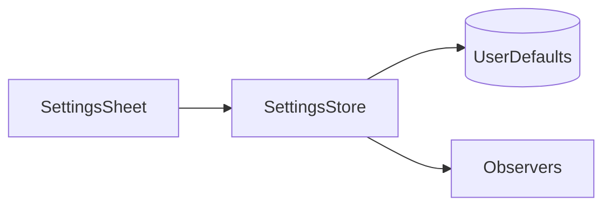

# Front Door Implementation Plan

> **For agentic workers:** REQUIRED SUB-SKILL: Use superpowers:subagent-driven-development (recommended) or superpowers:executing-plans to implement this plan task-by-task. Steps use checkbox (`- [ ]`) syntax for tracking.

**Goal:** Make `README.md` and the site hero open with the problem Reader.md solves, and show a real screenshot of the app on both.

**Architecture:** A new screenshot fixture root (`agent-run/`) holds an agent-written plan document; a one-shot manifest captures it to `docs/assets/screenshots/hero/01-hero.png`, which both front doors reference — the README repo-relative, the site via `prebuild`'s copy into `public/screenshots/`. `Hero.astro`'s hand-built CSS window mock is deleted and replaced by that image, and the copy on both front doors is rewritten.

**Tech Stack:** Bash (`fixtures.sh`, `capture.sh`), JSON manifest, Astro 7 with plain scoped CSS, Markdown.

**Spec:** `docs/superpowers/specs/2026-09-04-front-door-design.md`

## Global Constraints

- **No CSS or UI framework.** Plain `.astro` components with scoped `<style>` over the custom properties in `web/src/styles/global.css`. A hard-coded hex in a component is a mistake.
- **No gradients.** Flat Apple style. This is why `.mock__glow` is not carried over and why `.gradient-text` leaves the headline.
- **`web/public/screenshots/` is generated and gitignored.** `npm run prebuild` deletes it and re-copies `../docs/assets/screenshots/`. Never add or retouch an image there.
- **Screenshots come from the app**, captured from a manifest by `.claude/skills/reader-docs/scripts/capture.sh`. Never hand-edit a captured PNG.
- **Fixtures are never committed.** `fixtures.sh` regenerates the whole corpus into `/tmp/reader-md-docs` on every run, deterministically — fixed dates, no machine-specific paths.
- **Deploys are automatic.** Cloudflare Pages publishes on any push to `main` touching `web/` or `docs/`. This change touches both: merging is publishing.
- **Liquid Glass is demoted, not deleted.** It leaves the hero badge and headline. It stays in `web/src/data/content.ts`'s highlight card, the README bullet list, and the docs. Do not remove those.
- **The verification that matters is `cd web && npm run build`.** There is no test suite for any file in this plan; `swift test` is untouched because no Swift changes.

---

### Task 1: The `agent-run` fixture root

The hero shot needs a document whose first screenful argues the headline. It goes in a **second fixture root**, not into `field-notes`: every committed manifest seeds `reader.md.folders: ["<fixtures>/field-notes"]`, so a file added there would change the sidebar tree in all nine existing screenshot sets and force a full re-shoot.

**Files:**
- Modify: `.claude/skills/reader-docs/scripts/fixtures.sh` — insert before the `# --- git fixture ---` section (line 147; the `glossary.md` heredoc closes just above it)

**Interfaces:**
- Consumes: nothing.
- Produces: `<fixtures>/agent-run/` containing `plan.md`, `spec.md`, `review.md`, and `runs/2026-03-04.md`. Task 2's manifest opens `agent-run/plan.md`.

- [ ] **Step 1: Confirm the insertion point**

Run:

```bash
grep -n "glossary.md\|--- git fixture" .claude/skills/reader-docs/scripts/fixtures.sh
```

Expected: a `cat > "$ROOT/field-notes/reference/glossary.md"` line, then a few lines later `# --- git fixture ---`. The new block goes between them.

- [ ] **Step 2: Insert the `agent-run` fixture block**

Insert this immediately before the `# --- git fixture ---` comment line:

`````bash
# --- agent-run fixture -------------------------------------------------------
# A second root, deliberately separate from field-notes. Every other manifest
# seeds only <fixtures>/field-notes, so nothing added here can change the
# sidebar in the committed screenshot sets. Used by docs/hero.shots.json for
# the README and landing-page hero image.
mkdir -p "$ROOT/agent-run/runs"

cat > "$ROOT/agent-run/plan.md" <<'EOF'
# Extract the settings sheet

*Generated 2026-03-04 · 6 phases · 34 tasks · unreviewed*

The settings sheet reaches into three view models directly. This plan moves it
behind a single store, in phases that each leave the app building.



## Phase 1 — Read the current shape

- [x] Map every caller of `SettingsStore`
- [x] List the defaults keys written outside it
- [ ] Note which writes race the in-memory copy
- [ ] Decide what stays a direct read

## Phase 2 — Introduce the store

One owner for every preference, with the sheet reading through it.

### The interface

`SettingsStore` exposes typed properties, not a dictionary. A missing key
returns the declared default rather than nil.

### Migrating the keys

Keys move one at a time. Each move is its own commit, so a bad default can be
reverted without unwinding the phase.

## Phase 3 — Move the writes

Every write goes through the store. Direct defaults calls are removed as their
key migrates.

### Ordering

Writes are ordered so the sheet never observes a half-migrated state.

## Phase 4 — Delete the old path

The three view models drop their preference properties once nothing reads them.

## Phase 5 — Tests

Round-trip every key, then assert the declared defaults survive a cold start.

## Phase 6 — Ship

Behind no flag. The change is invisible if it works.
EOF

cat > "$ROOT/agent-run/spec.md" <<'EOF'
# Spec — one owner for preferences

Preferences are read in three places and written in five. This is the design
for collapsing that to one store.

## Constraints

The on-disk format does not change. A downgrade must still read its own keys.
EOF

cat > "$ROOT/agent-run/review.md" <<'EOF'
# Review

Notes from reading the plan back.

- Phase 3 assumes Phase 2 landed whole. Say so.
- The cold-start test belongs in Phase 2, not Phase 5.
EOF

cat > "$ROOT/agent-run/runs/2026-03-04.md" <<'EOF'
# Run 2026-03-04

Phases 1 and 2 complete. Phase 3 stopped on the ordering question.
EOF
`````

- [ ] **Step 3: Regenerate the corpus and verify the tree**

Run:

```bash
.claude/skills/reader-docs/scripts/fixtures.sh && find /tmp/reader-md-docs/agent-run -type f | sort
```

Expected, exactly:

```
/tmp/reader-md-docs/agent-run/plan.md
/tmp/reader-md-docs/agent-run/review.md
/tmp/reader-md-docs/agent-run/runs/2026-03-04.md
/tmp/reader-md-docs/agent-run/spec.md
```

- [ ] **Step 4: Verify the outline will have at least ten entries**

The outline pane is built from headings. Run:

```bash
grep -c '^#' /tmp/reader-md-docs/agent-run/plan.md
```

Expected: `10`. If it prints fewer, the heredoc lost lines — re-insert it.

- [ ] **Step 5: Verify the existing fixture roots are unchanged**

Run:

```bash
find /tmp/reader-md-docs/field-notes -type f | sort
```

Expected, exactly these five — no new file, or the committed screenshots become stale:

```
/tmp/reader-md-docs/field-notes/guides/architecture.md
/tmp/reader-md-docs/field-notes/guides/setup.md
/tmp/reader-md-docs/field-notes/index.md
/tmp/reader-md-docs/field-notes/reference/glossary.md
/tmp/reader-md-docs/field-notes/reference/shortcuts.md
```

- [ ] **Step 6: Eyeball the document in the real app**

This is the cheap iteration loop — do it before spending a capture run.

```bash
swift run ReaderMd
```

Add `/tmp/reader-md-docs/agent-run` as a folder, open `plan.md`, and check three things at roughly a 1400×900 window with the sidebar and outline open:

1. The Mermaid graph renders as a diagram, not as a code block.
2. The four Phase 1 items render as **checkboxes**, not as literal `[x]` / `[ ]` text. If they render literally, the bundled `marked` config has GFM task lists off — edit those four lines in the heredoc to plain `- ` bullets and re-run Step 3. This is a fixture edit, not a code change.
3. The heading, the italic generated-by line, the paragraph, the graph, and `## Phase 1` all fit above the fold.

Quit the app when done — Task 2's capture refuses to run while it is open.

- [ ] **Step 7: Commit**

```bash
git add .claude/skills/reader-docs/scripts/fixtures.sh
git commit -m "docs(shots): add an agent-run fixture root for the hero shot

A second root, separate from field-notes so no committed screenshot set
changes. plan.md is an agent-written implementation plan whose first
screenful carries a Mermaid graph and a phase checklist.

Co-Authored-By: Claude Opus 5 (1M context) <noreply@anthropic.com>
Claude-Session: https://claude.ai/code/session_013kZHKGjLiX6pKksJqKU7nN"
```

---

### Task 2: The hero manifest, the capture, and the convention amendments

**Files:**
- Create: `docs/hero.shots.json`
- Create (by capture, committed): `docs/assets/screenshots/hero/01-hero.png`
- Modify: `.claude/skills/reader-docs/references/manifest-schema.md:19`
- Modify: `CLAUDE.md:69`

**Interfaces:**
- Consumes: `<fixtures>/agent-run/plan.md` from Task 1.
- Produces: `docs/assets/screenshots/hero/01-hero.png`, and its exact pixel dimensions, used verbatim as the `width`/`height` attributes in Task 3.

- [ ] **Step 1: Write the manifest**

Create `docs/hero.shots.json`:

```json
{
  "page": "hero",
  "window": { "width": 1400, "height": 900 },
  "prefs": {
    "reader.md.folders": ["<fixtures>/agent-run"],
    "reader.md.theme": "dark",
    "reader.md.contentWidth": "wide",
    "reader.md.showSidebar": true,
    "reader.md.showTOC": true
  },
  "shots": [
    {
      "id": "01-hero",
      "open": "agent-run/plan.md",
      "caption": "An agent-written plan open in Reader.md, with the file tree and outline beside it"
    }
  ]
}
```

`showTOC: true` opens the outline through preferences, so the shot needs no `actions` array and has nothing that can drift.

- [ ] **Step 2: Quit the real Reader.md, then capture**

`capture.sh` refuses to run while the normal app is open (both builds are named "Reader.md" and AppleScript cannot tell them apart), hides every other application for the duration, and drives the screen with synthetic events. Expect about a minute of unusable Mac.

```bash
osascript -e 'quit app "Reader.md"' 2>/dev/null
.claude/skills/reader-docs/scripts/capture.sh docs/hero.shots.json
```

Expected: a `capture: hero — window 1400x900, fixtures at /tmp/reader-md-docs` line, then exit 0 and the file at `docs/assets/screenshots/hero/01-hero.png`.

If it exits non-zero, the code says what went wrong: `3` missing tool or permission, `4` an isolation guard tripped, `5` the app never appeared, `6` focus kept being stolen, `7` a shot never settled, `8` the window would not hold its size.

- [ ] **Step 3: Look at the image**

```bash
open docs/assets/screenshots/hero/01-hero.png
```

Per the reader-docs skill, any of these is a **failed capture, not a cosmetic issue** — fix and re-shoot rather than accepting:

- A real path, a real filename, or a real file count anywhere in frame.
- The sidebar showing anything other than the `agent-run` tree.
- The outline pane closed, or empty.
- The Mermaid graph unrendered.
- Literal `[x]` text where checkboxes should be (fix in `fixtures.sh`, Task 1 Step 6, then re-shoot).

Re-shoot a single shot with `--only 01-hero`.

- [ ] **Step 4: Record the exact dimensions**

Run:

```bash
sips -g pixelWidth -g pixelHeight docs/assets/screenshots/hero/01-hero.png
```

Write both numbers down. Task 3 Step 2 needs them verbatim — the existing 1400×900 shots come out at 2400×1543, so do not assume 2800×1800.

- [ ] **Step 5: Amend the manifest schema's `page` rule**

The schema currently claims `page` must match a feature page. It does not — `capture.sh` reads `page` only to name the output directory — and this manifest is the exception. In `.claude/skills/reader-docs/references/manifest-schema.md`, replace line 19:

```
| `page` | yes | Must match `docs/features/<page>.md`; also the asset directory name |
```

with:

```
| `page` | yes | The asset directory name. For a feature page it must match `docs/features/<page>.md`; `hero` is the one manifest with no page — it feeds the README and the landing-page hero |
```

- [ ] **Step 6: Amend the root `CLAUDE.md` convention**

In `CLAUDE.md`, line 69 currently reads:

```
Each `docs/features/<slug>.md` has a `<slug>.shots.json` manifest beside it
```

Change it to:

```
Each `docs/features/<slug>.md` has a `<slug>.shots.json` manifest beside it
(plus `docs/hero.shots.json`, which has no page — it captures the shared
README and landing-page hero image)
```

Keep the rest of that sentence — the description of what a manifest contains and the pointer to `.claude/skills/reader-docs` — intact.

- [ ] **Step 7: Commit**

```bash
git add docs/hero.shots.json docs/assets/screenshots/hero/01-hero.png \
        .claude/skills/reader-docs/references/manifest-schema.md CLAUDE.md
git commit -m "docs(shots): capture the hero image

One still of an agent-written plan with the tree and outline open, from a
manifest with no feature page. Records that exception in the manifest schema
and CLAUDE.md rather than leaving the documented rule reading as violated.

Co-Authored-By: Claude Opus 5 (1M context) <noreply@anthropic.com>
Claude-Session: https://claude.ai/code/session_013kZHKGjLiX6pKksJqKU7nN"
```

---

### Task 3: Replace the hero mock with the screenshot

**Files:**
- Modify: `web/src/components/Hero.astro` — full rewrite, 419 lines down to roughly 95
- Modify: `web/src/styles/global.css` — remove the keyframes and the one utility class that this change orphans

**Interfaces:**
- Consumes: `docs/assets/screenshots/hero/01-hero.png` and its pixel dimensions from Task 2 Step 4; served at `/screenshots/hero/01-hero.png` after `prebuild`.
- Produces: nothing later tasks depend on.

**Note on ownership before you start:** every keyframe lives in `global.css`, not in `Hero.astro` — the component only references them. `.chip`, `.accent-*`, `.tok`, and the `.c-*` code-token classes used by the mock are all shared with `FinalCta.astro`, `KeyboardCli.astro`, `RemoteShowcase.astro`, and `docs.astro`. **Leave every one of those alone.** Only `blink`, `fillBar`, `railSlide`, and `.gradient-text` become dead, and only because of this change.

- [ ] **Step 1: Make the image available to the dev server**

`npm run dev` does not run `prebuild`, so the new image 404s until it is copied once:

```bash
cd web && npm run prebuild && ls public/screenshots/hero/
```

Expected: `01-hero.png`

- [ ] **Step 2: Rewrite `web/src/components/Hero.astro`**

Replace the entire file. Substitute the two numbers from Task 2 Step 4 for `WIDTH` and `HEIGHT`:

```astro
---
import { repo } from "../data/site";
import Icon from "./Icon.astro";
---

<header class="hero">
  <div class="hero__badge">
    <span class="hero__dot"></span>
    free · open source · macOS 13+
  </div>
  <h1 class="hero__title">
    Your agent just wrote<br />400 lines of markdown.
  </h1>
  <p class="hero__sub">
    Reader.md opens plans, specs and READMEs in a real Mac reading window —
    outline, search, highlights, live reload — instead of one more tab in your
    code editor.
  </p>
  <div class="hero__cta">
    <a href="#install" class="btn btn--primary"><Icon name="download" size={17} />Download on Mac</a>
    <a href={repo} class="btn btn--ghost" target="_blank" rel="noopener"><Icon name="star" size={17} />Star on GitHub</a>
  </div>

  <div class="hero__shot">
    
  </div>
</header>

<style>
  .hero {
    position: relative;
    z-index: 2;
    max-width: 1120px;
    margin: 0 auto;
    padding: 172px var(--pad-x) 80px;
    text-align: center;
  }
  .hero__badge {
    display: inline-flex;
    align-items: center;
    gap: 9px;
    padding: 7px 15px;
    border-radius: 999px;
    background: var(--surface-2);
    border: 1px solid var(--border);
    font-size: 13px;
    color: rgba(255, 255, 255, 0.75);
    animation: riseIn 0.7s ease both;
  }
  .hero__dot {
    width: 7px;
    height: 7px;
    border-radius: 50%;
    background: var(--green);
    box-shadow: 0 0 10px oklch(0.75 0.17 150);
  }
  .hero__title {
    margin: 26px auto 0;
    max-width: 20ch;
    font-size: clamp(40px, 5.5vw, 68px);
    line-height: 1.05;
    letter-spacing: -0.035em;
    animation: riseIn 0.8s 0.06s ease both;
  }
  .hero__sub {
    margin: 26px auto 0;
    max-width: 56ch;
    font-size: clamp(17px, 2vw, 21px);
    line-height: 1.55;
    color: var(--muted);
    text-wrap: pretty;
    animation: riseIn 0.8s 0.14s ease both;
  }
  .hero__cta {
    display: flex;
    flex-wrap: wrap;
    gap: 14px;
    justify-content: center;
    margin-top: 38px;
    animation: riseIn 0.8s 0.22s ease both;
  }

  /* ---- app screenshot ---- */
  .hero__shot {
    margin: 76px auto 0;
    max-width: 1000px;
    border-radius: 18px;
    overflow: hidden;
    border: 1px solid var(--border);
    box-shadow: 0 40px 100px rgba(0, 0, 0, 0.6);
    animation: riseIn 1s 0.32s ease both;
  }
  .hero__shot img {
    display: block;
    width: 100%;
    height: auto;
  }
</style>
```

What went, and why: the `.mock` markup and every `.mock__*` rule (the mock is redundant beside a real shot); the whole `<script>` (it only drove the mock's typing and word-count animations); `.mock__glow` is not carried over because it is a gradient; the `.gradient-text` span leaves the headline for the same reason; and `.hero__title`'s `16ch` / `clamp(44px, 7vw, 86px)` was sized for a five-word headline and stacks this one four lines deep.

- [ ] **Step 3: Verify nothing else referenced the mock**

Run:

```bash
grep -rn "mock__\|data-typed\|data-words" web/src/ | grep -v RemoteShowcase
```

Expected: no output. (`RemoteShowcase.astro` has its own unrelated `.sidemock__*` classes — those stay.)

- [ ] **Step 4: Remove the three keyframes this change orphaned**

In `web/src/styles/global.css`, delete the `@keyframes blink`, `@keyframes fillBar`, and `@keyframes railSlide` blocks. Confirm first that nothing else uses them:

```bash
grep -rn "blink\|fillBar\|railSlide" web/src/ --include=*.astro
```

Expected: no output.

Do **not** touch `@keyframes riseIn` (still used here and by `changelog.astro`), `@keyframes sweep` (still used by `FinalCta.astro`), or `floatY`, `hueDrift`, `dotPulse` — those are pre-existing and not this change's business.

- [ ] **Step 5: Remove the `.gradient-text` utility**

The headline was its only user, so this change is what kills it. Confirm, then delete the `.gradient-text` rule from `web/src/styles/global.css`:

```bash
grep -rn "gradient-text" web/src/
```

Expected before deleting: only the `global.css` definition. Expected after: no output.

- [ ] **Step 6: Build**

```bash
cd web && npm run build
```

Expected: build completes with no errors.

- [ ] **Step 7: Confirm the image actually shipped**

```bash
ls -l web/dist/screenshots/hero/01-hero.png
grep -o '/screenshots/hero/01-hero.png' web/dist/index.html | head -1
```

Expected: the file exists, and the path appears in the built HTML.

- [ ] **Step 8: Look at the page**

```bash
cd web && npm run preview
```

Open the URL it prints. Check that the headline sits on two lines and does not collide with the badge, that the screenshot is framed and not stretched, and that nothing below the fold shifts as the image loads.

- [ ] **Step 9: Commit**

```bash
git add web/src/components/Hero.astro web/src/styles/global.css
git commit -m "feat(web): lead the hero with the problem and a real screenshot

Deletes the hand-built CSS window mock and its typing/word-count script in
favour of the captured hero image, and rewrites the badge, headline and
subhead around the reader's problem rather than the app's architecture.
Liquid Glass keeps its feature card; it just stops being the first thing on
the page. Drops blink/fillBar/railSlide and .gradient-text, which this
change orphaned.

Co-Authored-By: Claude Opus 5 (1M context) <noreply@anthropic.com>
Claude-Session: https://claude.ai/code/session_013kZHKGjLiX6pKksJqKU7nN"
```

---

### Task 4: The README opening and highlight order

**Files:**
- Modify: `README.md:1-30` — the opening paragraph, a new image, and the order of the `## Highlights` bullets

**Interfaces:**
- Consumes: `docs/assets/screenshots/hero/01-hero.png` from Task 2, referenced repo-relative.
- Produces: nothing later tasks depend on.

- [ ] **Step 1: Replace the opening paragraph and add the image**

Everything from `# Reader.md` down to (but not including) `## Highlights` becomes:

```markdown
# Reader.md

**Website:** [reader-md.jnahian.me](https://reader-md.jnahian.me)

Your agent just wrote 400 lines of markdown. Reader.md opens plans, specs and
READMEs in a real Mac reading window — outline, search, highlights, live
reload — instead of one more tab in your code editor.


```

The SwiftUI / `WKWebView` paragraph is **dropped, not relocated** — `docs/architecture.md` already carries that material, and the root `CLAUDE.md` says the README is an index and highlights, with detail in `docs/`. The `(Swift / SwiftUI)` suffix on the H1 goes with it.

A repo-relative image path, so GitHub renders it and it also resolves when the README is opened in Reader.md itself.

- [ ] **Step 2: Reorder the `## Highlights` bullets**

Reorder only — **do not reword any bullet.** The new order:

1. Live reload
2. Highlights and notes
3. Multi-folder browser
4. Git-aware
5. Mermaid, LaTeX, and syntax highlighting
6. Remote folders
7. Hand off to your editor
8. Settings in one window
9. Liquid Glass chrome

- [ ] **Step 3: Verify the bullets survived intact**

```bash
sed -n '/^## Highlights/,/^## Install/p' README.md | grep -c '^- \*\*'
```

Expected: `9`. A different number means a bullet was lost or split in the reorder.

- [ ] **Step 4: Verify the image path resolves**

```bash
ls -l docs/assets/screenshots/hero/01-hero.png
```

Expected: the file exists. The path in the README is relative to the repo root, which is where GitHub resolves it from.

- [ ] **Step 5: Confirm nothing below Install moved**

```bash
git diff --stat README.md
sed -n '/^## Install/,$p' README.md | head -5
```

Expected: the diff touches only the top of the file and the highlight block, and `## Install` onward is unchanged.

- [ ] **Step 6: Commit**

```bash
git add README.md
git commit -m "docs: open the README with the problem and a screenshot

Replaces the SwiftUI/WKWebView opening — which docs/architecture.md already
covers — with what a reader arrives wanting, and puts the hero image on the
page. Reorders the highlights so reading and annotation lead and Liquid Glass
sits last; no bullet text changes.

Co-Authored-By: Claude Opus 5 (1M context) <noreply@anthropic.com>
Claude-Session: https://claude.ai/code/session_013kZHKGjLiX6pKksJqKU7nN"
```

---

### Task 5: Site metadata and the dev-server note

**Files:**
- Modify: `web/src/pages/index.astro:11` — the `<Base title>` prop
- Modify: `web/src/layouts/Base.astro:15` — the default `description`
- Modify: `web/src/layouts/Base.astro:38,41` — `og:image` and `twitter:card`
- Modify: `web/README.md` — the `## Develop` block

**Interfaces:**
- Consumes: `/screenshots/hero/01-hero.png`, available after Task 2 and `prebuild`.
- Produces: nothing.

- [ ] **Step 1: Update the page title**

In `web/src/pages/index.astro`, change:

```astro
<Base title="Reader.md — a markdown viewer that feels truly native" page="home">
```

to:

```astro
<Base title="Reader.md — read your markdown in a real Mac window" page="home">
```

- [ ] **Step 2: Update the default description**

In `web/src/layouts/Base.astro`, change the default:

```ts
  description = "Reader.md is a native macOS markdown viewer with live reload, Mermaid diagrams, LaTeX math, and remote SSH folders — wrapped in Liquid Glass chrome.",
```

to:

```ts
  description = "Reader.md opens plans, specs and READMEs in a native macOS reading window — outline, search across every folder, highlights, live reload, Mermaid diagrams and LaTeX math.",
```

This string is what search results show and what feeds `og:description`, so it is the last place the old framing survives.

- [ ] **Step 3: Point the social preview at the screenshot**

In the same file's `<head>`, change:

```astro
    <meta property="og:image" content={new URL("/icon.png", Astro.site)} />
```

to:

```astro
    <meta property="og:image" content={new URL("/screenshots/hero/01-hero.png", Astro.site)} />
```

and:

```astro
    <meta name="twitter:card" content="summary" />
```

to:

```astro
    <meta name="twitter:card" content="summary_large_image" />
```

Leave `<link rel="icon">` and `<link rel="apple-touch-icon">` pointing at `/icon.png` — the favicon is not the social card.

- [ ] **Step 4: Note the `prebuild` step in the web README**

In `web/README.md`'s `## Develop` block, change:

```bash
cd web
npm install
npm run dev      # http://localhost:4321
npm run build    # static output → dist/
npm run preview  # serve the build
```

to:

```bash
cd web
npm install
npm run prebuild # copies ../docs/assets/screenshots → public/ (build does this itself)
npm run dev      # http://localhost:4321
npm run build    # static output → dist/
npm run preview  # serve the build
```

`npm run dev` does not trigger `prebuild`, so without it every screenshot — including the hero — 404s in development.

- [ ] **Step 5: Build and check the rendered metadata**

```bash
cd web && npm run build
grep -o '<title>[^<]*</title>' dist/index.html
grep -o 'og:image" content="[^"]*"' dist/index.html
grep -o 'twitter:card" content="[^"]*"' dist/index.html
```

Expected:

```
<title>Reader.md — read your markdown in a real Mac window</title>
og:image" content="https://reader-md.jnahian.me/screenshots/hero/01-hero.png"
twitter:card" content="summary_large_image"
```

- [ ] **Step 6: Confirm the old framing is gone from the built site's head**

```bash
grep -c "Liquid Glass" web/dist/index.html
```

Expected: a non-zero count — the feature card still says it, which is correct — but confirm by eye that no hit is inside a `<title>`, `<meta name="description">`, or `og:` tag.

- [ ] **Step 7: Commit**

```bash
git add web/src/pages/index.astro web/src/layouts/Base.astro web/README.md
git commit -m "feat(web): reframe the page metadata and use the hero as the social card

Title and description carried the old architecture-led framing; og:image was
the 512px app icon, so every shared link previewed as a tiny square. Also
notes that npm run dev does not run prebuild.

Co-Authored-By: Claude Opus 5 (1M context) <noreply@anthropic.com>
Claude-Session: https://claude.ai/code/session_013kZHKGjLiX6pKksJqKU7nN"
```

---

## Final verification

After all five tasks:

- [ ] `cd web && npm run build` — passes
- [ ] `ls web/dist/screenshots/hero/01-hero.png` — exists
- [ ] `git status` — clean; `web/public/screenshots/` must **not** appear (it is gitignored and generated)
- [ ] `grep -rn "gradient-text\|mock__" web/src/` — no output
- [ ] Read `README.md` rendered, and confirm the image displays and the Install section is untouched
- [ ] `swift test` is not run: no Swift, no `Resources/docs/`, and no `SHORTCUTS.md` change, so `ShortcutDocTests` has nothing to catch

**Before pushing:** this change touches both `web/` and `docs/`, which are both Cloudflare Pages build-watch paths. Pushing to `main` publishes it immediately, with no staging step. Per the repo's convention, open a PR rather than merging locally.
