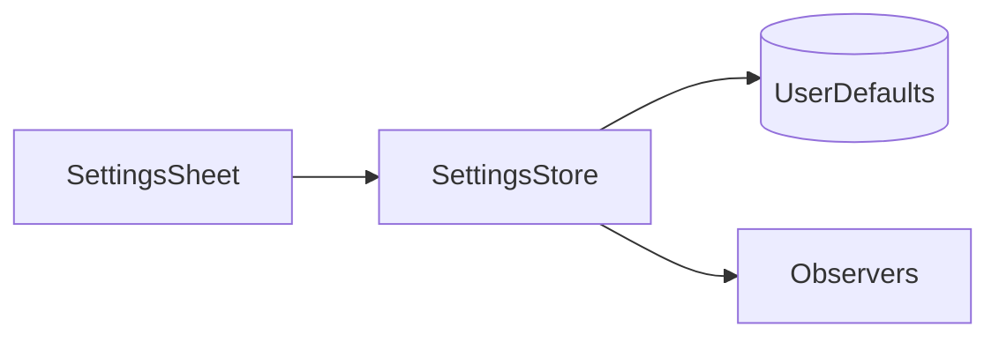

# Front door: lead with the problem, show the app

Design for reworking the two places a new person lands — `README.md` and the
site's hero — so that both open with the problem Reader.md solves and both show
a real screenshot of the app.

## The problem being fixed

Both front doors describe the app the way its author thinks about it, not the
way a reader arrives at it.

- **`README.md`** opens with *"A native macOS markdown viewer built with SwiftUI
  and AppKit"* followed by a paragraph on the `WKWebView` split. That is
  architecture, and it belongs in `docs/architecture.md`, where it already is.
- **The site hero** leads with a badge reading *"Built with SwiftUI & Liquid
  Glass for macOS 26"* over the headline *"A markdown viewer that feels truly
  native."* Nobody wants nativeness; they want to stop reading a 400-line
  agent-generated plan file in a code editor. The badge also tells every visitor
  on macOS 13–15 — a supported configuration — that the app is not for them.
- **Neither front door shows the app.** The site has a hand-built CSS mock; the
  README has no image at all. Nine sets of real screenshots exist under
  `docs/assets/screenshots/`, none of them where people land.

## Decisions taken

| Question | Decision |
|---|---|
| The CSS window mock in `Hero.astro` | Delete it. A real shot above the fold orphans it, and a stylized fake beside a real one makes the fake look worse. |
| The hero image | New capture against a new, purpose-built fixture — not a reuse of `reading/01-document.png`, whose on-screen prose is scaffolding filler. |
| Headline direction | Name the agent output explicitly. Narrowest and most concrete of the options considered; the feature grid below the fold picks up handbook and VPS-docs readers. |
| Liquid Glass | Demoted, not deleted. Out of the badge and the headline; stays in the `content.ts` highlight card, the README bullet, and the docs. |
| Ride-alongs | Page title, meta description, `og:image`, and the README highlight order. |

## 1 · The fixture

`.claude/skills/reader-docs/scripts/fixtures.sh` gains a **second root**,
`<fixtures>/agent-run/`, alongside the existing `field-notes` and `field-guide`.

A second root rather than a new file inside `field-notes` is the whole point:
every committed manifest seeds `reader.md.folders: ["<fixtures>/field-notes"]`,
so a file added there would change the sidebar tree in all nine existing
screenshot sets and force a full re-shoot. A separate root is invisible to them.

```
agent-run/
  plan.md              ◀ opened in the shot
  spec.md
  review.md
  runs/
    2026-03-04.md
```

`plan.md` is written so the **first screenful is the argument**: heading, a
generated-by line, a compact Mermaid graph, then a phase with checkboxes. The
document continues past the fold with enough phases and sub-headings to fill the
outline pane.

`````markdown
# Extract the settings sheet

*Generated 2026-03-04 · 6 phases · 34 tasks · unreviewed*

The settings sheet reaches into three view models directly. This plan moves it
behind a single store, in phases that each leave the app building.



## Phase 1 — Read the current shape

- [x] Map every caller of `SettingsStore`
- [x] List the defaults keys written outside it
- [ ] Note which writes race the in-memory copy
- [ ] Decide what stays a direct read

## Phase 2 — Introduce the store
…
`````

Phases 2–6 follow, each with a short paragraph and at least one `###`
sub-heading — the outline pane must show **no fewer than ten entries** so it
reads as a real document structure rather than a stub. `spec.md`, `review.md`,
and `runs/2026-03-04.md` need only be plausible and short: they exist to give
the sidebar a real shape, and none of their content is visible in the shot.

Everything stays deterministic, per the file's existing contract: fixed dates, no
machine-specific paths, regenerated from scratch on every run.

**Open question resolved at implementation time:** if the bundled `marked`
configuration does not render GFM task lists, the checkboxes will show as literal
`[x]`. Verify in the captured image; if so, swap those four lines to plain
bullets. This is a look-at-the-image check, not a code change.

## 2 · The manifest

New file `docs/hero.shots.json` — one still, no actions.

```json
{
  "page": "hero",
  "window": { "width": 1400, "height": 900 },
  "prefs": {
    "reader.md.folders": ["<fixtures>/agent-run"],
    "reader.md.theme": "dark",
    "reader.md.contentWidth": "wide",
    "reader.md.showSidebar": true,
    "reader.md.showTOC": true
  },
  "shots": [
    {
      "id": "01-hero",
      "open": "agent-run/plan.md",
      "caption": "An agent-written plan open in Reader.md, with the file tree and outline beside it"
    }
  ]
}
```

`showTOC: true` opens the outline through preferences rather than a `⇧⌘B`
keystroke, so the shot has no `actions` array and nothing to drift.

Capture with:

```
.claude/skills/reader-docs/scripts/capture.sh docs/hero.shots.json
```

Output: `docs/assets/screenshots/hero/01-hero.png`, captured at 2×.
`web/package.json`'s `prebuild` runs `cp -R ../docs/assets/screenshots/.
public/screenshots/`, so the new directory is picked up with no build edit and
serves at `/screenshots/hero/01-hero.png`.

### Two deliberate deviations from the reader-docs convention

Both are recorded, not smuggled:

1. **`page` has no matching docs page.** `references/manifest-schema.md` states
   that `page` "must match `docs/features/<page>.md`". It is not enforced in
   `capture.sh` — `PAGE` is read only to name the output directory — but the
   documented rule must be amended to name this exception, rather than left to
   read as violated.
2. **The manifest does not sit beside a feature page.** It lives at
   `docs/hero.shots.json`. `web/plugins/docs-pages.mjs` lists publishable
   patterns explicitly (`install.md`, `features.md`, `features/*.md`, `cli.md`,
   `architecture.md`, `building.md`), so a `.json` file in `docs/` publishes
   nothing and cannot collide with a page.

The root `CLAUDE.md` documentation section notes the `<slug>.shots.json`
convention and needs the same one-line exception.

## 3 · `web/src/components/Hero.astro`

### Removed

The `.mock` block in the markup, the entire `<script>` (typing animation and
word-count counter), and every `.mock__*` rule in the `<style>` block — the
sweep, the progress fill, the rail slide, the fake tree, the fake code block, the
chips, the status bar, and the mobile-hiding media query. Roughly 450 lines.

`riseIn`, `blink`, `sweep`, `fillBar`, and `railSlide` keyframes: keep only those
still referenced after the deletion. `riseIn` stays (the badge, title, sub, and
CTA all use it); the rest are checked and removed if orphaned. Keyframes defined
in `global.css` and shared with other components are left alone.

### Added

```html
<div class="hero__shot">
  
</div>
```

`width` and `height` are the captured file's real pixel dimensions, read after
capture, so the fold does not jump while the image loads. `fetchpriority="high"`
because it is the largest above-the-fold paint.

`.hero__shot` inherits `.mock__window`'s framing — 18px radius, 1px
`var(--border)`, `0 40px 100px rgba(0,0,0,.6)` — and the `riseIn` entrance.
`.mock__glow` is **not** carried over: it is a linear gradient, and the project's
design direction is flat.

### Changed

| Element | From | To |
|---|---|---|
| `.hero__badge` text | "Built with SwiftUI & Liquid Glass for macOS 26" | "free · open source · macOS 13+" |
| `<h1>` | "A markdown viewer<br />that feels `<span class="gradient-text">`truly native.`</span>`" | "Your agent just wrote<br />400 lines of markdown." — no gradient span |
| `.hero__sub` | current | "Reader.md opens plans, specs and READMEs in a real Mac reading window — outline, search, highlights, live reload — instead of one more tab in your code editor." |
| `.hero__title` sizing | `max-width: 16ch; font-size: clamp(44px, 7vw, 86px)` | `max-width: 20ch; font-size: clamp(40px, 5.5vw, 68px)` |

The sizing change is not cosmetic taste: the current values were chosen for a
five-word headline and stack the new one four lines deep at the top of the clamp.

The `.gradient-text` class is used elsewhere on the site and is not removed —
only this one usage stops.

## 4 · `README.md`

The opening paragraph is replaced and the screenshot goes directly beneath it,
above `## Highlights`:

```markdown
# Reader.md

**Website:** [reader-md.jnahian.me](https://reader-md.jnahian.me)

Your agent just wrote 400 lines of markdown. Reader.md opens plans, specs and
READMEs in a real Mac reading window — outline, search, highlights, live
reload — instead of one more tab in your code editor.


```

A repo-relative path, so GitHub renders it and it also resolves when the README
is opened in Reader.md itself.

The SwiftUI / `WKWebView` prose is **not rewritten elsewhere** — it is dropped
from the README because `docs/architecture.md` already carries it. The README's
job is to be an index and a set of highlights, per the root `CLAUDE.md`.

`## Highlights` bullets are reordered; their text is unchanged:

1. Live reload
2. Highlights and notes
3. Multi-folder browser + ⌘P
4. Git-aware
5. Mermaid, LaTeX, and syntax highlighting
6. Remote folders
7. Hand off to your editor
8. Settings in one window
9. Liquid Glass chrome

Everything from `## Install` down is untouched.

## 5 · Site metadata

Three edits, all consequences of the reframing:

- `web/src/pages/index.astro` — the `<Base title>` prop, currently
  "Reader.md — a markdown viewer that feels truly native".
- `web/src/layouts/Base.astro` — the default `description`, currently ending
  "…remote SSH folders — wrapped in Liquid Glass chrome." This string is what
  search results show and what feeds `og:description`.
- `web/src/layouts/Base.astro` — `og:image` moves from `/icon.png` to
  `/screenshots/hero/01-hero.png`, and `twitter:card` from `summary` to
  `summary_large_image`. Shared links currently preview as a 512px square icon.

## What is explicitly out of scope

- `content.ts`'s "Liquid Glass chrome" highlight card — that placement *is* the
  demotion.
- `FinalCta.astro`'s "Free, open source, and unmistakably Mac."
- The `docs/` feature pages and their existing screenshots.
- Any Swift change. Nothing in `Sources/` is touched.

## Verification

| Check | How |
|---|---|
| The captured image is publishable | Look at it. Per the reader-docs skill, any real path, real filename, or real file count in frame is a failed capture, not a cosmetic issue — re-shoot. Also confirms whether task-list checkboxes rendered. |
| The site builds | `cd web && npm run build`. `src/data/*.ts` is typed, so a malformed edit fails the build rather than rendering wrong. |
| The image ships | `dist/screenshots/hero/01-hero.png` exists after that build. |
| No dead links in the README | Read the rendered markdown; confirm the image path resolves from the repo root. |
| Repeatability (optional) | `capture.sh docs/hero.shots.json --verify-repro` |

`swift test` is unaffected — no Swift, no bundled-docs, and no `SHORTCUTS.md`
change, so `ShortcutDocTests` has nothing to catch.

## Risks and notes

- **The capture takes over the machine.** `capture.sh` refuses to run while the
  normal Reader.md is open, hides all other applications for its duration, and
  drives the screen with synthetic events. Roughly a minute of unusable Mac.
- **`npm run dev` does not run `prebuild`.** The hero image 404s in dev until
  `npm run prebuild` has been run once. Worth a line in `web/README.md`.
- **Deploy is automatic.** Cloudflare Pages publishes on any push to `main`
  touching `web/` or `docs/`. This change touches both. Merging is publishing;
  there is no staging step.
- **Narrowing risk, accepted knowingly.** Naming agent output in the headline
  speaks to fewer people than a generic markdown-viewer line would. The
  feature grid, `RemoteShowcase`, and the docs still cover handbooks, VPS
  folders, and cloned repos.
