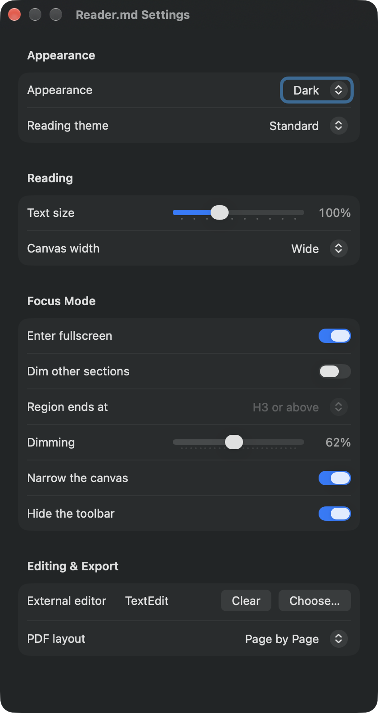
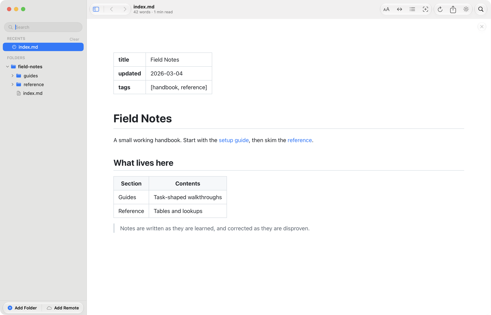
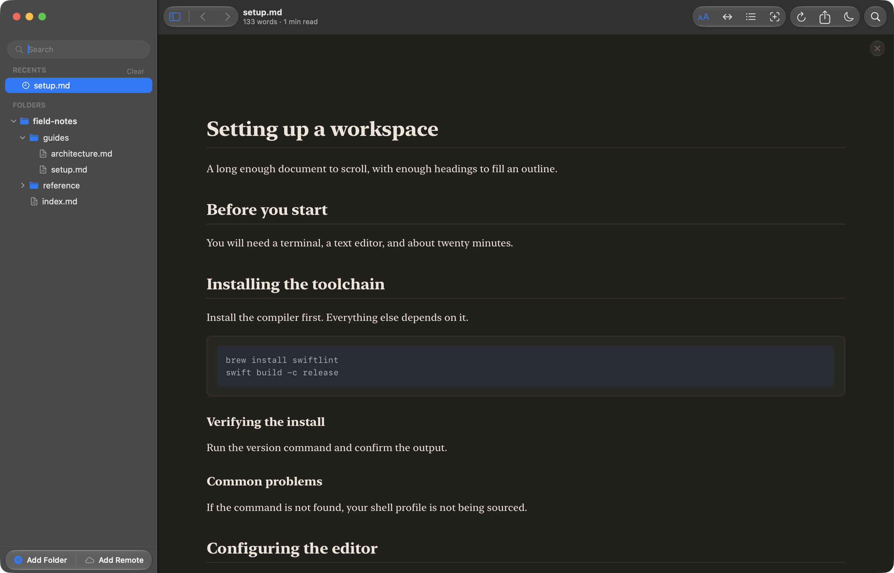
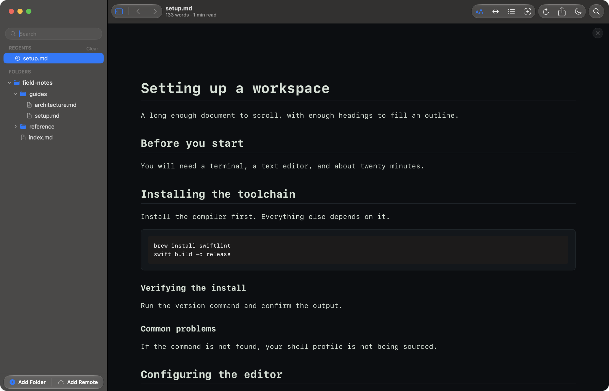

# Read markdown in dark mode, light mode, or your own reading theme

Reader.md is a free markdown viewer for Mac that reads your documents in a
light window, a dark one, or whichever macOS is using right now. On top of
that, three reading themes restyle the document itself, and text size and
canvas width set how the page sits in the window.

## How do I read markdown in dark mode on a Mac?

Open Settings (⌘,) and set **Appearance** to **Dark**. Reader.md turns the
whole app dark, the sidebar, toolbar, and window chrome as well as the
rendered document, and every document you open afterwards stays dark.

There are two other ways to get there:

- **The toolbar button** cycles the appearance in order: Light, Dark, System.
- **Quick Open (⌘P)** with a `>` in front lists a command that switches to the
  next appearance, for when your hands are already on the keyboard.

The Settings picker is the only place to jump straight to one mode rather
than cycling through them. See [Appearance](../features/settings.md#appearance).

## Follow macOS light and dark mode automatically

Set **Appearance** to **System** and Reader.md follows macOS as it changes.
That includes a switch macOS makes on a schedule, so a Mac set to go dark at
sunset takes Reader.md with it, without anything pressed in the app.

**Light** and **Dark** pin Reader.md to one look regardless of what macOS is
doing, which suits anyone who wants a dark reading window on a light desktop,
or the reverse.

## Pick a reading theme for the document

A reading theme changes how the document reads without touching the window
around it. Reader.md has three, chosen under **Reading theme** in Settings:

| Theme | What it does | Suits |
|---|---|---|
| **Standard** | The default look | Most documents |
| **Editorial** | Serif text on a warmer ground | Long prose, essays, design docs |
| **Terminal** | Everything in a monospaced face | Runbooks and docs that are mostly commands and code |

In the Standard theme, links and heading anchors take the accent colour you
picked in System Settings, and follow it if you change it. Editorial and
Terminal keep accents of their own. See
[Reading themes](../features/settings.md#reading-themes).

### Does the reading theme change the sidebar too?

No. A reading theme restyles the document only, and sits on top of the
appearance rather than replacing it. Editorial in dark mode is a dark
Editorial page inside a dark window; the sidebar and toolbar stay as Light,
Dark, or System left them.

### Can I use my own fonts or CSS?

No. Reader.md offers three reading themes, and Settings, which collects every
preference in one window, has no option for custom fonts or stylesheets. Text size and canvas width are the other two
controls over how the page looks.

## Set the text size and canvas width

Text size and canvas width finish the job a theme starts. Both apply to every
document and persist across launches.

- **Text size** — Increase Text (⌘+), Decrease Text (⌘−), and Actual Size
  (⌘0) step it; the slider in Settings runs from 70% to 160%.
- **Canvas width** — Cycle Canvas Width (⇧⌘\\) moves through **Narrow**,
  **Wide** (the default), and **Full Width**. Narrow with larger text gives a
  book's line length; Full Width with smaller text fits wide tables and long
  code blocks.

More in [Text size](../features/reading.md#text-size) and
[Canvas width](../features/reading.md#canvas-width). For a page with nothing
else on screen, see
[Read markdown on your Mac without distractions](distraction-free-markdown-reader.md).

## Does a PDF export keep dark mode?

Yes. Export as PDF (⌘E) carries the document as you are reading it: the same
appearance, reading theme, and text size. A dark document exports dark, with
the background painted to the edge of the paper rather than left as white
margins. If you want a light PDF, switch the appearance to Light before
exporting. See
[What ends up in the file](../features/exporting.md#what-ends-up-in-the-file)
and [Convert markdown to PDF on your Mac, then share it](markdown-to-pdf-mac.md).

## Get Reader.md

Reader.md is free and MIT-licensed, for macOS 13 or later on Apple silicon.
See [Install](../install.md) for Homebrew and the direct download.
