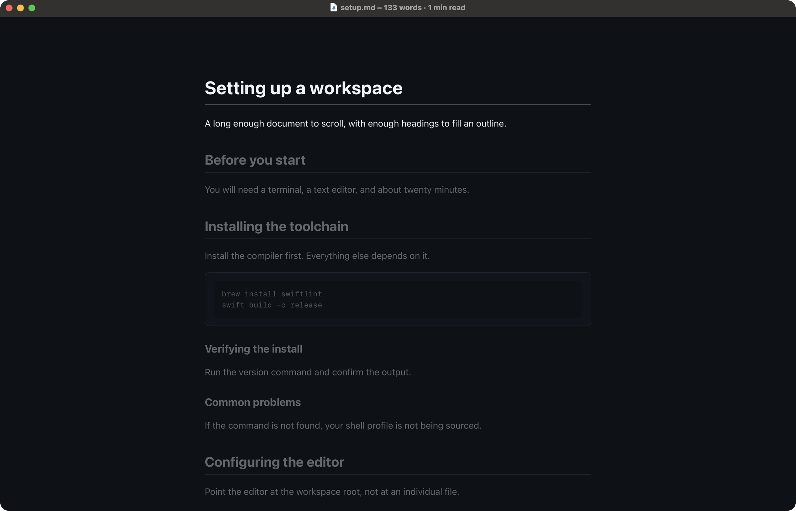

# Read markdown on your Mac without distractions

Reader.md is a free markdown reader for Mac with a focus mode that leaves
nothing on screen but the page. One shortcut, Focus Mode (⌥⌘F), collapses the
sidebar and outline, hides the toolbar, goes fullscreen, and narrows the text
to a comfortable column; Reader.md can also dim every section except the one
you are reading.

## How do I read markdown without the editor clutter?

Open the file in Reader.md, which is a viewer rather than an editor. There is
no source pane, no cursor, and no formatting bar: Reader.md shows the rendered
document and never writes to it. When the file needs a change, Open in Editor
(⇧⌘E) hands it to the editor you chose in Settings, and Reader.md re-renders
the page on every save.

## What focus mode does

Focus Mode (⌥⌘F) turns four things on at once:

| Piece | Effect | On by default |
|---|---|---|
| Enter fullscreen | The window goes fullscreen | Yes |
| Narrow the canvas | The text column narrows to a short line length | Yes |
| Hide the toolbar | The toolbar slides away | Yes |
| Dim other sections | Every section but yours fades | No |

The sidebar and outline collapse too. The toolbar's focus button and
`>Focus Mode` in Quick Open (⌘P) do the same as the shortcut. See
[Focus mode](../features/reading.md#focus-mode).

## Dim everything but the section you're reading

Switch on **Dim other sections** in Settings (⌘,) and Reader.md fades the rest
of the document while you read. Dimming follows the outline rather than the
scroll position, so it holds still through a section and fades across when you
reach the next heading.

Two settings shape it:

- **Region ends at** — how wide "a section" is: headings down to H3 (the
  default), H2, H1, or every heading.
- **Dimming** — how far the rest fades, from 40% to 88%.

Dimming steps aside while you search, in diff mode, and in a document with
fewer than two headings. Writing apps such as Typora fade everything except the
current line or block as you type; Reader.md dims by heading section, because
nobody is typing. See [Focus Mode settings](../features/settings.md#focus-mode).

## How do I hide the toolbar and sidebar in a markdown viewer?

In Reader.md, Focus Mode (⌥⌘F) hides both, along with the outline. Outside
focus mode, Toggle Sidebar (⌘B) and Toggle Outline (⇧⌘B) hide each pane on its
own and leave the document the whole window.

The toolbar is never far away in focus mode. Move the pointer to the top edge
of the screen and it slides back down for as long as you stay there. Find in
Page (⌘F) also brings it down with the search field ready, without leaving
focus mode.

## Can I use focus mode without fullscreen?

Yes. Settings has a separate switch for each of the four pieces, so focus mode
can keep the window as it is and only hide the toolbar, narrow the page, or
dim. Hiding the toolbar works the same with or without fullscreen.

## How do I get out of focus mode?

Press Focus Mode (⌥⌘F) again, or ⎋. Reader.md puts the sidebar, outline, and
column width back to what they were, not to a default. ⎋ first clears an
active search or dismisses Quick Open, and only leaves focus mode once nothing
else is open. Leaving fullscreen with the green window button exits focus mode
too; if the window was already fullscreen before ⌥⌘F, it stays fullscreen.

Focus mode never persists: however you quit, Reader.md starts outside it.

## Set the measure

Line length and text size decide how comfortable a long read is, and both
work outside focus mode as well:

- **Canvas width** — Cycle Canvas Width (⇧⌘\\) steps through Narrow, Wide
  (the default), and Full Width.
- **Text size** — Increase Text (⌘+), Decrease Text (⌘−), and Actual Size
  (⌘0); Settings has a slider from 70% to 160%.

A narrow canvas with larger text gives the short line length of a book. Both
settings apply to every document and survive a restart. See
[Canvas width](../features/reading.md#canvas-width).

## A page that reads like a page

The **Editorial** reading theme sets the text in a serif face on a warmer
ground, for long prose. **Appearance** is Light, Dark, or System, and the
reading theme sits on top of it, so an Editorial page can be light or dark.
See [Read markdown in dark mode, light mode, or your own reading theme](dark-mode-markdown-viewer-mac.md).

## Long documents

Reader.md shows the word count and an estimated reading time under the file
name, and a progress bar under the toolbar fills as you scroll. A long document
reopens at the place you left it. For jumping around a long document by its
headings, see
[Navigate long markdown documents on your Mac](markdown-table-of-contents-viewer.md).

## Get Reader.md

Reader.md is free and open source under the MIT license, for macOS 13 or later
on Apple silicon, and renders every document offline. Install it with Homebrew
or the DMG — see [Install](../install.md).
