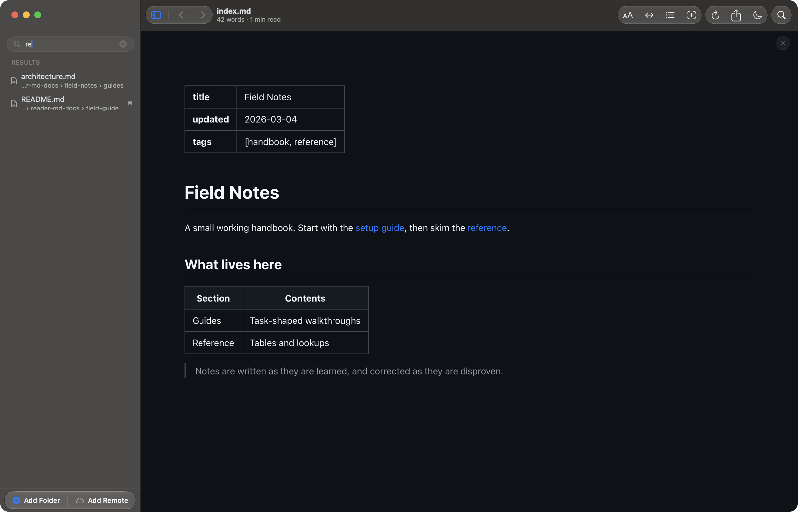

# Every markdown folder on your Mac in one library

Reader.md is a free, native markdown file browser for Mac that keeps every
folder you add in one sidebar: docs folders, notes, and as many git
repositories as you like. Reader.md reads each folder in place, shows only its
markdown files, and finds any file by name or folder path with Quick Open
(⌘P).

## How do I see all my markdown files in one place on Mac?

Add each folder to Reader.md as a root. A root is a top-level section of the
sidebar holding every markdown file beneath that folder, and Reader.md takes
as many roots as you add, side by side under **FOLDERS**.

Three ways to add a root:

- **Add Folder** (⇧⌘A) from the File menu
- drop a folder onto the window
- `reader <folder>` from a terminal, or `reader .` for the current directory

Each root collapses on its own, and Toggle Sidebar (⌘B) hides the whole
sidebar when you want the room. See
[Folders in the sidebar](../features/library.md#folders-in-the-sidebar).

## Browse docs from multiple git repositories

Documentation that lives in several repositories can sit in one Reader.md
sidebar: add each repository as its own root. There is nothing to build or
configure, and no site generator to run first. Each repository keeps its own
git status badges, so the files with uncommitted changes stand out. See
[Working in a git repository](../features/git.md).

For a repository you have not checked out, or one on a server, Add Remote
Folder (⌥⌘A) clones or syncs it read-only into a local cache that shows up as
another root. See
[Read markdown docs from a remote server on your Mac](read-markdown-over-ssh.md).

## Find any markdown file by name or folder path

Quick Open (⌘P) is a fuzzy switcher across every file in every root.
Reader.md matches the folder path as well as the file name, so a query can
find a file by where it sits rather than what it is called.

- ↑ and ↓ move through results, ⏎ opens one
- ⌘1–⌘9 jump straight to one of the first nine results
- ⎋ dismisses Quick Open

Quick Open finds files by name and path; it does not search the text inside
files. Starting the query with `#` lists the headings of the document you
have open, and `>` runs commands. See
[Quick Open](../features/library.md#quick-open).

## How do I find a markdown file when many are named README.md?

Type part of the folder name along with the file name. Quick Open (⌘P)
matches folder paths, so a few letters of the folder narrow twenty READMEs
down to the one in the folder you mean.

Filter Files (⇧⌘F) is the other route. Reader.md replaces the tree with a
**RESULTS** list drawn from every root at once, and labels each result with
the folder it came from, so two files with the same name stay apart. The
filter matches file names only. See
[Filtering the tree](../features/library.md#filtering-the-tree).

## Keep node_modules and generated docs out of the list

Reader.md shows markdown files only (`.md`, `.markdown`, `.mdown`, `.mdx`)
and skips folders like `node_modules` and `.git`, so vendored READMEs do not
bury your own documents.

Inside a git repository, Reader.md also respects `.gitignore`: markdown that
`.gitignore` excludes never appears in the tree, not greyed out, just absent.
Generated documentation stays out without a separate exclude list. See
[What is left out](../features/git.md#what-is-left-out).

## Pin the documents you open every day

Reader.md keeps two lists above your folders:

| List | What it holds |
|---|---|
| **RECENTS** | files you have opened, most recent first; **Clear** empties it |
| **FAVORITES** | files you pinned with Add to Favorites (⌘D), the hover star, or the right-click menu |

Pinning moves a file out of Recents, so a document you open daily stops
pushing everything else off the list. Favorites stay until you unpin them,
and you can drag them into any order. See
[Recents and Favorites](../features/library.md#recents-and-favorites).

## Does Reader.md move or import my files?

No. Reader.md reads folders where they already are; there is no import step
and no copy of your documents. Removing a root (right-click it → **Remove**)
takes it out of the sidebar and leaves the folder on disk untouched. Reader.md
also watches each root, so a file added, removed, or saved on disk shows up
without a manual reload.

`reader ls` lists every configured root from a terminal, and
`reader rm <name|path>` removes one. See the
[command line reference](../cli.md#folders).

## Get Reader.md

Reader.md is a free, open-source (MIT) markdown viewer for macOS 13 or later
on Apple silicon. Install it with Homebrew or the DMG — see
[Install](../install.md).
