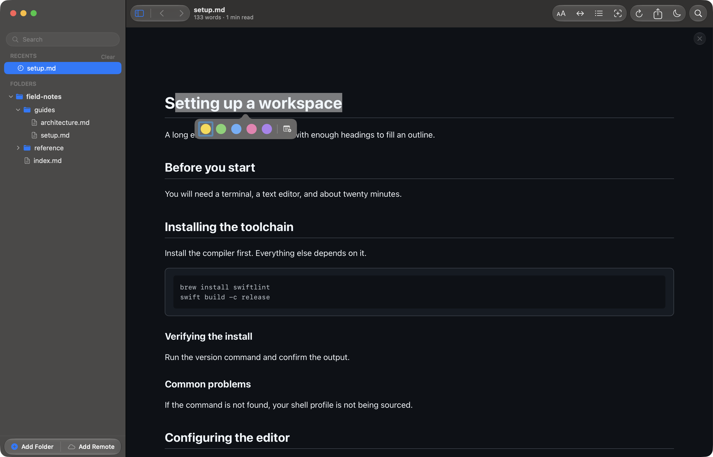
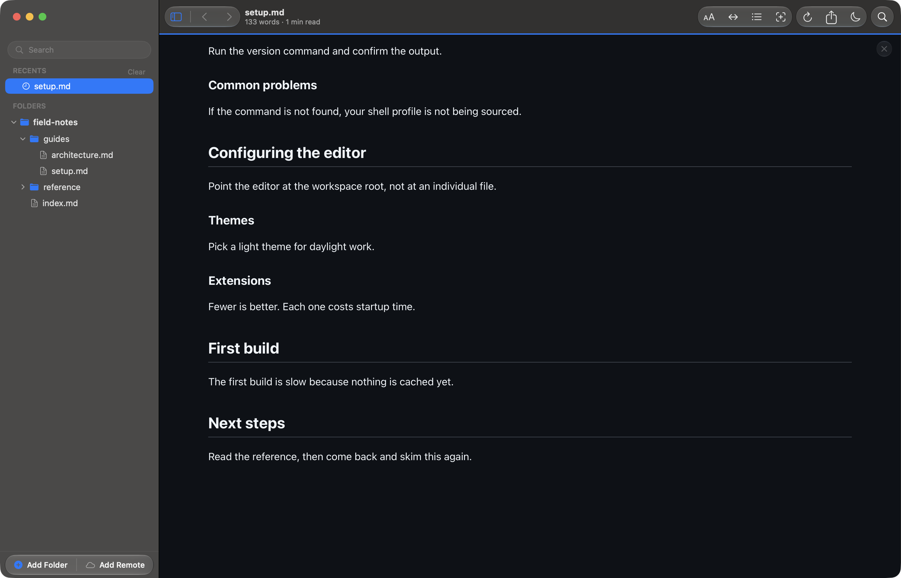

# Highlight and take notes on markdown, without touching the file

Reader.md is a free markdown reader for Mac that lets you highlight passages
in five colours and attach notes to them while the `.md` file stays exactly as
it was. Reader.md stores highlights and notes beside the file, on your Mac, so
you can mark up documentation, specs, course material, and research notes you
have no reason to edit. This page covers highlighting passages for yourself,
not the syntax highlighting Reader.md applies to code blocks.

## How do I highlight text in markdown?

Markdown has no standard highlight syntax. Some renderers accept `==text==`,
and an HTML `<mark>` tag works where HTML is allowed, but both change the
file and show up for everyone who reads it.

To highlight for yourself without changing the file, use Reader.md: select any
text in the rendered document and a bar appears under it with five colours and
a note button. Click a colour and the selection keeps it.

Reader.md anchors each highlight to the words you selected, not to a position
in the file. See [Highlighting](../features/annotations.md#highlighting).

## Add a note to a passage

The button at the right of the markup bar opens a note field instead of
picking a colour. Write the note and send it, and the highlight carries it.
A note takes a default colour, so an annotated passage still reads as
highlighted, and a small marker at the end of the range shows something is
attached.

In Reader.md a highlight, a note, and a comment thread are one kind of mark.
They differ only in how much you have added: no text is a highlight, one note
is a note, and replies make it a thread. See
[Notes](../features/annotations.md#notes).

## Reply, recolour, resolve, and hide

Click a mark you have already made and Reader.md brings the bar back with
everything the mark can do:

- change its colour, or remove the colour
- read the thread and reply to it
- **Delete** the mark
- **Resolve** it

Replies stack under the first note, each with an author (your macOS full name)
and the order they were written in. A resolved mark is de-emphasized, and a
count of resolved threads appears in the toolbar. That count is also a
switch: click it to hide resolved marks entirely, and again to bring them
back.

Threads and Resolve also suit a first pass over a proposal; see
[Read RFCs, ADRs, and design docs before you weigh in](review-design-docs-markdown.md).

## Study a cloned repo or a read-only folder

Reader.md never writes to your markdown, so a repository you cloned, a folder
mounted read-only, or someone else's handbook can carry your highlights and
notes like any other file. That makes a course repository or a team's
documentation a study set you can mark up freely.

Add the folder to the sidebar with Add Folder (⇧⌘A), or let Reader.md clone a
repository for you with Add Remote Folder (⌥⌘A). Reader.md keeps a cloned
repository in a local cache at a stable path, so annotations survive each
re-sync. See [Remote and cloned folders](../features/remote.md#read-only-and-what-follows-from-it)
and, for a folder on a server,
[Read markdown docs from a remote server on your Mac](read-markdown-over-ssh.md).

## What happens to highlights when the file changes?

Highlights survive edits elsewhere in the document. Reader.md remembers the
words a mark was made on plus a little of the text either side, so editing
the paragraph above leaves the highlight on its own words.

If the highlighted text disappears entirely, Reader.md flags the mark as
**orphaned** instead of deleting it. An amber count appears in the toolbar,
and clicking it lists the marks that lost their anchor so you can decide what
to do with them. See [When the text moves](../features/annotations.md#when-the-text-moves).

## Where are markdown highlights stored?

Reader.md stores annotations per document under
`~/Library/Application Support/Reader.md/`, keyed by the file's path. The
markdown file is never written to.

What follows from that:

| Situation | What happens to marks |
|---|---|
| You edit the file | Marks stay, anchored to their text |
| You rename or move the file | Marks are lost, because the path is the key |
| You switch to Toggle Diff (⇧⌘D) | Marks are hidden until you return to the rendered view |
| You use another Mac | Marks stay behind; there is no sync, export, or account |

## Can I annotate a markdown file without editing it?

Yes. Every highlight, note, and thread in Reader.md lives outside the file,
so the markdown on disk never changes. For using notes while reviewing a
pull request or a branch, see
[Review documentation changes before they merge](review-markdown-changes.md).

## Get Reader.md

Reader.md is a free, open-source (MIT) markdown reader for macOS 13 or later
on Apple silicon. Install it with Homebrew or the DMG — see
[Install](../install.md).
