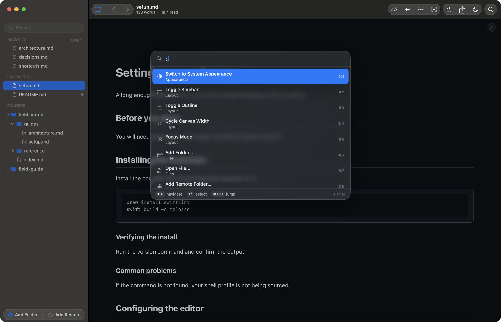

# Read markdown on a Mac without reaching for the mouse

Reader.md is a free markdown viewer for Mac where every reading action has a
keyboard shortcut. Reader.md opens files, finds them across every folder,
runs commands, jumps to headings, and moves focus through the sidebar and
outline, all without a trackpad.

## How do I open a markdown file from the keyboard on a Mac?

Press Open File (⌘O) for a single file, or Quick Open (⌘P) for any file in a
folder you have already added. Add Folder (⇧⌘A) brings a whole folder into
the sidebar. From a terminal, `reader README.md` opens a file and `reader .`
adds the folder you are standing in; see the [command line](../cli.md).

## Find any file with Quick Open

Quick Open (⌘P) is a fuzzy switcher across every file in every folder in
Reader.md. Reader.md matches the folder path as well as the file name, so a
query can find a file by where it sits.

| Key | In Quick Open |
|---|---|
| ↑ ↓ | Move through results |
| ⏎ | Open the selected result |
| ⌘1–⌘9 | Open one of the first nine results directly |
| ⎋ | Dismiss |

Filter Files (⇧⌘F) is the other route: it filters the sidebar by file name
across every root at once. See [Quick Open](../features/library.md#quick-open)
and [Filtering the tree](../features/library.md#filtering-the-tree).

## Run any command from Quick Open

Start a Quick Open query with `>` and Reader.md lists commands instead of
files: appearance, layout, and the file actions, each numbered for ⌘1–⌘9.
That makes Quick Open the keyboard route to actions with no shortcut of their
own, such as switching between light and dark appearance.

## How do I navigate markdown headings without a mouse?

Open Quick Open (⌘P) and type `#`. Reader.md lists the open document's
headings in order; pick one with the arrow keys and ⏎ to jump there. The
outline (⇧⌘B) works from the keyboard too: ⇥ into it and ⏎ jumps to the
focused heading. More in
[Navigate long markdown documents on your Mac](markdown-table-of-contents-viewer.md).

## Move between documents

Back (⌘[) and Forward (⌘]) step through every document you have opened in
Reader.md, like a browser. Following a link between two markdown files counts,
so ⌘[ returns you to the document you came from, scrolled to where you were.
See [Back and forward](../features/navigating.md#back-and-forward).

## Search inside a document

Find in Page (⌘F) opens the search field and counts matches as you type.
Find Next (⌘G) and Find Previous (⇧⌘G) step through them, as do ⌘↩ and ⇧⌘↩,
and ⎋ clears the field. See
[Finding text in a document](../features/reading.md#finding-text-in-a-document).

## Tab through the sidebar, outline, and toolbar

⇥ moves focus to the next control in Reader.md and ⇧⇥ to the previous one.
Focus runs through the sidebar rows, the outline, the empty-state hints, and
the toolbar. ␣ or ⏎ activates whatever has focus: it opens the file, jumps to
the heading, or expands the folder.

### Why doesn't Tab move focus in Mac apps?

macOS gates it. Turn on **System Settings → Keyboard → Keyboard navigation**,
and ⇥ moves through Reader.md's sidebar, outline, and toolbar. With the
setting off, ⇥ reaches only text fields.

## Make room for the page

- **Toggle Sidebar (⌘B)** hides or shows the file tree.
- **Toggle Outline (⇧⌘B)** hides or shows the heading pane.
- **Focus Mode (⌥⌘F)** hides the chrome, goes fullscreen, and narrows the
  canvas. ⌥⌘F again or ⎋ brings the layout back as it was.

For more on focus mode, see
[Read markdown on your Mac without distractions](distraction-free-markdown-reader.md).

## Adjust the page

Increase Text (⌘+), Decrease Text (⌘−), and Actual Size (⌘0) set the text
size. Cycle Canvas Width (⇧⌘\\) moves through Narrow, Wide, and Full Width.
Both apply to every document and persist across launches. See
[Text size](../features/reading.md#text-size).

## Every keyboard shortcut in one place

Keyboard Shortcuts (⌘/) opens the full list from the Help menu inside
Reader.md. The ones used most while reading:

| Shortcut | Action |
|---|---|
| ⌘O | Open File… |
| ⌘P | Quick Open (`>` commands, `#` headings) |
| ⇧⌘F | Filter Files |
| ⌘F | Find in Page |
| ⌘[ / ⌘] | Back / Forward |
| ⌘B / ⇧⌘B | Toggle Sidebar / Toggle Outline |
| ⌥⌘F | Focus Mode |
| ⌘E | Export as PDF… |
| ⇧⌘E | Open in Editor |
| ⌘, | Settings |

## Get Reader.md

Reader.md is free and MIT-licensed, for macOS 13 or later on Apple silicon.
See [Install](../install.md) for Homebrew and the direct download.
