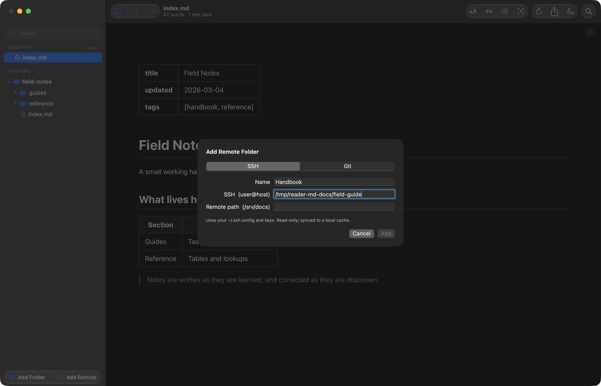
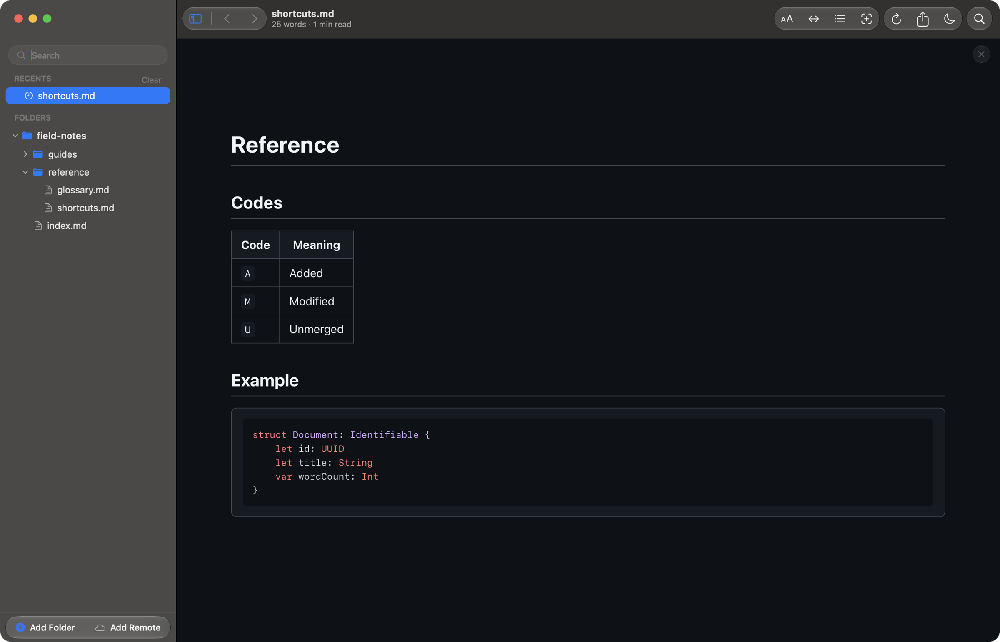

# Keep your runbooks readable when the network isn't

Reader.md is a free markdown viewer for Mac that keeps a folder of runbooks,
on-call guides, and incident playbooks readable when the systems around you
are failing. Reader.md reads a local folder or a cloned copy of your runbooks
repository, renders everything with bundled assets, and finds the right
runbook and the right step from the keyboard.

## How do I access runbooks during an outage?

Keep a local copy that was synced before the outage, and read it in an app
that needs no network to render. Reader.md does both: a cloned runbooks
repository stays readable from its local cache even when the git host is
unreachable, and every part of rendering, diagrams included, is bundled with
the app.

A runbook that lives only in a hosted wiki is exactly as available as the
wiki. A copy on your Mac is not.

## Keep a local copy of the runbooks repo

Add the repository with Add Remote Folder (⌥⌘A), switch the sheet to **Git**,
and give it the clone URL (`https://`, `git@`, `ssh://`, or a path to a
repository on disk). Reader.md clones it once into a local cache and shows
it in the sidebar as another root.

How Reader.md keeps that copy current:

- **On launch**, Reader.md runs `git pull --ff-only` on the clone.
- **On demand**, hover the root and click **Re-sync**, or right-click it and
  choose **Re-sync**.
- **Credentials** are your existing git credentials. Git is never allowed to
  prompt, and Reader.md stores none.

The copy is as fresh as the last successful pull, not continuously updated,
so re-sync before a shift starts. See
[A git repository](../features/remote.md#a-git-repository).

If your runbooks already sit in a repository you have checked out, add that
folder with Add Folder (⇧⌘A) instead. Reader.md watches a local folder and
re-renders a file as soon as it changes on disk.

## Does Reader.md work without internet?

Yes, for reading. Reader.md renders markdown, code highlighting, Mermaid
diagrams, and LaTeX math with assets bundled in the app, so none of it
reaches the network. Only the pull needs a connection. When the host is
unreachable, the root's badge shows an amber triangle (hover it for git's
error) and the cached copy stays readable. See
[Reading the badges](../features/remote.md#reading-the-badges).

## Find the right runbook fast

Quick Open (⌘P) fuzzy-matches every file name and folder path across every
root, so a few letters of the service or the alert reach the runbook.
⌘1–⌘9 open one of the first nine results directly. Filter Files (⇧⌘F)
narrows the sidebar to matching file names instead.

Quick Open matches names and paths, not the text inside runbooks, so runbooks
named and foldered by service are the fastest to reach. See
[Every markdown folder on your Mac in one library](find-markdown-files-across-folders.md).

## Jump to the step in a long runbook

Three ways to get from the top of a long runbook to the step you need:

| Need | Use |
|---|---|
| A section by name | Quick Open (⌘P), then type `#` to list the open document's headings |
| The whole structure | Toggle Outline (⇧⌘B), which tracks your position and jumps on click |
| A word or error string | Find in Page (⌘F), with a match count; ⌘G and ⇧⌘G step through matches |

See [The outline](../features/reading.md#the-outline) and
[Finding text in a document](../features/reading.md#finding-text-in-a-document).

## Copy the command from a code block

Hover any fenced code block and Reader.md shows a **Copy** button at its top
right. The button copies the code as plain text, so a command lands in your
terminal without stray formatting, and reads **Copied** for a moment
afterwards.

## Mermaid diagrams without the network

A `mermaid` code fence in a runbook renders as a diagram from Reader.md's
bundled copy of Mermaid, with no network request. Diagram controls appear on
hover: zoom out, zoom in, reset, and fullscreen, which drops Mermaid's width
limit so a large architecture or escalation diagram stays legible. A diagram
that fails to parse shows its error in place and leaves the rest of the
runbook readable. See
[Diagrams and math](../features/rendering.md#diagrams-and-math), or
[View Mermaid diagrams on your Mac, offline](mermaid-diagram-viewer-mac.md).

## Does Reader.md run the commands in a runbook?

No. Reader.md reads and copies; it never executes anything in a document.
Reader.md also never writes to your runbooks, and a cloned root is read-only:
nothing you do in Reader.md is sent back to the repository.

## Where should runbooks live?

Runbooks are easiest to trust when they live in a git repository, reviewed in
pull requests like code, and when a copy sits somewhere that does not depend
on the system that is failing. Reader.md covers the second half: a clone on
your Mac, pulled on launch. For runbooks kept on a server instead, see
[Read markdown docs from a remote server on your Mac](read-markdown-over-ssh.md).

## Get Reader.md

Reader.md is a free, open-source (MIT) markdown viewer for macOS 13 or later
on Apple silicon. Install it with Homebrew or the DMG — see
[Install](../install.md).
