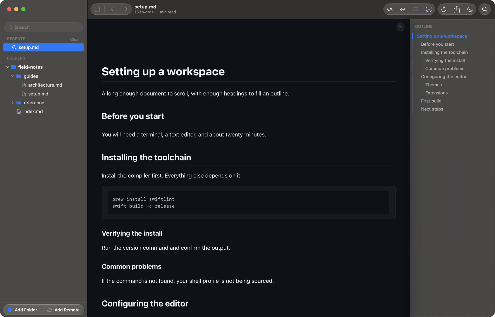
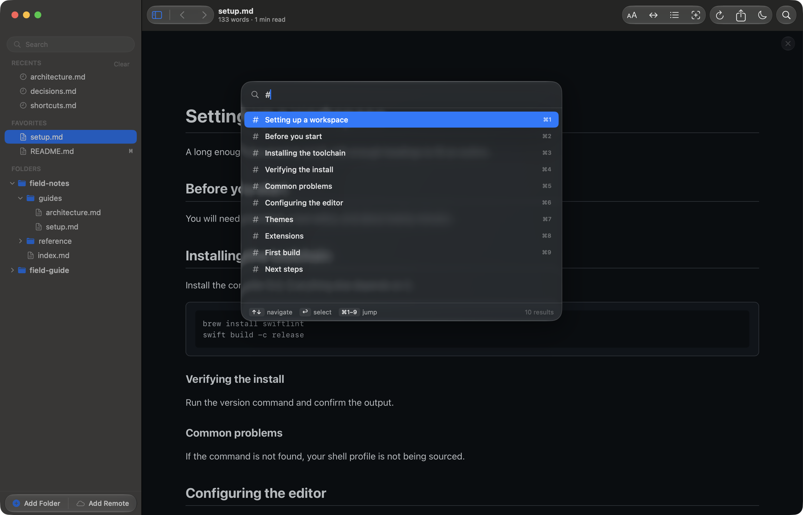
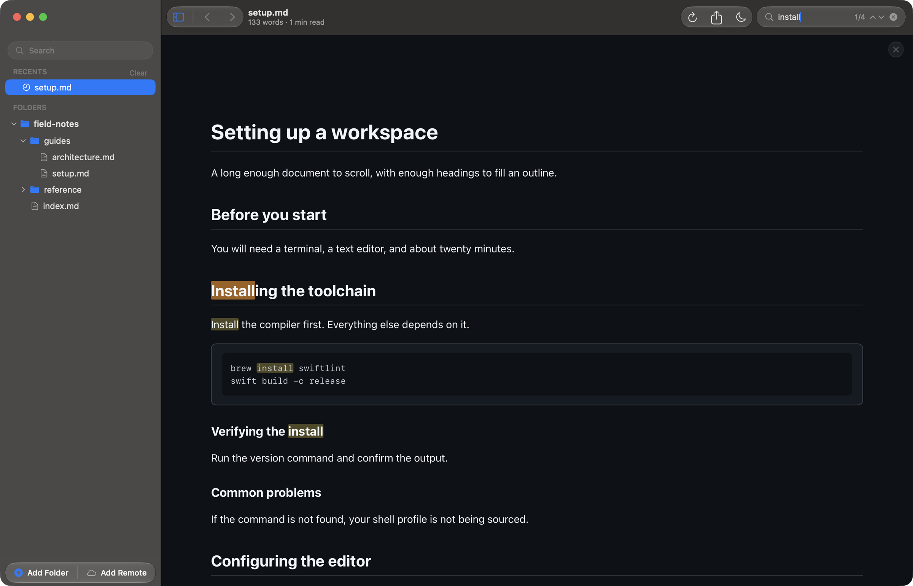

# Navigate long markdown documents on your Mac

Reader.md is a free markdown viewer for Mac that builds a table of contents
from any document's headings and keeps it beside the page. Reader.md adds a
heading jump, find in page, a progress bar, and back and forward between
files, so a long spec or handbook stays easy to move around.

## How do I see the outline of a markdown file on a Mac?

Open the file in Reader.md and choose Toggle Outline (⇧⌘B). Reader.md shows
the document's headings in a pane on the right, nested headings indented, and
clicking any entry jumps to that section. Press ⇧⌘B again to hide it.

The indentation shows at a glance how deeply a document is structured, which
is often the quickest way to judge a long file before reading it. See
[The outline](../features/reading.md#the-outline).

### Does the table of contents follow my scroll position?

Yes. The Reader.md outline tracks your position as you scroll, with an accent
rail marking the heading you are inside. Scroll on to the next section and the
rail moves with you.

### Do I need a table of contents in the markdown file itself?

No. Reader.md builds the outline from the headings already in the document,
so there is no `[TOC]` marker or generated list to maintain. Reader.md never
writes to the file, so the markdown stays exactly as it was.

## How do I jump to a section in a long markdown file?

Click the heading in the outline, or open Quick Open (⌘P) and type `#`.
Reader.md lists the open document's headings in document order; pick one and
the page scrolls to it.

The `#` list covers the document you are reading only. Quick Open without the
`#` searches files across every folder instead. See
[Commands and headings](../features/library.md#commands-and-headings), and
[Read markdown on a Mac without reaching for the mouse](keyboard-markdown-viewer-mac.md)
for the rest of the keyboard route.

Hovering a heading in the document also reveals an anchor link to its left.

## Know where you are in the document

Reader.md shows how far through a document you are without a scroll bar
hunt:

- **Progress bar** — a bar under the toolbar fills as you scroll.
- **Word count and reading time** — under the file name in the title bar; the
  reading time is an estimate.
- **Current heading** — the outline's accent rail.

## Find a phrase in a long document

Find in Page (⌘F) searches the open document. Reader.md counts the matches as
you type, highlights all of them, and tints the current one more strongly.
Step through with Find Next (⌘G) and Find Previous (⇧⌘G), or ⌘↩ and ⇧⌘↩.
⎋ clears the field.

To search across files rather than inside one, use Filter Files (⇧⌘F) or
Quick Open (⌘P). See
[Finding text in a document](../features/reading.md#finding-text-in-a-document).

## Follow links between files and come back

Links between markdown files open in the same Reader.md window, and following
one counts as navigation. Back (⌘[) returns you to the document you came from,
and Reader.md resumes it where you had scrolled to. Forward (⌘]) goes the
other way. See [Back and forward](../features/navigating.md#back-and-forward).

## Pick up where you stopped

A long document reopens in Reader.md at the place you left it, so returning
to a 40-section spec does not mean scrolling back down from the top.

## Make room for the page

Toggle Sidebar (⌘B) gives the document and its outline the whole window. For
nothing on screen but the page, see
[Read markdown on your Mac without distractions](distraction-free-markdown-reader.md).

In a git repository, diff mode (⇧⌘D) swaps the outline's headings for the
changed hunks. See
[Review documentation changes before they merge](review-markdown-changes.md).

## Get Reader.md

Reader.md is free and MIT-licensed, for macOS 13 or later on Apple silicon.
See [Install](../install.md) for Homebrew and the direct download.
