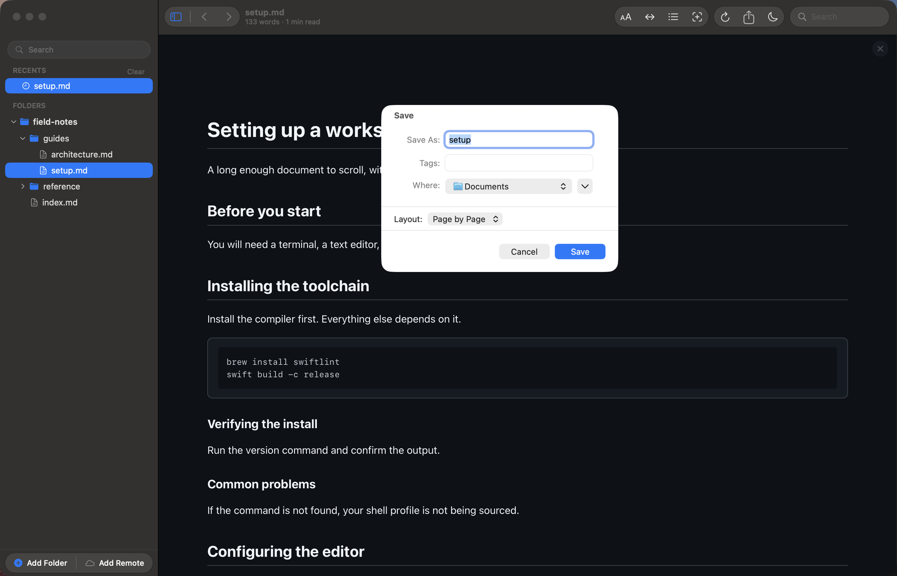
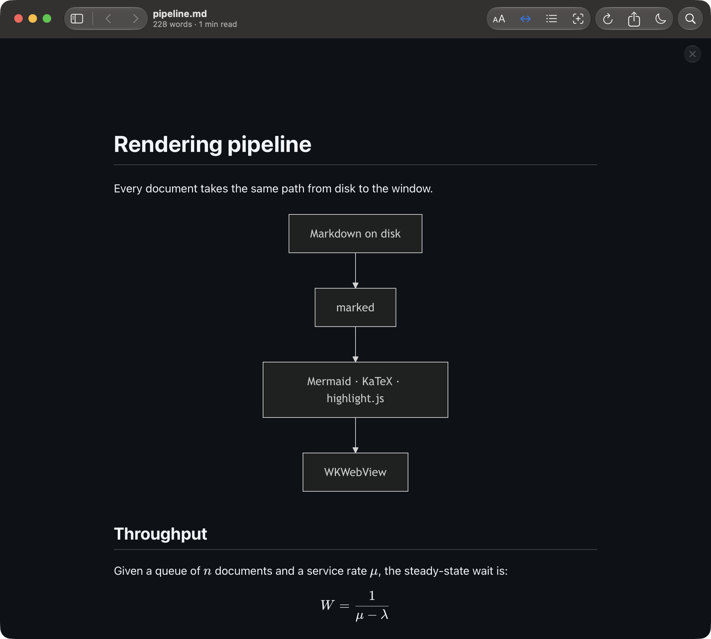
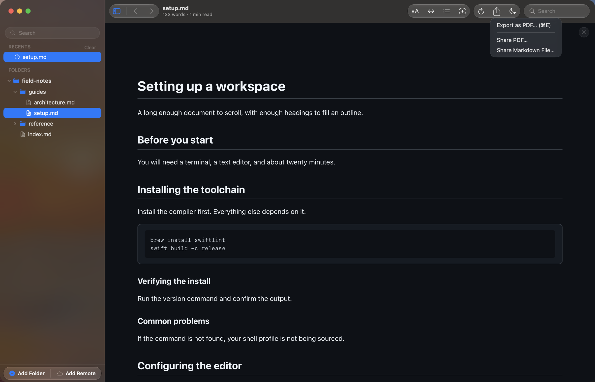

# Convert markdown to PDF on your Mac, then share it

Reader.md is a free markdown viewer for Mac that turns the document you are
reading into a PDF in one step. Reader.md exports the rendered page, with
Mermaid diagrams, LaTeX math, and highlighted code intact, and can hand the PDF
straight to AirDrop, Mail, or Messages without saving it first.

## How do I convert a markdown file to PDF on a Mac?

Open the markdown file in Reader.md and choose Export as PDF (⌘E). A save
dialog opens with a **Layout** control below the name field; pick a layout,
name the file, and save.

1. Open the file with Open File (⌘O), or drop it onto the window.
2. Choose **File → Export as PDF…** (⌘E).
3. Pick **Page by Page** or **Continuous** under **Layout**, then **Save**.

The export menu in the toolbar holds the same command. See
[Export as PDF](../features/exporting.md#export-as-pdf).

## Export markdown to PDF without Pandoc

Reader.md needs no Pandoc, no LaTeX distribution, and no command-line setup to
make a PDF. The markdown renderer, Mermaid, KaTeX, and the syntax highlighter
are all bundled with the app, and the PDF is made from the page Reader.md has
already drawn.

Reader.md exports one open document at a time, as PDF only.

## Can I export markdown to PDF offline?

Yes. Reader.md renders and exports on your Mac, so nothing is uploaded to a
conversion service and no account is involved. A document renders the same
with the network off; the app's only outbound request is its update check.

## How do I save markdown as PDF with diagrams intact?

Reader.md's PDF carries the document as you are reading it, so a Mermaid
diagram drawn on screen is drawn in the PDF, and LaTeX math and highlighted
code blocks come across the same way.

What carries over and what doesn't:

| In the PDF | Left out |
|---|---|
| Rendered diagrams, math, tables, highlighted code | Diagram zoom and fullscreen controls |
| Your appearance (light or dark) and reading theme | Code-block copy buttons |
| Your text size | Heading anchor links |
| Long code lines, wrapped to the page | Find highlights |

A diagram you zoomed while reading is reset for the export and put back
afterwards, and exporting in the middle of a search doesn't lose your place in
the matches. See
[What ends up in the file](../features/exporting.md#what-ends-up-in-the-file).

## Page by page or one long page?

Reader.md offers two PDF layouts in the export dialog:

- **Page by Page** — a paginated PDF on your system paper size, the way it
  would print.
- **Continuous** — a single page as tall as the document, so no page break
  lands in the middle of a diagram or a code block.

The choice applies to that one export. The default it starts from lives in
**Settings ▸ Editing & Export** (⌘,).

## Does the PDF keep dark mode and my theme?

Yes. Reader.md exports a dark document as a dark PDF, edges included: the
page background is painted to the paper's edge rather than left as white
margins. The reading theme (Standard, Editorial, or Terminal) and text size
carry over too, so set them before you export. See
[Read markdown in dark mode, light mode, or your own reading theme](dark-mode-markdown-viewer-mac.md).

## Send the PDF without saving it first

The export button in Reader.md's toolbar is a menu. **Share PDF…** renders the
same PDF that ⌘E would save and opens the system share sheet: AirDrop, Mail,
Messages, Notes, and any share extension you have installed. The recipient
needs no markdown reader, and the file arrives named after the document — share
a `README.md` and `README.pdf` lands on the other end.

A shared PDF uses the default layout from Settings, because a share has no
dialog to hold the **Layout** control. A long document can pause briefly before
the sheet opens while Reader.md renders it. Both share commands are also in the
**File** menu and in Quick Open (⌘P).

## Or send the markdown itself

**Share Markdown File…** sends the `.md` file through the same share sheet,
with nothing rendered, so it opens at once. It stays available while a git diff
is showing, when there is no rendered page to export. See
[Share](../features/exporting.md#share).

## What Reader.md doesn't do

- No batch export: one open document per PDF.
- No custom margins, headers, footers, or page sizes; Page by Page uses your
  system paper size.
- PDF only — no Word, HTML, or other formats.
- No headless export from the `reader` command; export from the app window.

For reading a long document before you export it, see
[Read markdown on your Mac without distractions](distraction-free-markdown-reader.md).

## Get Reader.md

Reader.md is free and open source under the MIT license, for macOS 13 or later
on Apple silicon. Install it with Homebrew or the DMG — see
[Install](../install.md).
