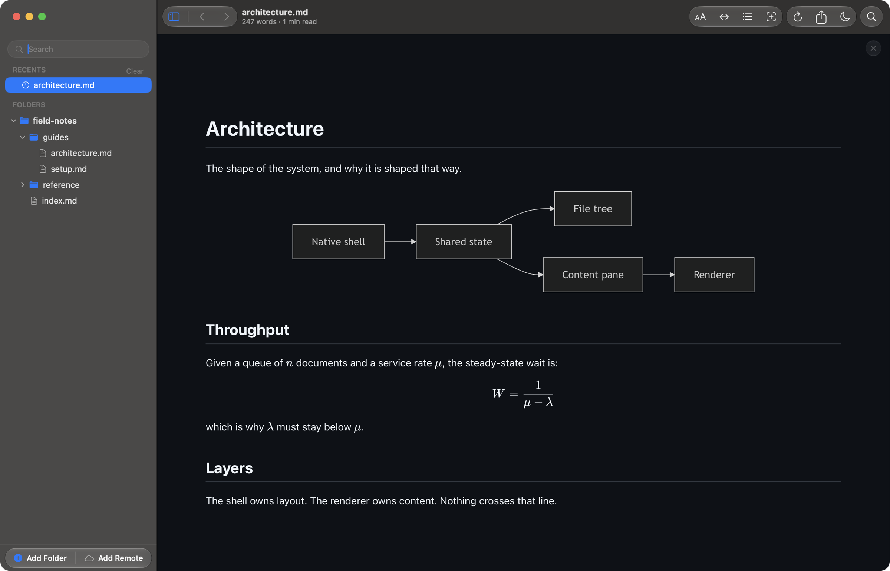

# View Mermaid diagrams on your Mac, offline

Reader.md is a free markdown viewer for Mac that draws every `mermaid` code
fence in a document as a diagram, right where it sits in the text. Reader.md
bundles the Mermaid engine, so diagrams render with no browser, no plugin, and
no network connection, and large ones can be zoomed, panned, and blown up to
fullscreen.

## How do I view a Mermaid diagram in a markdown file on Mac?

Open the markdown file in Reader.md and each fenced block tagged `mermaid` is
drawn as a diagram in place. There is nothing to switch on: open the file with
Open File (⌘O), drop it onto the window, or add its folder with Add Folder
(⇧⌘A) and pick it from the sidebar.

````markdown

````

The rest of the document renders around the diagram as GitHub-flavoured
markdown, with tables, syntax-highlighted code, and LaTeX math in the same
page. From a terminal, `reader notes.md` opens the file the same way — see the
[command line](../cli.md).



## Can I view Mermaid diagrams without internet?

Yes. Reader.md ships Mermaid inside the app, along with everything else it
needs to render markdown, so a diagram draws the same with Wi-Fi off. Nothing
in a document reaches the network; the app's only outbound request is its
update check.

That matters for documents you can't paste into a web tool: internal
architecture notes, runbooks, or anything under an NDA stays on your Mac.

## Which Mermaid diagram types are supported?

Reader.md bundles Mermaid 11.16.0, so it draws the diagram types that release
ships, including:

- flowchart and sequence diagrams
- class, state, and entity-relationship (ER) diagrams
- gantt charts, pie charts, and user journeys
- gitGraph, mindmap, and timeline diagrams

Newer types such as quadrant charts, sankey, xychart, block, and architecture
diagrams are in the bundle too. The bundled Mermaid version moves forward with
Reader.md's own updates, not on its own.

## Why is my Mermaid diagram too small to read?

Mermaid caps the width of its own output, so a wide flowchart shrinks to fit
the page and its labels get tiny. Reader.md's fullscreen control drops that
cap, which is what makes a large diagram readable.

Hover a diagram and its controls appear in the corner of the drawing:

| Control | What it does |
|---|---|
| Zoom out / zoom in | Steps the drawing smaller or larger |
| Reset | Returns to the fitted size |
| Fullscreen | Drops Mermaid's width limit, so a large diagram is readable |

Pinch or ⌘-scroll zooms too, double-clicking resets, and a diagram zoomed past
its fitted size can be dragged to pan. See [Diagrams and math](../features/rendering.md#diagrams-and-math).

## What happens if a Mermaid diagram has a syntax error?

Reader.md replaces a diagram that fails to parse with Mermaid's error message,
in place. A broken block never takes the rest of the document down with it, so
the text above and below still reads normally while you fix the fence.

## Preview Mermaid diagrams while you edit

Reader.md watches the folders you add, so saving the file in your editor
re-renders the open document where it stands, scroll position kept. Put your
editor on one side and Reader.md on the other, and each save redraws the
diagram. Open in Editor (⇧⌘E) hands the current document to the editor you
chose once in Settings. See [Live reload](../features/rendering.md#live-reload).


Reader.md is a viewer, not a diagram editor. Mermaid's Live Editor is built for writing and tweaking a diagram; Reader.md is for
reading the markdown file the diagram already lives in, alongside the prose
that explains it.

## Diagrams in AI-written docs

Coding agents often write plans and design docs with Mermaid flowcharts and
sequence diagrams in them. Reader.md draws those as soon as the file opens,
and redraws them as the agent edits. For that workflow, see
[Review what your coding agent writes](review-ai-agent-docs.md).

## Can I export markdown with Mermaid diagrams to PDF?

Yes. Export as PDF (⌘E) carries the drawn diagrams into the PDF, while the
hover controls are left out and any diagram you zoomed is reset for the
export. See [Convert markdown to PDF on your Mac, then share it](markdown-to-pdf-mac.md).

## What Reader.md doesn't do

- Reader.md does not edit diagrams or markdown; editing goes to your own editor.
- Reader.md does not export a single diagram as PNG or SVG.
- Reader.md opens Mermaid inside markdown files (`.md`, `.markdown`, `.mdown`,
  `.mdx`, `.mkd`, `.mkdn`, `.mdwn`), not standalone `.mmd` files.

## Get Reader.md

Reader.md is free and open source under the MIT license, for macOS 13 or later
on Apple silicon. Install it with Homebrew or the DMG — see
[Install](../install.md).
