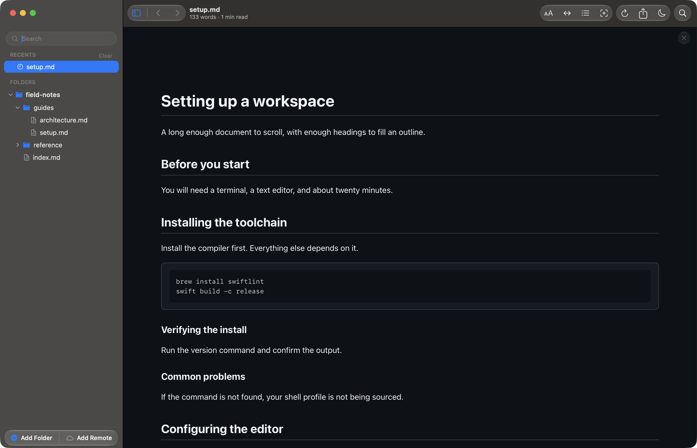

# How to open .md files on a Mac, rendered instead of raw

An `.md` file is a markdown document: plain text with `#` headings, `*`
emphasis, and `[links](…)` that a markdown app turns into a formatted page.
Reader.md is a free, native markdown viewer for Mac that opens `.md` files
rendered, and once it is the Finder default, double-clicking any `.md` file
shows the formatted page instead of the raw syntax.

## How do I open an .md file on a Mac?

Open the `.md` file from inside Reader.md with Open File (⌘O) or by dragging
it onto the window, or make Reader.md the Finder default so a double-click
opens it rendered. Reader.md renders GitHub-flavoured markdown, so headings,
lists, tables, and code blocks appear formatted rather than as
symbols.

1. Install Reader.md with Homebrew or the DMG — see [Install](../install.md).
2. In Reader.md, choose **File → Open File…** (⌘O) and pick the file.
3. Or drag the `.md` file onto the Reader.md window.

Opening a single file this way does not add a folder to the sidebar. See
[Opening a document](../features/navigating.md#opening-a-document).



## Does a Mac have a built-in markdown viewer?

No. macOS ships no app that renders markdown, so an `.md` file opens in
whichever app has claimed the extension, often a text editor that shows the
raw `#` and `*` characters. Changing the Finder default to a markdown viewer
fixes that for every `.md` file at once.

## How do I set the default app for .md files on a Mac?

Use Finder's **Get Info** panel to make Reader.md the default for all `.md`
files. After that, double-clicking any `.md` file in Finder opens it rendered
in Reader.md.

1. In Finder, right-click any `.md` file and choose **Get Info**.
2. Under **Open with**, choose **Reader.md**.
3. Click **Change All…** and confirm.

Reader.md registers itself as a markdown viewer, which is why it appears in
that list. To change the default markdown viewer again later, repeat the same
steps with another app.

Reader.md also has an **Always Open With** item on its own sidebar context
menu. That one is different: it opens the file in another app and remembers
that app as your editor for Open in Editor (⇧⌘E). It does not change Finder's
default.

## Which file extensions does Reader.md open?

Reader.md opens markdown under all seven common extensions:

| Extension | Example |
|---|---|
| `.md` | `README.md` |
| `.markdown` | `notes.markdown` |
| `.mdown` | `draft.mdown` |
| `.mdx` | `page.mdx` |
| `.mkd` | `notes.mkd` |
| `.mkdn` | `notes.mkdn` |
| `.mdwn` | `index.mdwn` |

## Open a whole folder of markdown files

Drag a folder onto the Reader.md window, or choose **File → Add Folder…**
(⇧⌘A), and Reader.md lists every markdown file beneath it in the sidebar.
Other files are skipped, along with folders like `node_modules` and `.git`.
Add as many folders as you like; Quick Open (⌘P) then searches all of them.
See [Folders in the sidebar](../features/library.md#folders-in-the-sidebar).


For keeping several folders in one place, see
[Every markdown folder on your Mac in one library](find-markdown-files-across-folders.md).

## How do I open an .md file from Terminal?

Run `reader` with the file's path, and Reader.md opens it in a window. The
`reader` command comes with the Homebrew install; with the DMG, choose
**File → Install `reader` Command Line Tool…** once.

```bash
reader README.md     # open one file
reader .             # add the current folder to the sidebar
```

See the [command line](../cli.md), or
[Render markdown from the terminal in a Mac window](render-markdown-from-terminal.md).

## How do I view a markdown file without an editor?

Reader.md is a viewer: Reader.md never writes to the files it opens, so there
is no source pane, cursor, or risk of an accidental edit. When you do want to
change a file, Open in Editor (⇧⌘E) hands it to the editor you chose in
Settings, and Reader.md re-renders the page each time you save.

## Options compared

| App | What you get with an `.md` file |
|---|---|
| A plain text editor | The raw markdown syntax, unrendered |
| VS Code | A rendered preview (⇧⌘V), or the preview beside the source (⌘K V) |
| Reader.md | The rendered page on double-click, with no source pane |

VS Code suits files you are writing. Reader.md suits files you mostly read:
READMEs, docs folders, notes, and documents a tool or an agent produced.

## What Reader.md renders

Beyond standard markdown, Reader.md draws Mermaid diagrams, LaTeX math, and
syntax-highlighted code, and shows YAML frontmatter as a table. Every renderer
is bundled with the app, so a document renders the same offline. See
[How a document is rendered](../features/rendering.md).

## Get Reader.md

Reader.md is free and open source under the MIT license, for macOS 13 or later
on Apple silicon. Install it with Homebrew or the DMG — see
[Install](../install.md).
