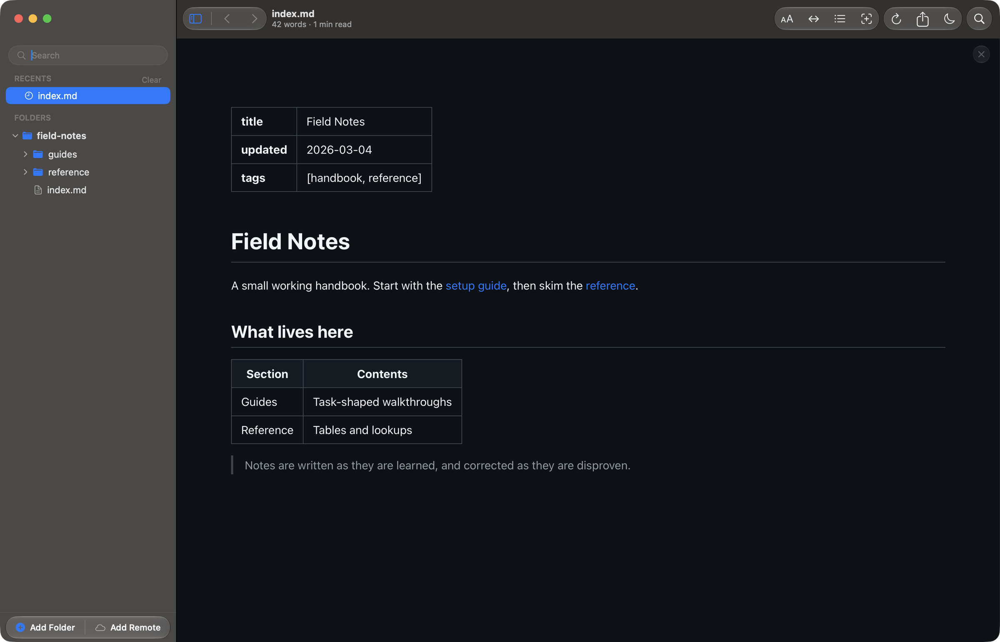

# Preview blog posts and their frontmatter on your Mac

Reader.md is a free markdown viewer for Mac that renders a post's YAML
frontmatter as a key/value table above the body, instead of raw text or a
stray heading. Reader.md opens Hugo, Jekyll, and Astro drafts straight from
the content folder, without a dev server, so you can read a post and check its
metadata in one view.

## Why does YAML frontmatter show as a heading in a markdown preview?

A frontmatter block opens and closes with `---` lines, and in plain markdown a
line of text followed by `---` is a heading. A previewer that doesn't know
about frontmatter renders the last line of your YAML as a large heading and
the rest as a paragraph.

Reader.md separates a leading `---` … `---` block from the document before
rendering, and shows it as a table. The body below starts where your post
does. See [Frontmatter and tables](../features/rendering.md#frontmatter-and-tables).

## See the metadata at a glance

Each top-level `key: value` line becomes a row, so a wrong `date`, a missing
`title`, or a `draft: true` you forgot to flip is visible before you publish.
A list such as `tags` renders as a bullet list in its cell.

What Reader.md recognises:

| Frontmatter | In Reader.md |
|---|---|
| YAML between `---` lines at the top of the file | a key/value table |
| top-level `key: value` lines | one row each |
| indented `- item` lists | a bullet list in the cell |
| nested maps | flattened into text, not a nested table |
| TOML (`+++`) or JSON frontmatter | shown as body text, no table |

## How do I preview a Hugo post without running hugo server?

Add your site's content folder to Reader.md with **Add Folder** (⇧⌘A), or run
`reader content` from the site's root, and open the post from the sidebar.
Reader.md renders the markdown and its YAML frontmatter directly, with no build
and no server.

The same goes for a Jekyll `_posts` folder or an Astro `src/content`
collection. Use `hugo server`, `jekyll serve`, or `astro dev` when you need to
see the post inside your theme; use Reader.md to read the draft and its
metadata quickly.

## What Reader.md won't show

Reader.md renders markdown, not your site, so some of what a static site
generator does is missing:

- **Shortcodes and Liquid** — `` and `` tags appear as literal
  text.
- **Theme and layout** — your site's templates and CSS are not applied; the
  post uses Reader.md's own reading themes.
- **Site-root images** — a path such as `/images/cover.png` points at the root
  of your disk, not your site's static folder, so it won't show. Images
  referenced relative to the post, as in a page bundle, are the ones to expect.

## Can I preview MDX files on a Mac?

Yes, as markdown. Reader.md lists and opens `.mdx` files alongside `.md`,
`.markdown`, `.mdown`, `.mkd`, `.mkdn`, and `.mdwn`, and renders their markdown. `import` lines show as
text and JSX components are not rendered, so an MDX post that leans on
components reads with gaps where they would be.

## Your whole content folder in one sidebar

Reader.md lists every markdown file beneath a folder you add, skipping
`node_modules` and `.git`, and keeps several folders side by side, so the blog
and the docs site can sit together. Quick Open (⌘P) finds a post by name or by
the folder it sits in, and Filter Files (⇧⌘F) narrows the tree by file name.
See [Finding your files](../features/library.md#quick-open).

## Write in your editor, read in Reader.md

Reader.md watches every folder you add. Save a post in your editor and the open
document re-renders where it stands, with your scroll position kept, so a
changed `date` or a new paragraph shows up as soon as you save. The open in
editor command (⇧⌘E) hands the post to the editor you choose in
**Settings ▸ Editing & Export**. See
[Live reload](../features/rendering.md#live-reload).

For a full read-through before you post, see
[Proofread markdown the way your readers will see it](proofread-markdown.md).

## Get Reader.md

Reader.md is a free, open-source (MIT) markdown viewer for macOS 13 or later on
Apple silicon. Install it with Homebrew or the DMG — see
[Install](../install.md).
