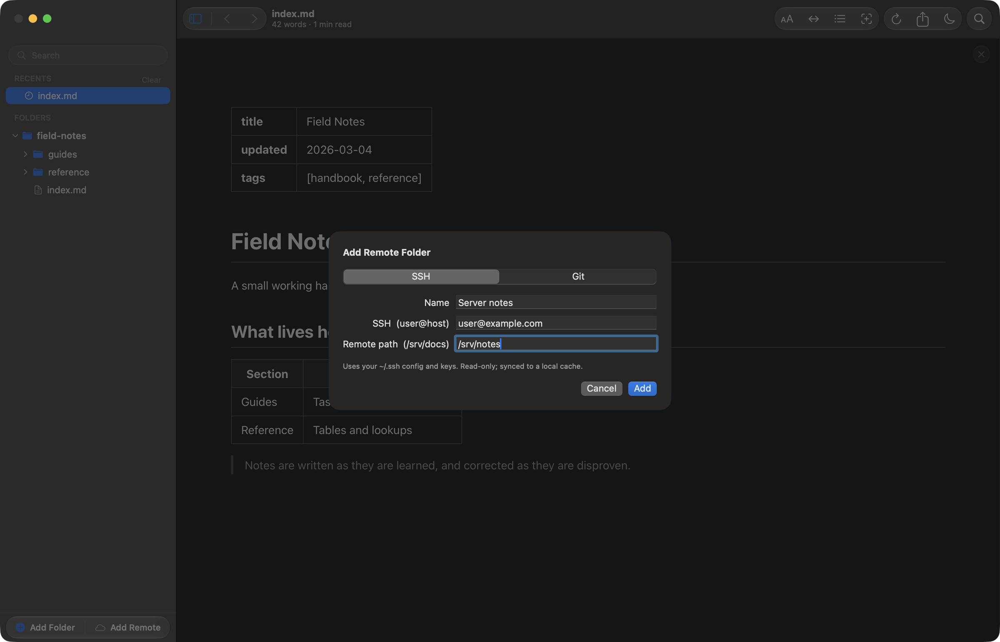
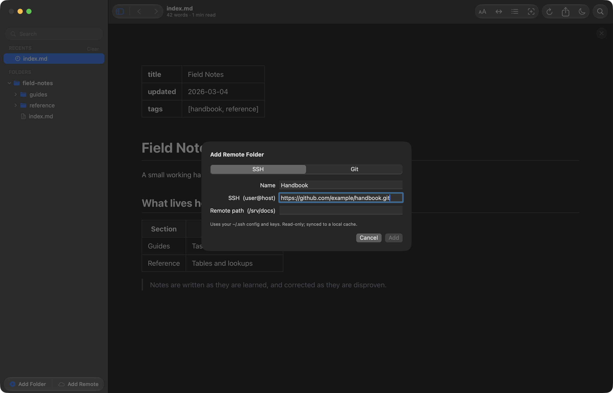

# Read markdown docs from a remote server on your Mac

Reader.md reads markdown over SSH by syncing a folder from a server, or cloning
a git repository, into a read-only cache on your Mac. The docs then render
locally like any other folder in the sidebar, work with no connection, and use
your own `~/.ssh` keys and git credentials.

## How to read markdown files on a server from my Mac

Open **Add Remote Folder…** (⌥⌘A), stay on the **SSH** side, and enter a
destination and a path on that host. Reader.md copies the folder's markdown
into a local cache with `rsync`, and the folder appears in the sidebar as a new
root.

The destination is whatever you would type after `ssh`, so a host already set
up in `~/.ssh/config` works by its short name. That makes Reader.md a markdown
viewer that uses your `~/.ssh` config as it is: no separate connection list, no
keys to import.



What the sync brings down, per [A folder on a server](../features/remote.md#a-folder-on-a-server):

- **Only markdown files and the images they reference** — a build directory
  next to the docs stays on the server.
- **Deletions follow** — a file removed on the server leaves the sidebar on the
  next sync.
- **Re-syncs are incremental** — only what changed moves.

## Open a remote folder from the command line

The `reader remote` command takes an SSH destination and an absolute path,
separated by a colon, and opens the Add Remote sheet with both fields filled in
for you to confirm.

```bash
reader remote me@vps:/srv/docs
```

`reader remote` is SSH only. A clone URL is not a valid argument; add a
repository from the sheet instead. A malformed command exits `1` with the
reason on stderr, so `reader remote "$HOST:$DIR" || handle_error` works in a
script. See [Command line](../cli.md#remote-folders).

## Read markdown from a git repository on your Mac

Switch the Add Remote sheet to **Git** and paste a clone URL — `https://`,
`git@`, `ssh://`, or a path to a repository on disk. Reader.md clones the
repository once and runs `git pull --ff-only` on each launch.



Reader.md uses your existing git credentials and never lets git prompt, so a
repository you cannot read fails with git's own error instead of hanging. The
cloned root carries a branch badge in the sidebar; an SSH folder carries a
cloud. See [A git repository](../features/remote.md#a-git-repository).

Runbooks kept in a repository work the same way; see
[Keep your runbooks readable when the network isn't](markdown-runbook-viewer.md).

## How do I preview markdown on a remote server without VS Code Remote SSH?

Add the folder to Reader.md with **Add Remote Folder…** (⌥⌘A) and read it in a
dedicated markdown reader on your Mac. Reader.md installs nothing on the server
(the host needs SSH access and `rsync`) and no editor session stays open; Reader.md pulls a copy of the docs and renders
them locally, with Mermaid, math, and syntax highlighting from engines bundled
in the app.

Because reading happens against the cache, the tree is as fast as a local
folder, and a remote root behaves like any other root in the sidebar — see [Finding your files](../features/library.md).

## Do I need sshfs or macFUSE to read remote files?

No. Reader.md does not mount the server. Remote sync shells out to `rsync` and
`git`, which copy the docs into a local cache, so there is no file system
extension to install and no mount to drop when the network does.

The trade-off is that Reader.md shows the last copy that came down, not a live
view of the server. Syncs run quietly on launch, and **Re-sync** on the root
fetches changes on demand. If a host is unreachable, an amber badge says so and
the cached copy stays readable — which is how Reader.md lets you read remote
markdown offline.

## Is my server modified when I read docs remotely?

No. Reader.md never writes back to the server. A remote root is a read-only
copy: **Open in Editor** (⇧⌘E) is unavailable for files inside one,
and a cloned repository only fast-forwards, so the cache is never sent
anywhere.

Removing a remote root takes it out of the sidebar and leaves the server
untouched. Reader.md stores no password, key, or token of its own; `rsync` and
`git` use your existing `~/.ssh` config and git credential helper. See
[Read-only, and what follows from it](../features/remote.md#read-only-and-what-follows-from-it).

## Can I annotate or highlight remote markdown files?

Yes. Highlights, notes, and comment threads work on remote files, and they stay
on your Mac. Reader.md keys each annotation by the file's path in the local
cache, and that path is stable across re-syncs, so marks survive them.


Nothing is written into the markdown or sent to the server. See
[Highlights and notes](../features/annotations.md).

## A markdown reader with SSH support for Mac

| | Reader.md |
|---|---|
| Price | Free, MIT licensed |
| App | Native macOS, 13 or later, Apple silicon |
| SSH | Your own `~/.ssh` config and keys, no credentials stored |
| Git | Clone URL, `pull --ff-only` on launch |
| Server access | Read-only, nothing written back |
| Offline | Reads the last synced copy |

## Get Reader.md

Install Reader.md with Homebrew or the DMG — see [Install](../install.md). Then
use **Add Remote Folder…** (⌥⌘A), or run `reader remote` from a terminal, and point it at the docs on
your server.
