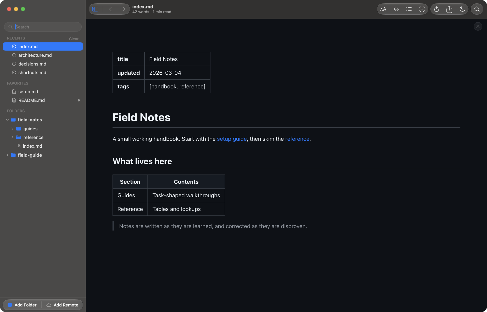
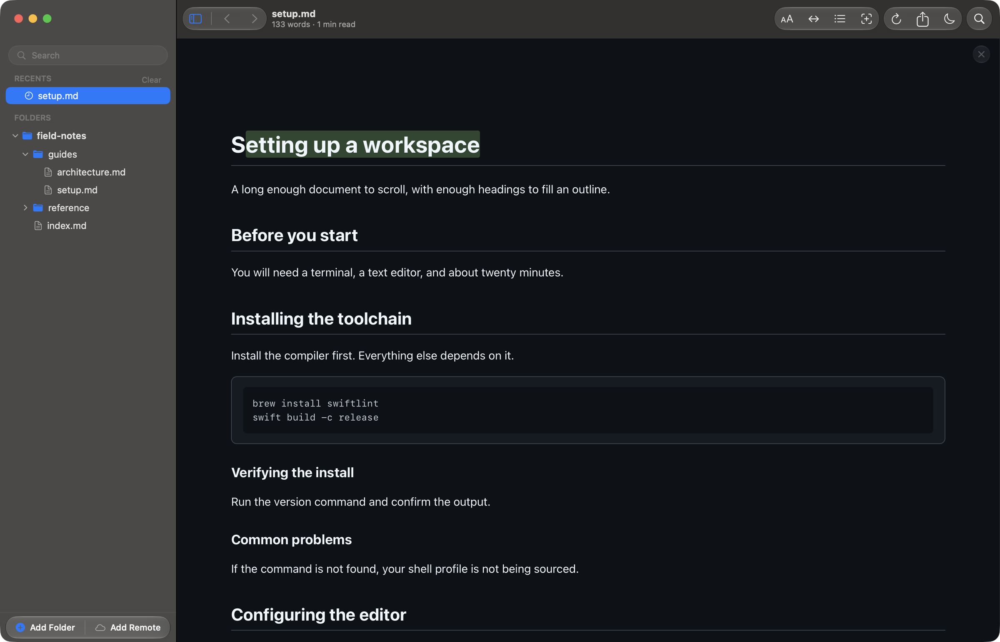

# Review what your coding agent writes

Reader.md is a free markdown viewer for AI coding agents on the Mac: it gives the
plans, specs, and reports an agent writes a proper reading window. Claude Code, Codex, and
Cursor leave markdown on disk; Reader.md renders it, re-renders it as the agent
keeps editing, and lets you highlight what needs another look, all without
touching the file.

## How do I view markdown files Claude Code creates?

To read Claude Code plans on a Mac, run `reader` on the file, or add the folder the agent works in, and Reader.md
opens the document rendered: headings, tables, task lists, code with syntax
highlighting, Mermaid diagrams, and LaTeX math. Reader.md never writes to the
file, so reading a plan cannot disturb what the agent is working on.

```bash
reader docs/plan.md        # open one file
reader .                   # add the current repository to the sidebar
```

Adding the repository keeps every markdown file in it one click away in the
sidebar, with `node_modules`, `.git`, and anything `.gitignore` excludes left
out. Quick Open (⌘P) finds a file by name or by the folder it sits in, which
helps when an agent has spread specs across `docs/`, `plans/`, and the
repository root. See [Finding your files](../features/library.md) and
[the CLI reference](../cli.md).



### Let the agent open it for you, from a skill or AGENTS.md

Reader.md ships an agent skill that tells a coding agent to run `reader` on the
plan, spec, design doc, report, or review it has just written. Install it for
Claude Code, Codex, Cursor, and the other agents the `skills` installer knows:

```bash
npx skills add jnahian/reader.md --skill reader-md -g
```

An agent that reads `AGENTS.md` instead of skills needs only one line there,
asking it to open finished documents with `reader <absolute path>` when the
command exists. The full instructions, including a manual install for Claude
Code, are in [With a coding agent](../cli.md#with-a-coding-agent).

## Can I get a live preview while Cursor or Codex writes docs?

Yes. Reader.md is a markdown viewer that reloads when the file changes: it
watches the folder of the open file and re-renders the document on every save,
keeping your scroll position, so a spec an agent is still writing grows in front
of you without a manual reload. New files the
agent creates in an added folder appear in the sidebar as they land.

The clip below shows a section being appended to a document on disk. Nothing is
pressed in Reader.md; the new heading simply appears.


Reload (⌘R) covers the cases the watcher cannot see, such as a file on a remote
volume. See [Live reload](../features/rendering.md#live-reload).

## How to review an AI-generated spec before implementing

Read the spec rendered, mark the passages you disagree with, and then go back
to the agent with what you found. Reader.md lets you highlight and comment on
markdown without editing it: select any text and highlight it in one of five colours, attach a note, or build a short comment
thread and resolve it once the point is settled.



Marks are anchored to the words, not to a line number, so when the agent
rewrites another section the highlight stays on its passage. A mark whose text
disappears entirely is flagged as orphaned rather than silently dropped.

Marks stay on your Mac. Reader.md stores them under
`~/Library/Application Support/Reader.md/`, keyed by the file's path, and never
writes them into the markdown, so the agent does not see them; they are your
notes for the review. Renaming or moving the file loses its marks. See
[Highlights and notes](../features/annotations.md).


## See what the agent changed

Toggle Diff (⇧⌘D) shows the markdown source side by side, the committed text on
the left and the current file on the right, with changed words highlighted, so
a reworded requirement reads as the few words that moved. The diff covers
markdown files only; Reader.md is a reading tool, not a code-review tool.
`reader docs/spec.md --diff` opens a file straight into that view. For scopes,
branches, and hunks in the outline, see
[Review markdown changes](review-markdown-changes.md) and
[Reading a diff](../features/git.md#reading-a-diff).

## Pipe markdown to a viewer from the terminal

`reader -` reads a document from standard input and opens it in Reader.md, so
markdown produced in a terminal can be read rendered instead of scrolling past:

```bash
git diff | reader -
pandoc notes.rst -t gfm | reader -
```

Piped documents can be scrolled, searched, and exported to PDF like any other.
They cannot be favorited or handed to an editor, and they are cleaned up a day
later. See [Piping](../cli.md#piping).

The same viewer works for checking a README before you push it; see
[Preview README files before you push](preview-readme-mac.md).

## Get Reader.md

Reader.md is free and open source under the MIT licence, and runs on macOS 13
or later on Apple-silicon Macs. Install it with Homebrew, which puts the `reader` command on your PATH, or from
the DMG and then **File → Install `reader` Command Line Tool…**. See
[Install](../install.md).
