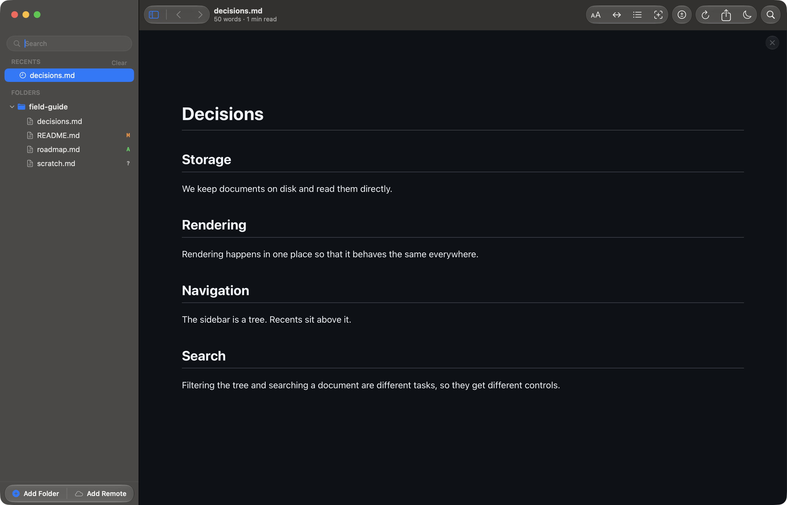
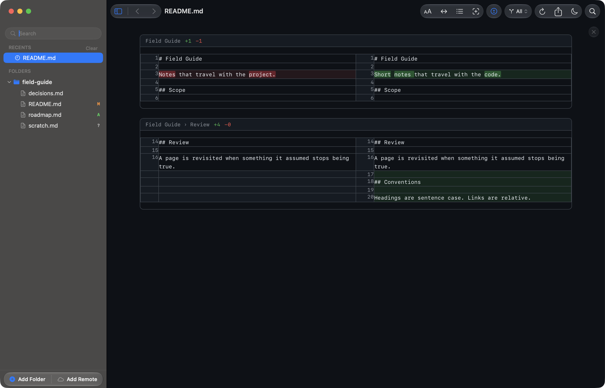
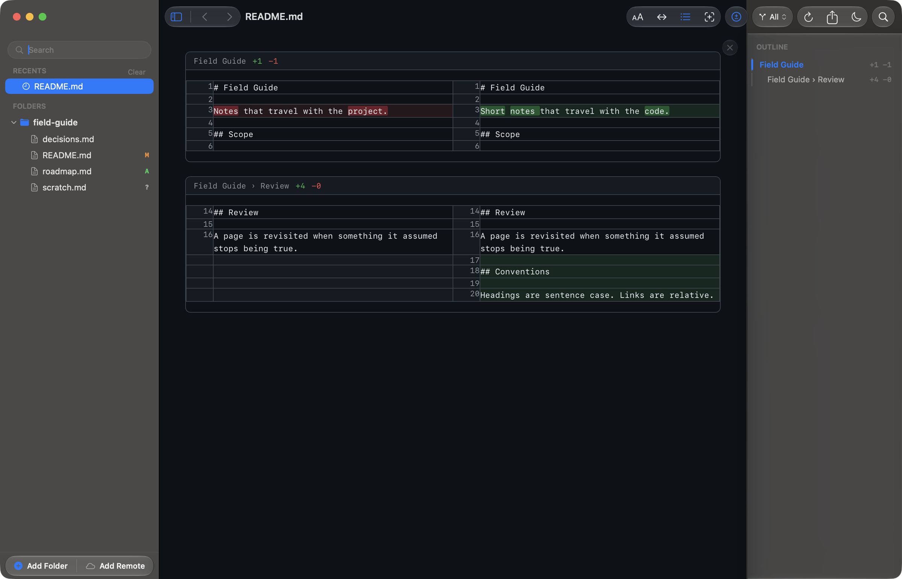
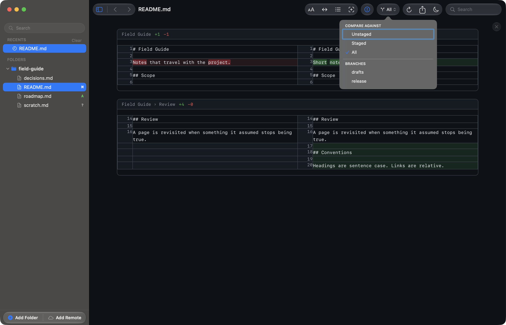

# Review documentation changes before they merge

Reader.md is a free markdown viewer for Mac that shows what changed in the
markdown files of a git repository. Reader.md badges every changed file in the
sidebar, opens any of them as a side-by-side diff of the markdown source with
word-level highlights, and lets you leave notes on the text without touching
the file.

## See which markdown files changed

Add a repository folder and Reader.md marks each markdown file with
uncommitted changes in the sidebar. Folders stay unmarked, so the badges point
straight at the files worth reading.

| Badge | Meaning |
|---|---|
| **M** | modified |
| **A** | added |
| **?** | untracked |
| **U** | conflicted by a merge |

Edits on disk show up as they happen, and Reader.md re-checks the index when
it comes back to the front, so staging a file in a terminal turns its **?**
into **A** the moment you switch across. See
[Change badges](../features/git.md#change-badges).

## How do I see what changed in a markdown file before committing?

Open the file in Reader.md and choose Toggle Diff (⇧⌘D). Reader.md replaces
the rendered document with a side-by-side diff of the markdown source: the
committed text on the left, yours on the right. Press ⇧⌘D again to go back to
the rendered view.

Diff mode is a setting rather than a per-file switch, so it stays on as you
move from file to file, and a file with no changes says so. From a terminal,
`reader <file.md> --diff` opens a file straight into the diff — see the
[command line](../cli.md).

## How to get a word diff instead of a line diff for markdown

Reader.md highlights changed lines word by word, so a reworded sentence reads
as the few words that moved rather than a whole paragraph replaced. Prose
wraps into long lines, which is why a plain line diff of documentation is hard
to read. In a terminal, `git diff --word-diff` solves the same problem inline;
Reader.md shows it in two aligned columns instead.

## Jump between changes in a long doc

In diff mode, the outline (Toggle Outline, ⇧⌘B) lists the changed hunks
instead of the document's headings. Each hunk names the section it falls in
and counts the lines added and removed, and clicking one jumps to it. See
[Hunks in the outline](../features/git.md#hunks-in-the-outline).

## Review staged vs unstaged changes

The scope control beside the diff button sets what Reader.md compares
against:

- **Unstaged** — changes you have not staged yet
- **Staged** — changes you have staged
- **All** — everything since the last commit (the default)

The scope carries over to the next file you open, so you can set it once and
read a whole set of documents the same way.

## How do I compare a doc with another branch before merging?

Pick a branch in the same scope list and Reader.md compares your working copy,
uncommitted edits included, against that branch's tip. That shows the document
as it will read after the merge. A repository with many branches gets a filter
field above the list. See
[What the diff compares against](../features/git.md#what-the-diff-compares-against).

## Can I add comments to a markdown file without changing it?

Yes. Select text in Reader.md and highlight it, attach a note, or reply to
build a thread you can **Resolve** later. Reader.md never writes annotations
into the markdown; they are stored on your Mac under
`~/Library/Application Support/Reader.md/`, keyed by the file's path.

Limits worth knowing:

- Marks stay on your Mac. There are no accounts, no sharing, and no pull
  request comments.
- Marks are hidden while a diff is showing, so annotate in the rendered view.
- Renaming or moving a file loses its marks, because the path is the key.
- A mark whose text disappears is flagged as orphaned rather than deleted.

See [Highlights and notes](../features/annotations.md).

For highlighting as you study or research, see
[Highlight and take notes on markdown, without touching the file](highlight-markdown-files.md).

## Review AI agent edits to markdown

The same diff works on documents a coding agent rewrote: badges show which
files the agent touched, and the word-level diff shows what it changed. For
that workflow, see [Review what your coding agent writes](review-ai-agent-docs.md).

## Does Reader.md change my repository?

No. Reader.md runs `git` read-only, only to ask what changed. Reader.md never
stages, commits, or discards anything, and never writes to your markdown.
Reader.md works with markdown files only (`.md`, `.markdown`, `.mdown`,
`.mdx`), and markdown excluded by `.gitignore` stays out of the sidebar.

## Get Reader.md

Reader.md is a free, open-source markdown viewer with git integration for
macOS 13 or later on Apple silicon. Install it with Homebrew or the DMG — see
[Install](../install.md).
