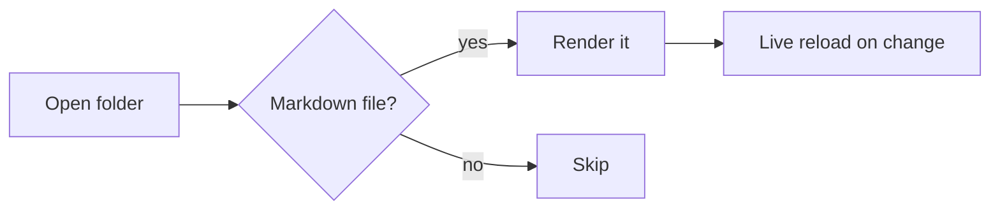

# Sample document

Tests every rendering feature.

## Code

```python
def fib(n: int) -> int:
    return n if n < 2 else fib(n - 1) + fib(n - 2)
```

## Mermaid



## Math

Inline: $e^{i\pi} + 1 = 0$

Display:

$$
\int_{-\infty}^{\infty} e^{-x^2}\,dx = \sqrt{\pi}
$$

## Table

| Feature | Status |
|---|---|
| Highlighting | ✅ |
| Mermaid | ✅ |
| KaTeX | ✅ |

> Blockquote with a [link to the README](README.md) and an [external link](https://example.com).

- [x] Task list item
- [ ] Unchecked item
